# Dev log & playtest guide

## How to send results back

1. **Terminal logs:** every bot run writes `logs/bots-<time>.log`. Attach the file to the chat. For the server, copy the last ~50 lines of the terminal running `npm run dev` (on Oracle: `journalctl -u city-life-auto -n 100 > server.log`).
2. **Screenshots:** take them with the in-game HUD visible. The bottom-right corner shows `fps · ping · entity count`, which helps diagnose. Name them after the checklist item, e.g. `M3-4-crate-fell-through.png`.
3. **Videos:** short phone/OBS clips are fine for your own reference, but I review **3–5 screenshots of the key moments + the matching log** much more reliably than video.
4. **Bug report template** (paste in chat):
   ```
   Milestone / step: M5-3
   Device + browser: Pixel 8 Chrome / Windows Firefox
   What I did:
   What I expected:
   What happened:
   Screenshot(s) / log attached: yes
   ```
5. **Browser console errors:** press F12 → Console, screenshot anything red.

Dev mode (`npm run dev`) adds a playtest panel, opened with the **`** (backtick) key. It has rain/night toggles, money, weapons, wanted levels, a loaded cargo truck, a contraband drop and more, so each checklist below can be done in minutes.

---

## 2026-10-03 · M0 → M8 first full build

**Automated verification run before this entry:**
- `npm test`: 19/19 pass (rules + a 4-minute chaos simulation with 24 random players, 0 system errors).
- `npm run bots -- 100 40 ws://localhost:8080/ws --spread`: 100 players, ~1,300 entities, avg tick ~19 ms (50 ms budget), ~35 KB/s per player, 0 errors.
- Headless-browser playtests on desktop 1280×720, phone landscape 844×390 and portrait 390×844: title, driving, combat, arrest, shop menu, courier job, night, rain.

### M0 · Foundations
Built: zero-dependency Node server (HTTP + hand-written WebSocket), 20 Hz world tick, signed guest tokens, atomic auto-saving profiles, deterministic city generator shared with the client, `/health` + `/stats` endpoints.

Playtest:
1. `npm run dev`, open http://localhost:8080 → title screen shows *Signed in as GuestXXXX*.
2. Press PLAY, walk around, reload the page → you return as the **same guest name** with the same money.
3. Open http://localhost:8080/stats → JSON with `online: 1`.
4. Stop the server with Ctrl+C → terminal prints *saving and shutting down*; restart → money is still there.

### M1 · Playable skeleton
Built: canvas renderer (baked ground chunks, rooftops, signage, lane markings, crosswalks, traffic lights), client-side prediction + server reconciliation, 110 ms interpolation of everyone else, chunk net-culling, keyboard/mouse + Xbox gamepad + touch sticks/buttons, 16:9 scaling with a portrait strip, speed-based camera zoom, radar + big map (M), sprite atlas from your concept art.

Playtest:
1. Two browser windows side by side → each sees the other player move smoothly with a name tag.
2. Walk into a parked car, press **F** → drive; **Space** handbrake-drifts (tire marks); camera zooms out at speed.
3. Plug in an Xbox controller → it works without settings. On a phone (same Wi-Fi, `http://<PC-IP>:8080`) → touch sticks appear.
4. Rotate the phone to portrait → the view becomes a narrow strip (no zoom) with a "rotate" banner.
5. `npm run bots -- 30 60 ws://localhost:8080/ws` while playing → bots appear, game stays smooth; attach the `logs/bots-*.log`.

### M2 · Life cycle & saving
Built: health, bleeding below 30% with red footprints on dry concrete, death → WASTED screen → hospital respawn, value-tiered loot bags (duffel → backpack → security case → gold lockbox), **30-second ghost state** on disconnect, banked money survives death, continuous autosave.

Playtest:
1. Dev panel → *Give weapons*, walk up to a citizen and fight; get hurt below 30 → HUD says BLEEDING and red footprints trail on sidewalks.
2. Die (or drive into traffic) → WASTED, respawn at St. Neon General with $0; a loot bag sits where you died. In a second window, walk to it and press **E** to loot it.
3. With $ in your wallet, close the tab. In the other window watch your body stay ~30 s, then pop into a loot bag.
4. Reopen within 30 s instead → you're back in the same body with your money.
5. Deposit at First Pixel Bank / ATM (E) → die → bank balance is unchanged.

### M3 · Vehicles & open cargo
Built: 15 vehicle models (compact, sedan, taxi, sports, pickup, flatbed, van, bus, police, SWAT, ambulance, armored, motorcycle, speedboat, dinghy), multi-seat passengers, surfaces (grass/sand/dirt slow you), wrecks + explosions + fire, hydrant geysers, motorcycle crash ejection, physical crates: carry (−40% speed), throw, load into visible slots, knocked off in hard crashes, tossed crates land in truck beds, crates sink in water.

Playtest:
1. Dev panel → *Loaded flatbed* → a truck with one crate of each tier appears; drive it into a wall hard → crates fly off.
2. Walk to a crate, **E** pick up (you slow down), **Q** or click to throw it; stand near an empty pickup bed holding a crate → prompt *Load onto Pickup Truck*.
3. Throw a crate onto an empty pickup bed from beside it → it snaps into the bed.
4. Two players: one drives, the other presses **F** on the same car → passenger; passenger can aim and shoot (mouse/right stick + click).
5. Harbor Marina (B on radar) or the piers: take a boat; press F at the dock edge to get out.

### M4 · Combat
Built: fists, bat, knife, crowbar, sledgehammer, baton, taser, pistol, revolver, shotgun, rifle, SMG, bazooka; hitscan with walls blocking, tracers, muzzle flashes that light the night, blood sprays + stains, hood blood on cars that hit people, stun/knockdown, reload (R), heal items (X), passenger drive-bys.

Playtest:
1. Dev panel → *Give weapons*. Cycle with Tab/wheel/1-9; check the ammo counter and reload.
2. Shoot at a car until it smokes, burns and explodes; nearby people get knocked back.
3. Run someone over → blood on your hood; Fresh Coat Garage (R on radar) → *Car wash* cleans it.

### M5 · Law & tri-faction
Built: witness network (NPC sight cones + traffic cameras, both weaker at night), 3-second red "!" public flare, wanted stars, out-of-sight search circle on police radar that grows as heat cools, legal immunity (self-defense, flagged outlaws, gang turf), NPC police units (taser + baton at 1–2★, firearms at 3★, SWAT at 4–5★), arrests with fines and confiscation, contraband spotting, **disguise system with peak-wanted memory**, enforcer badge (25 Samaritan, no felonies) with misconduct firing, bounty hunter license, player-placed bounties at the courthouse.

Playtest:
1. Punch someone in an empty alley with nobody looking → toast *nobody saw it*. Do it in front of people → stars + red "!" over your head for 3 s.
2. Dev → *4 stars* → police cruisers with sirens arrive; hide behind buildings and watch the stars cool off. A traffic camera blinks red and beeps when it spots you.
3. Get 3 stars, break line of sight, go to Threads Outfitters (D) → buy an outfit → stars drop to 0, HUD shows *Record on file ★★★*. Commit any small crime in view → straight back to 3★.
4. Dev → *+50 Samaritan*, go to Police HQ (P) → pick up badge → uniform + taser/baton/pistol; *Requisition a Police Interceptor*, H toggles the siren. In a second window give that player stars; arrest them by tasing then pressing E.
5. As an on-duty cop, punch a clean citizen → Samaritan points drop; keep doing it → FIRED.
6. Have player B punch player A; A goes to the courthouse (J) → place a bounty on B → hunters see a pulsing ring on the radar.

### M6 · Living city
Built: demographic pedestrians (executives, socialites, construction crews, sweepers, athletes, seniors, hustlers, drunks; more shady types at night), sidewalk wandering + jaywalking, reflex dive rolls away from speeding cars (athletes ~80%, drunks ~5%), fight-or-flight when attacked, carjacking (50% flee screaming / 50% fight and drag you out), syndicate gangs in the south-west turf that defend it, NPC traffic on a lane graph obeying traffic lights, parked cars, panicked drivers, ambulances that revive downed NPCs in 3 s, bodies dissolve after 45 s if unreachable, snatch-and-grab street muggings, scattering pigeons and gulls.

Playtest:
1. Stand at a big intersection for a minute: cars stop on red, go on green, turn at corners.
2. Drive fast along a busy sidewalk → some people dive out of the way, slow ones don't.
3. Pull a driver out of their car (F on an NPC car) several times → some run, some beat you up.
4. Knock someone down and wait nearby with no shooting → an ambulance arrives, medics revive them.
5. Wait for a *Snatch-and-grab!* toast → chase the mugger, knock them down, grab the purse, then either return it to the victim (E → +Samaritan) or sell it at Second Chance Pawn.

### M7 · World systems
Built: 20-minute chrono loop (15 min day / 5 min night) synced to all players, night darkness with street lamps, headlight cones, siren glow, shop-front light pools; rare rain (−35% asphalt grip, double braking distance, umbrellas, rain streaks, slick boats); waterfront with beach, piers and ocean; river and bridges to the rural Refuge Island with farm fields.

Playtest:
1. Dev → *Jump to night*: lamps and headlights light the streets; more hustlers/drunks appear.
2. Dev → *Start rain*: brake from top speed on asphalt → you slide about twice as far; umbrellas pop up.
3. Drive east across a bridge: the camera at the bridge approach pings wanted players.

### M8 · Economy & jobs
Built: Iron Sights Arms, Second Chance Pawn (sells stolen goods safely), Back-Alley Exchange black market (SMG, bazooka, fences contraband), Home Run Sports (bat, fishing pole), Nail & Gear Hardware, MediMart Pharmacy, Bean Machine Coffee + vending machines (stamina buffs), ER reception auto-heal ($150), bank + ATM, Motor Row dealership + Harbor Marina (owned vehicles saved to your profile, retrievable anytime), Fresh Coat Garage (respray disguise, wash, repair), Portside Logistics courier contracts, Refuge Island harvest contracts (4 produce boxes → FreshHub Grocery), contraband drops (iron vaults / carbon-gold cases with a map rumor; fence them or turn them in at PD for Samaritan points), fishing with bite timing + time/location tables (catfish at night, tuna in deep water, lures).

Playtest:
1. Portside Logistics (W) → courier contract → load the crate on any vehicle with a bed → drive to the yellow marker → carry it to the door → E → paid.
2. Refuge Island farm (¥ on the east island) → harvest contract → load 4 boxes on the co-op pickup → FreshHub Grocery (F) → paid + bonus.
3. Dev → *Contraband drop* → follow the dashed rumor ring → grab the glowing case → choose Back-Alley Exchange (X) for big cash, or Police HQ for Samaritan points. Carrying it past a cop gets you wanted.
4. Buy a fishing pole at Home Run Sports, stand at a pier edge facing water → E to cast → when **BITE! PRESS E** flashes, press E → sell fish at Dockside Fish Market (≈).
5. Buy a pickup at Motor Row (V) → log out and back in → retrieve it from the dealership or garage menu.

### Known gaps / next
- **M9 accounts & social:** Discord/Google sign-in, username choice, chat with filter, mute/report, leaderboards.
- **Final art:** characters, buildings and tiles are procedural stand-ins in your palette; vehicles and crates come from your concept sheets. See ART_SPEC.md.
- Bridges don't open (drawbridges), no jet skis or lost-pet events yet, gang alignment perks are basic (≥200 Criminal EXP stops gangs reacting to gunfire).
- NPC traffic uses straight lane graphs; police can drive onto sidewalks during direct pursuit (intended), and occasionally get wedged on corners (they reverse out).

---

## 2026-10-03 · Offline practice mode

**Built:** a **PRACTICE OFFLINE** button on the title screen. It runs the complete authoritative city simulation (the same `server/` code) inside a Web Worker on your own device. It needs no server and no internet once the page has loaded. You start with $2,000 cash and $5,000 bank, and the cheats panel is always on (` key, or the DEV button on phones). Nothing is saved, and your online guest token/profile is never touched.

Code changes: `server/session.js` (handshake + message routing shared by the Node server and the worker), `server/store.js` (environment-neutral profile store; the Node server plugs in `server/file-store.js`), `client/practice-worker.js`, and a WebSocket-compatible worker transport in `client/main.js`.

Playtest:
1. Open https://deadbaron.com/city-life-auto/ (even before the Oracle server exists) → title says the online city isn't reachable → press **PRACTICE OFFLINE** → you're in.
2. HUD shows *CITIZEN · PRACTICE*. Press ` (or DEV) → spawn the loaded flatbed, give weapons, start rain, etc.
3. Reload the page → practice money/items are gone (by design). Your online guest (once the server is live) is unaffected.
4. On a phone: same flow; the DEV button sits under the touch buttons.

---

## 2026-10-03 · Art pass, GTA-style city, punches, hospitals & homes

**City layout.** The generator was rewritten (`shared/map.js`). Four avenues and two bridges split the mainland into **nine districts with their own look**: Pine Hills (suburbs), Midtown (shops), Northgate (apartments, school, fire station), The Yards (industrial Syndicate turf, potholed asphalt), Downtown (towers, slate plazas, PD, bank, courthouse), Civic Center (hospital, chapel, Central Park), Southside (rough houses + turf), Neon Strip (clubs, hotels, red-brick sidewalks) and Harbor, plus Sunset Beach, the piers and Refuge Island. Each district is cut into irregular blocks with mixed street widths and T-junctions. A district title card pops up when you cross into one. The map grew from 256x256 to 384x352 tiles.

**Art.** Buildings are the actual lots from your building sheet. Roads, sidewalks, plazas and water use textures cut from your style-guide sheets, and about 70 street props come from the props sheet (`tools/build_art.py`). The bus and armored truck now use concept art too.

**Vehicles.** The dark rectangles under cars are gone; shadows follow the car outline. Every car keeps the art's own proportions and its collision box is the sprite itself.

**Combat feel.** Fists throw alternating left/right jabs (4 frames), and bats/crowbars/etc. swing in an arc with a motion trail. Hits make the victim flinch and flash, with an impact burst and screen shake. Your own punch animates instantly (predicted locally). Quick clicks can no longer be lost.

**Respawning.** There are 3 hospitals (St. Neon General, Westside Medical, Southside Clinic). The WASTED screen has a picker for where to wake up; by default you wake at your home, or else a hospital away from where you died.

**Homes.** There are 70+ buyable houses ($25k, $12k in turf) and apartments ($15k). Walk to the door and press E to buy. A home becomes your respawn point, has a Rest option (full heal), and comes with a garage: drive *any* car (yes, stolen ones too) up to your driveway and press E to park it, then take it out again from the door menu. Garage space is 2 + 3 per house / 2 per apartment, up to 3 homes.

Playtest (offline practice works for all of these):
1. Walk/drive across the city and watch the district title cards; compare Pine Hills, Downtown, Neon Strip and The Yards.
2. Punch the air and a pedestrian: arms should visibly jab; the victim flinches with a white impact burst.
3. Dev panel → +$25k → walk to any house door ("For sale" prompt) → buy it. Die (drive into traffic): the WASTED screen lists your home + 3 hospitals; pick one.
4. Steal any car, drive up to your house's driveway, press E → "parked in your garage". Walk to the door → E → *Take out*.
5. Check cars: no boxes around them; bumping into one should match where the art is.

### Screenshots from the automated browser playtest (2026-10-03)
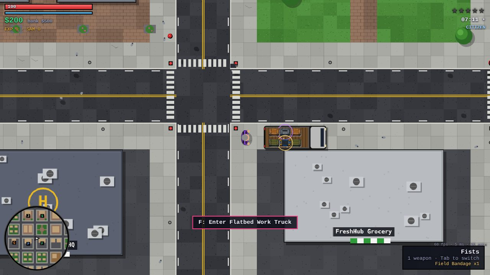
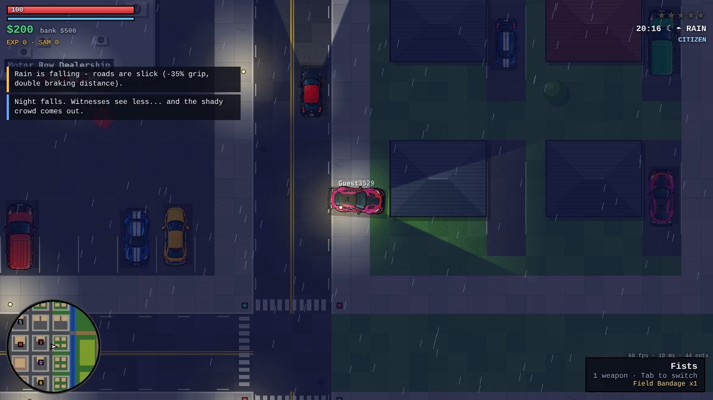
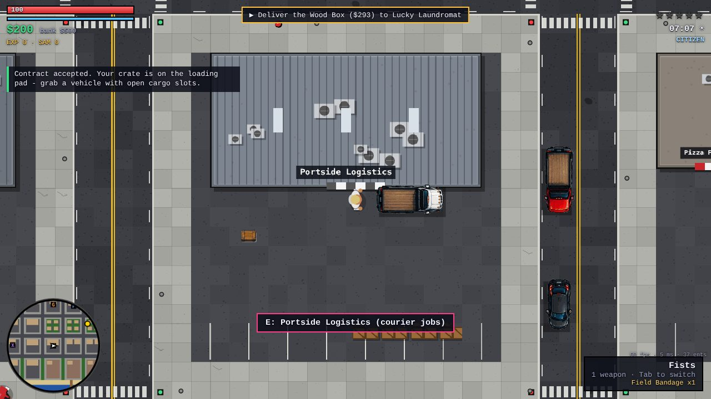
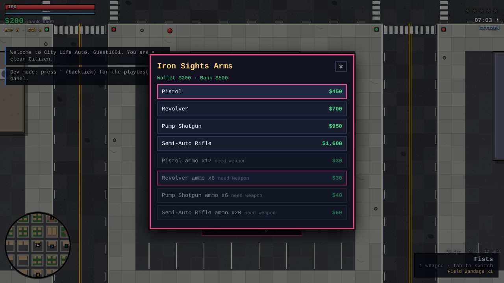
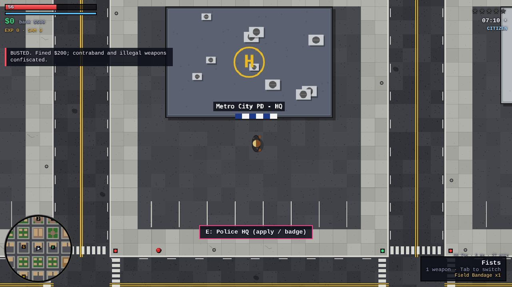
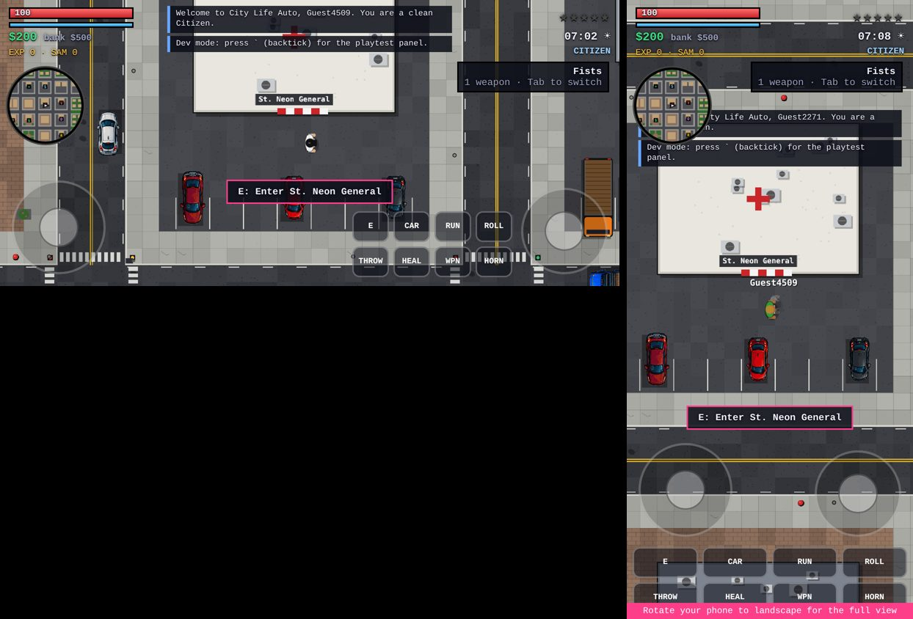

## 2026-10-03 · Character redraw

Players and every NPC archetype are now redrawn as top-down 16-bit pixel art in the concept-sheet style: a 24x24 art grid (1 art px = 2 world px, the same scale as the buildings), 3-tone shading, and a dark outline. They are drawn crisp, with no blur. Outfits are layered from the appearance the server already sends, so each archetype reads at a glance:
- suit and tie (executives)
- hard hat and hi-vis vest (construction)
- sun hat and dress (socialites)
- uniform and badge (cops)
- helmet and visor (SWAT)
- red bandana (gang)
- fur coat, hoodie, cardigan, briefcase, purse and tool bag

Animations:
- 8-frame walk and run, with legs that visibly step out
- breathing idle
- left/right jabs, where the fist extends past the body
- melee arc swing with weapons in hand
- aim, carry, fishing, dive roll, knocked down and dead

Each sprite is cached per look, pose and frame. You can preview every archetype and pose at `/tools/character-preview.html`.

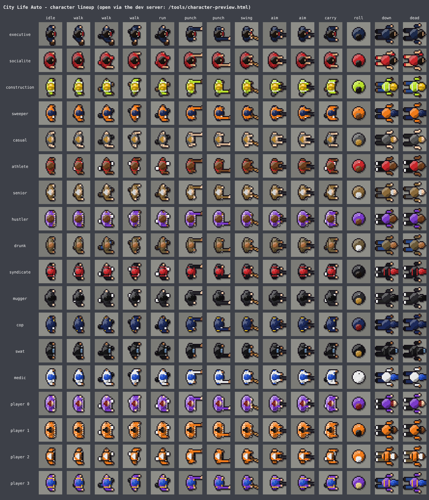

## 2026-10-03 · GTA2-style city layout + sharp art

**World layout (modelled on the GTA1/GTA2 level maps).** The city is now three islands separated by water channels and joined by bridges, plus a farm island:
- **Industrial:** Harbor docks, Ironworks, Greenfield Park with a pond, and The Yards (gang turf).
- **Residential:** Pine Hills, Northgate, Southside (gang turf) and Sunset Beach with piers.
- **Downtown:** Civic Center with Central Park, the Downtown towers, Midtown shops and the Neon Strip.
- **Refuge Island:** reached over a causeway from Neon Blvd; farm, fields and woods.

Each island has a coast ring road with a waterfront outside it: quays, promenade, lawns or beach, with piers and marinas. Inside, a hand-laid avenue grid has T-junction stubs, and every cell is cut into irregular blocks of mixed sizes. Blocks are lined with the concept building lots. Leftover lots and small blocks become solid rooftop buildings, so the city reads dense like the originals:
- tar, gravel, corrugated metal, glass or terracotta roofs
- parapets
- AC units, tanks, skylights and helipads cut from the concept roof tiles

The district title now shows the island under it. Crossing a bridge shows "Liberty Bay". The map is 432x416 tiles, up from 384x352. Three hospitals, one per island: St. Neon General, Westside Medical and Ironworks Clinic.

**Sharper graphics.** Buildings were blurry because the concept-sheet lots were stretched 2x at runtime. The art build now upscales them 4x with Real-ESRGAN, using a small torch-free numpy port in `tools/sr_upscale.py`. It then stores them at exactly 1 art px per world px, drawn nearest-neighbour. Grass, sand and dirt are new seamless pixel-art textures. The world only uses smoothing while zoomed out at speed, to avoid shimmer.

**Tools.** `/tools/map-preview.html?scale=0.125` renders the whole city with the game's own chunk baker, plus district labels.

Load test, 100 bots spread over the new map: 13–14 ms per tick (of a 50 ms budget), about 15 KB/s per player, 0 errors. All 21 tests pass.

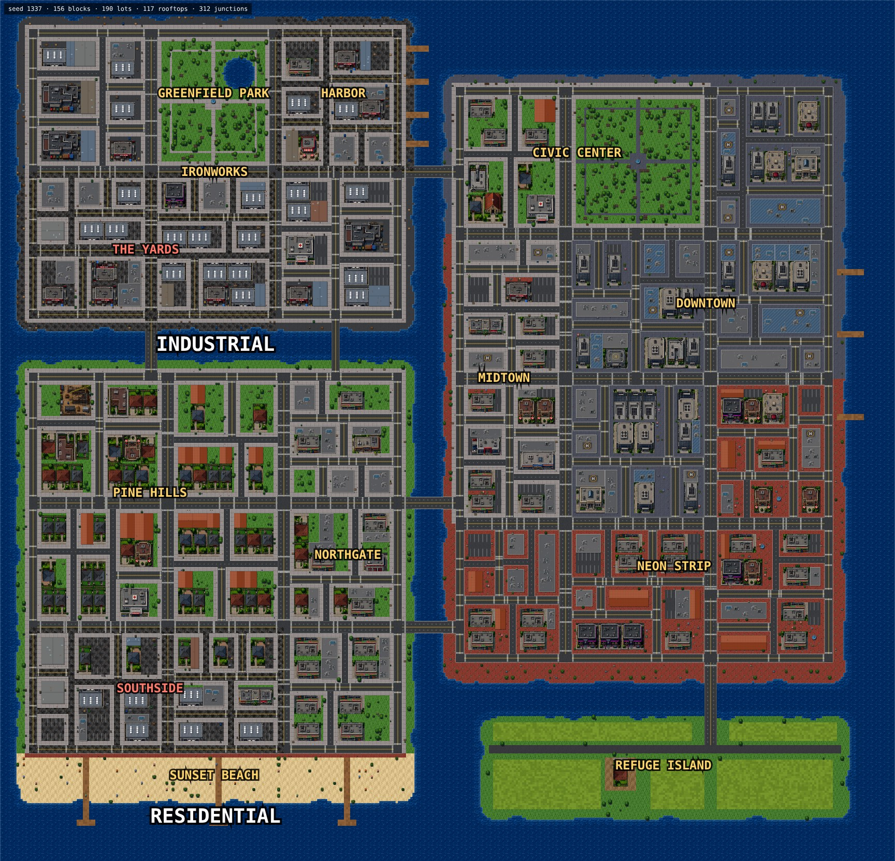

## 2026-10-03 · Art pass: blended blocks, reference hospital, night + rain

**Blocks blend together.** There are no more asphalt or odd-coloured patches between buildings. Every lot now sits on its district's own paving or lawn: Midtown is continuous concrete like its sidewalks, Downtown slate, the Neon Strip brick, and Pine Hills lawns. Each concept lot has feathered edges, so it fades into the surrounding paving instead of reading as a pasted rectangle.

**New hospital (all three hospitals),** built from the rainy-night street reference:
- the reference's lobby facade: lit glass, red-cross sign, entrance canopy and planter beds
- a parapet roof with a helipad, AC units, tanks, a skylight and a rooftop red cross
- a paved forecourt with tree planters, lamps and benches either side of the doors

**Night.** Every building lot has a generated emissive layer: facade glass turns warm yellow, lit windows and neon signs keep their colour, with a soft halo. It is drawn additively after dark. Street-lamp pools are bigger and warmer.

**Rain.**
- Wet asphalt reflects headlights (warm), tail and brake lights (red), sirens, street lamps and lit shopfronts as broken vertical streaks.
- Cars throw tyre spray.
- Drops splash on the ground.
- Most pedestrians now open umbrellas, drawn as pixel-art canopies in six colours.

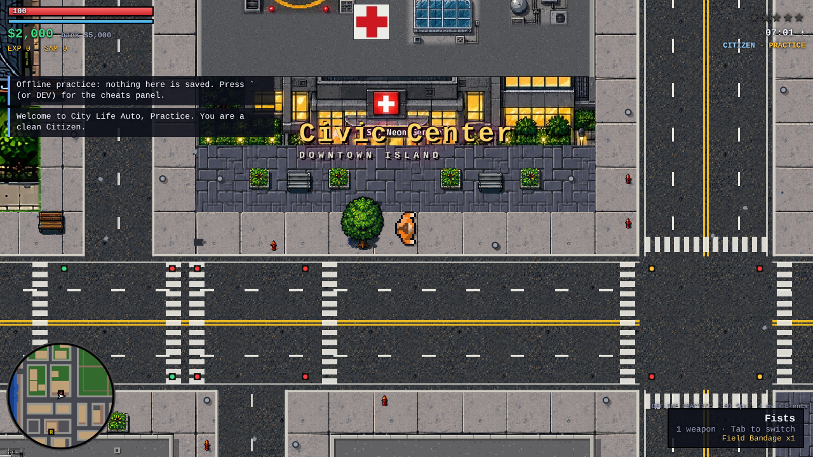
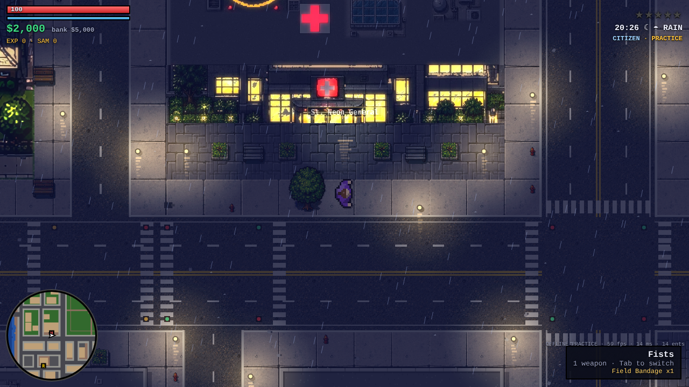

## 2026-10-03 · Twin-stick controls, smooth movement, mobile UX, GTA-style HUD

**Animation fix.** The 8-frame gait jumped from the full stride on one side straight to the other side, so walk and run never looped cleanly. Stride now follows a sine over the 8 frames. Each ped also has a walk phase driven by how far it actually moved on screen. Stride length and leg amplitude blend across four speed levels (stroll, walk, jog, run), so walking eases into running without the loop resetting.

**Movement feel.** How far you push now sets your speed:
- a light push walks, full push runs, and sprint adds a stamina burst on top
- speeding up eases in; letting go glides a short way before stopping
- the character turns smoothly instead of snapping

On keyboard, C or Ctrl walks.

**Driving.** The stick, keys or thumb point where you want to go:
- the car steers toward that direction, and push depth sets cruising speed
- pull back hard to brake, then reverse with the rear swinging round
- Settings has "Classic tank" driving for keyboard players who prefer W = gas, A/D = steer

**Twin-stick aiming.**
- Keyboard + mouse: WASD moves and the cursor aims. With a gun out you always face the cursor. Unarmed, you face where you walk and turn to the cursor to punch.
- Gamepad: the left stick moves or drives and the right stick aims. RT fires, LT sprints on foot or works as the handbrake in a car. A rolls, B interacts, X gets in or out, Y throws, LB/RB switch weapons, R3 reloads, Menu opens the map.
- Touch:
  - the left thumb-stick appears wherever you touch the left side
  - the right stick aims, shown with an aim line
  - firing is deliberate: tap the big FIRE button (it uses your last aim for about a second), or push the aim stick into its red outer ring, which buzzes when it engages
  - the ring can be turned off in Settings

**Device-aware hints.** The game detects touch devices and shows touch controls and help from the title screen onward. Prompts are GTA-style help boxes showing the right button for your device: a key cap, an Xbox-colour face button, or the on-screen button name. On touch, the matching button pulses. Contextual buttons:
- THROW appears only when carrying
- RELOAD only when armed
- HORN and BRAKE only in a car

Tap the weapon box to switch weapons and the radar to open the map.

**Fullscreen and landscape.**
- Mobile goes fullscreen when you press play, and there are ⛶ buttons on the title screen and in the HUD.
- Android also locks to landscape.
- iPhone gets an Add-to-Home-Screen hint.
- In portrait, a "landscape shows more" tip appears once and fades out.

**GTA-style HUD.**
- Fonts: Anton and Barlow Condensed, self-hosted.
- Top-right: weapon pixel icon and ammo, big outlined green money, white wanted stars.
- Bottom-left: circular radar with health and stamina bars.
- Help box and notifications top-left.
- Interaction-style shop menus.
- WASTED card over a desaturated screen.
- Skewed title buttons.

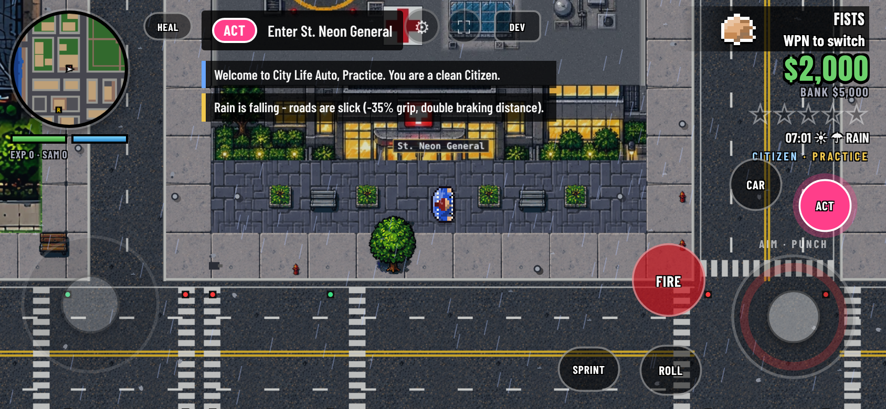

## 2026-10-03 · NPC toughness + fist fights, gamepad pause menu

**Why punched NPCs didn't die.** Fists did 8 damage against about 100 HP. Every punch shoved the target out of reach, and anyone who fled sprinted faster than you could chase. So a fist fight in practice never ended.

**Builds.** Every NPC now rolls a build, weighted by type: seniors are mostly frail, construction workers often tough, Syndicate heavies often brutes. Brutes are drawn bigger and frail people smaller, so you can size up a fight before you start it.

| Build | Health | Hits back with | Notes |
|---|---|---|---|
| Frail | 0.55x | 0.65x | flees more |
| Average | 1x | 1x | |
| Tough | 1.45x | 1.4x | more likely to fight back |
| Brute | 1.8x | 1.6x | needs 4-hit combos to floor |

**Fist fighting.**
- Fists hit for 10, with a shorter shove scaled by your strength against their poise, so you can keep a combo going.
- Three hits in quick succession is a KNOCKDOWN (four against brutes, and four against players). Hits on someone who's down do 1.5x.
- NPC brawlers swing a little slower than players.
- A health bar appears over whoever you're fighting, tagged TOUGH or BRUTE.

Simulated standing slugfests (480 fights, no dodging): you beat frail NPCs 100% of the time in about 4 punches, average 99% in about 8, tough about 88% in about 13, and brutes about 32%. Rolling and footwork improve those odds.

**Gamepad pause menu.** Start/Menu (or Esc) opens a GTA-style pause menu: Resume, Map, Settings, Controls, Toggle fullscreen, the Debug / cheats menu (dev and practice), and Back to title. The D-pad or left stick moves, A selects, left/right changes a setting, B goes back. The settings and debug panels are fully navigable with the pad.

## 2026-10-03 · Gamepad title screen + GTA-style trigger driving

- **Title screen:** the pad now works from the start. The D-pad or left stick moves between PLAY, PRACTICE, SETTINGS and FULLSCREEN, A or Start presses, and settings opened from the title are navigable too (B closes).
- **Driving with a pad is back to triggers, GTA1/2-style:**
  - RT gas and LT brake, then reverse (both analog, so a light squeeze cruises)
  - left stick steers, A handbrake
  - right stick aims drive-by fire, and pushing it all the way out shoots
  - a "point the stick where to go" option remains under Settings → Gamepad driving
- On foot nothing changes: left stick moves, right stick aims, RT fires.

## 2026-10-03 · Updates go live instantly + controller trigger fix

- **Why the RT driving fix seemed missing:** GitHub Pages lets browsers cache the game's JavaScript for 10 minutes, so right after a push you could still be running the previous controls code. `client/boot.js` now checks `version.json` uncached on every launch. When the build changed, it re-downloads every game file fresh before starting. The title screen shows the build id and time, so you can see which version you're on.
- **Release step:** run `node tools/stamp-version.mjs` before committing (it rewrites `version.json`).
- **Controllers that report triggers as axes:** some browser/OS combinations expose an Xbox pad without the standard mapping, with triggers on axes 2 and 5 resting at -1 and the right stick on axes 3/4. These are now detected, so RT/LT work there too. Tested with both layouts in the automated browser: RT accelerates, LT brakes and then reverses.
- Hard steering no longer scales the gas down in trigger-driving mode.

## 2026-10-03 · Destructible streets, signal poles, traffic loop fix, cash drops, smoother driving

**Destructible props.** About 60 kinds of street furniture now break:
- trees and palms
- lamp posts and hydrants
- bins, benches, planters and bushes
- newsstands, vending machines and mailboxes
- cones, barriers, pallets, drums, spools, carts and umbrellas

How it works:
- A car above roughly 85 px/s ploughs through instead of bouncing off, and loses some speed doing it. Trees, lamp posts and hydrants dent the car.
- Explosions also smash props in their radius.
- Breaks are server-authoritative and broadcast to everyone, and late joiners get the list in their welcome message. The ground is re-drawn with debris. Trees topple over beside a stump, lamp posts lie in the street, and smashed hydrants spout a geyser that drags passing cars.
- A tidy-up crew restores props after 4 minutes, but only when no player is within view.
- Fountains, dumpsters, ATMs and market stalls stay solid.

**Poles.**
- Traffic signals hang from mast arms: a pole on each corner with an arm over the approaching lanes and a 3-lamp head. The signal lamps glow at night.
- Street lights are poles with an arm over the road. The lamp head is lit at night, the light pool comes from the head, and they can be knocked down.
- Traffic cameras sit on yellow-banded poles with a white housing pointing at the junction.

**Traffic stuck in circles.** A waypoint inside a car's turning circle made drivers orbit forever. Drivers now drop that waypoint after about one lap, and re-join the road network at the nearest junction after about two. In a 4-minute simulation with 3 players, 10 of 154 traffic cars were caught orbiting before the fix and 0 of 230 after.

**Backwards vehicles.** The bus and the armored truck were cut from the sheet facing the wrong way. Fixed.

**Cash drops.**
- Not every NPC carries money: about 90% of executives do, but only about 30% of drunks.
- When the only loot is cash, it drops as a little pile of bills you scoop up by walking over it, with a floating "+$N".
- Bags are kept for item loot.

**Smoother driving.**
- When the server catches up on a backed-up input queue, it now gives the car the extra physics step the client already predicted. This removes a steady source of corrections.
- Heading corrections are eased instead of snapped.
- In a car, position corrections ease over about 150 ms.
- The camera's look-ahead follows smoothed velocity instead of the raw heading.

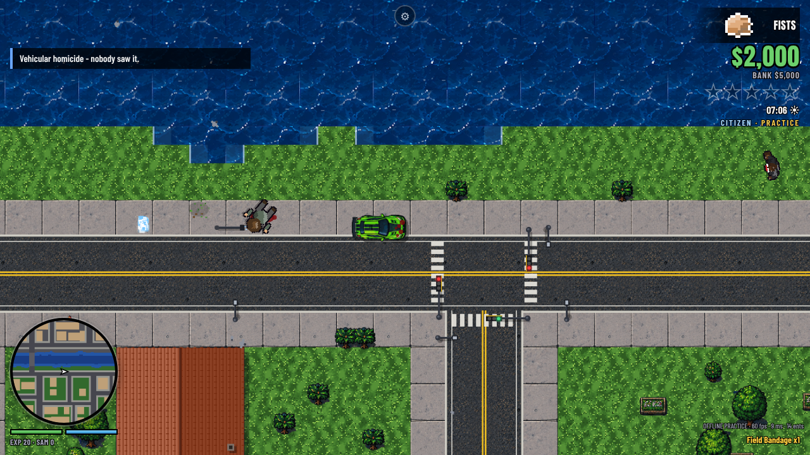
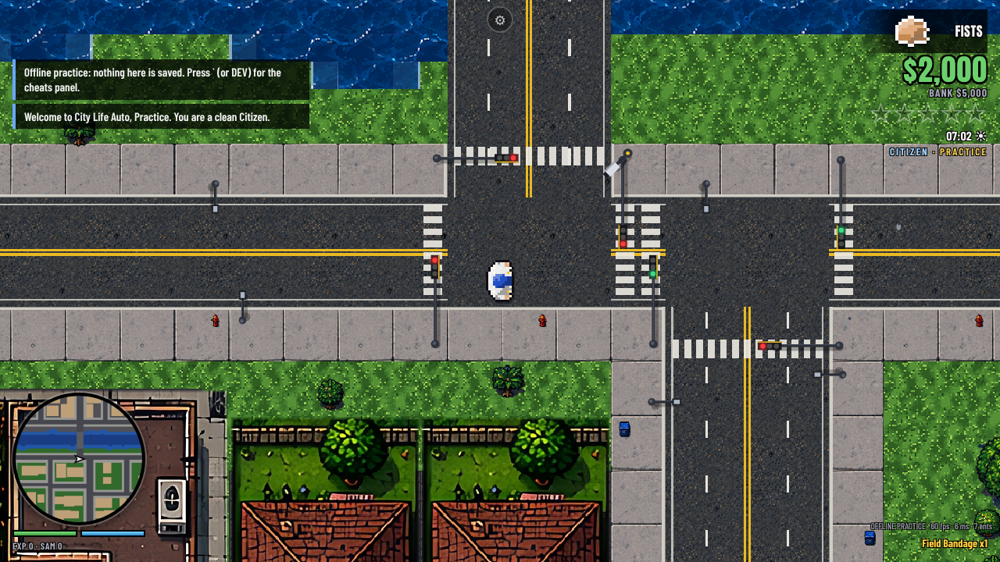

## 2026-10-03 · Installable app (separate from the other deadbaron.com games)

City Life Auto now installs as its own app from Chrome (Android "Install app", or the ⬇ INSTALL APP button on the title screen when Chrome offers it):
- **No overlap with the other games.** `manifest.webmanifest` has `id` and `scope` `/city-life-auto/` and start URL `/city-life-auto/?source=app`, so it installs next to Neon Asteroids (`/neon-asteroids/`) and Gear Bugs (`/gear-bugs/`) without clashing.
- **Display:** fullscreen, landscape.
- **Icons:** made from the logo, including maskable versions for Android's icon shapes, plus an iOS home-screen icon.
- **Service worker (`sw.js`):** scoped to `/city-life-auto/` and only ever clears its own `city-life-auto-` caches. It's network-first, so updates still land immediately, and keeps the cached copy as an offline fallback.
- **Offline practice:** after one online visit, Practice works with no connection, because the boot loader's version check pre-loads every game file.
- **Verified in Chromium:** no manifest errors, no installability errors, the service worker controls only `/city-life-auto/`, and offline practice runs after a reload with the network cut.

## 2026-10-03 · Cop-car theft, world map, police ranks + dispatch map, debug tools, portrait fullscreen

- **Stealing police cars works.** When you jacked a crewed cruiser, the officer you threw out was immediately able to drag you back out (NPCs pull drivers from slow cars). Now:
  - A jacked driver is knocked to the ground for about 1.6 s.
  - NPC passengers bail out too.
  - Officers from a hijacked unit chase and shoot instead of dragging you out.
  - Civilians only try to drag you out once every 6 s.
- **World map.** `assets/worldmap.webp` is baked from the game's own renderer (`python3 tools/build-worldmap.py`). It opens with M, the new ▦ HUD button, a tap on the radar, or Start → Map, and shows:
  - district names
  - shops and services
  - your homes, job and drop rumors
  - you
- **Police ranks.** Officer → Senior Officer → Sergeant → Lieutenant → Captain → Chief of Police. Ranks come from service points: arrests (10 × stars), NPC custody (4) and bounties (15). Promotions are announced, and the HUD shows "POLICE · RANK".
- **Police dispatch map.** On duty, the world map becomes dispatch:
  - **Crime reports:** only crimes a witness, camera or officer actually reported, plus purse-snatching calls. Each shows its age, and higher ranks keep reports longer.
  - **Live suspect markers:** only while someone can currently see them.
  - **Last-known search areas:** once a suspect slips out of sight. Nothing shows once they're gone.
  - **Fleeing NPC muggers:** while you have line of sight.
- **Debug menu:**
  - "Wipe criminal record (felonies)": clears wanted level, felonies, peak-wanted memory and any firing.
  - "Join the police (badge + rank)"
  - "Promote police rank"
- **Fullscreen in portrait:** the landscape lock is gone, and the installed app's manifest orientation is now "any".

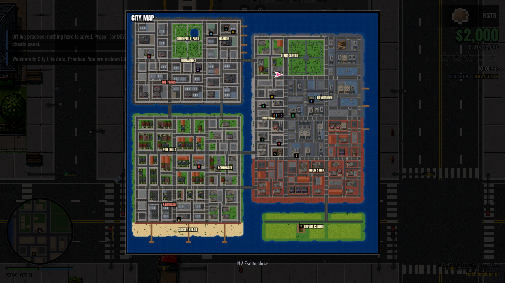
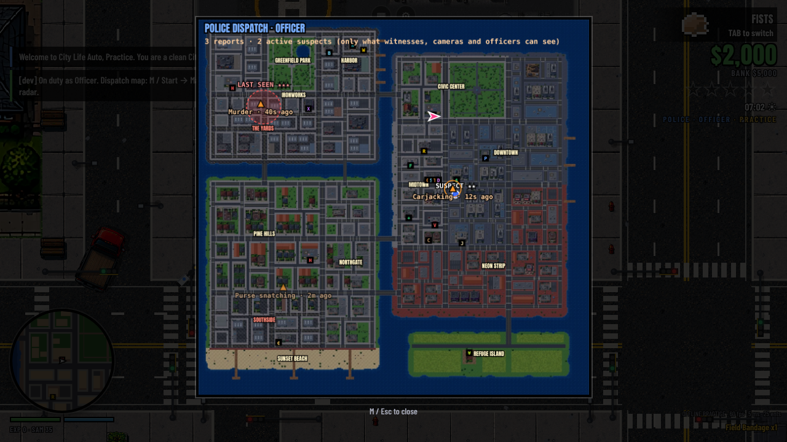

## 2026-10-03 · Rotation in fullscreen and in the installed app

- The game now asks the phone to follow its rotation sensor (`screen.orientation.lock('any')`) whenever it is fullscreen, and at launch when running as the installed app. This overrides an install made while the manifest still said landscape-only; Android only refreshes an installed app's manifest after about a day.
- Rotation re-fits the canvas and switches between the landscape and portrait HUD and touch layouts. The game listens for `resize`, `orientationchange`, `screen.orientation` change and `visualViewport` resize, because a rotation in fullscreen doesn't always fire `resize`. Canvas sizes are only reset when they actually change.
- Tested in headless Chromium by rotating mid-game from landscape (844×390) to portrait (390×844) and back: the canvas and portrait layout switched each time.

## Reinstall after uninstall
- Manifest `id` bumped to `/city-life-auto/app` (start_url `?source=pwa`) so phones holding a stale install record see a brand-new app; `related_applications` lets the page detect an existing install.
- Install button is always shown outside the app. It uses Chrome's native prompt when offered; otherwise it opens an install sheet with per-browser steps plus "already installed?" fixes.
- Settings → "Repair install": unregisters only the `/city-life-auto/` service worker, deletes `city-life-auto-*` caches, clears the build stamp and reloads. Other deadbaron.com games and saves are untouched. SW cache bumped to v2.

## Personal police cruisers
- Going on duty (HQ badge desk or dev "Join the police") puts you behind the wheel of your own Interceptor immediately.
- Cruiser wrecked or stolen → a 15 s cooldown, then **Call cruiser** (V / D-pad down / COP CAR touch button / pause menu). An NPC officer drives a new one to you, parks within ~150 px, gets out and walks off. If it's stuck in traffic for 45 s it's placed right next to you instead.
- A delivered (or HQ-requisitioned) cruiser stays locked to its officer until they first get in; after that it's an ordinary police car that can be stolen.
- Blue chevron orbits the player pointing at the cruiser, a red/blue marker bobs over it, and it shows as a blue square on the radar and world map.
- Leave it more than 900 px behind for 25 s (or cross town) and it's towed back to HQ: no cooldown, call another any time. Going off duty or logging out returns it to the pool.
- New system `server/systems/cruiser.js` runs after police in SYSTEMS. `me.cruiser = { s: none|coming|parked|in, cd, id, x, y }`. Client→server message `{ t: 'cruiser' }`.

## Police kit, misconduct grace, knock-out arrests, bail-outs and blasts
- **Service pistol:** going on duty issues the Police Service Pistol (15-round mag, 75 rounds) and equips it. The Police HQ menu gains a free "Armory: restock service pistol ammo". Your own weapons stay usable on duty. Department gear (taser, baton, service pistol) is handed back off duty or lost on death.
- **Misconduct grace:** officers get 3 strikes. Murder and vehicular homicide count 2, killing an officer counts 3, and shots fired don't count. Each strike expires after 10 real minutes. Graced crimes carry no heat; you get a warning toast, and the HUD faction line shows `MISCONDUCT n/3` (flashing at the last strike). One more strike: fired (10-minute lockout), and that crime counts normally.
- **Cruiser arrow removed:** the cruiser now only appears as a blue square on the radar and world map.
- **Crime blips:** dispatch reports within radar range pulse on the minimap for 2 minutes.
- **Suspect markers:** officers see a small red/blue chevron over visible criminals (wanted players, flagged NPCs). It becomes a pulsing ring once the suspect is down, meaning you can cuff them.
- **Arrests need a knockout:** the suspect must be floored, tased, tackled (dive into them) or run down. Officers and hunters who floor a suspect keep them down for 6 s. Being badly hurt is no longer enough. Walk up and interact: "Cuff X". Dead suspects (NPC or player) leave a body to "Book" for a smaller reward. Fixed: player-made arrests never paid out (the player object was passed instead of the ped).
- **Blown up in a car:** you're thrown clear. 50% dead; otherwise down at 6–16% HP, bleeding, for 3.5 s.
- **Bailing out above 140 px/s:** you roll out and slide (new `tumble` ped mod, shared with prediction, friction 2.2/s), down for up to 2.6 s. Damage scales with speed. Hitting a wall or car mid-tumble hurts more and can kill. The client draws the roll pose while a downed ped is still moving fast.

## City tour (tutorial cut scene)
- **Script:** `shared/tutorial.js` holds 30 stops in 6 chapters: The City, Survival Basics, Citizen Path, Criminal Path, Police Path, Your Move.
  - Stops point at POI kinds, districts, islands, traffic cameras, drop sites, gang turf and home clusters, resolved against `generateCity()` at play time.
  - Text tokens: `{{kind}}` / `{{kind:where}}` give live names and districts, and `[[action]]` gives the device-specific key or button.
  - Numbers come from the new `shared/rules.js`. Police, arrest, respawn and hospital constants moved there, and the server imports them.
  - Island stops list the places that are actually on that island.
- **Player:** `client/tutorial.js` flies a camera over the real city: the world-map image when zoomed out, live-baked chunks when zoomed in.
  - Pulsing rings and labels mark places; demo vehicles drive real road routes (courier van, harvest pickup, getaway car with a cruiser in pursuit, police call with siren).
  - Steps auto-advance with a progress bar, with Back / Pause / Next / Skip and chapter tabs. Keyboard: ←/→, Space, P, Esc. Gamepad: d-pad/stick ←/→, A, B. Touch: tap.
- **When it plays:** it plays before a first-timer's first Play or Practice (Skip always available). A title-screen card offers it too, along with a "📖 VIEW TUTORIAL" button and a pause-menu entry.
  - Seen state is stored as `cla.tutorial` = `TUTORIAL_VERSION`; bumping the version re-offers the updated tour.
- **Controls:** the key/button tables moved to `shared/controls.js`, read by both the HUD glyphs and the tour.
- **Guard rails:** `test/tutorial.test.js` checks that every stop and route resolves on the map and that all place tokens resolve. It also requires every POI kind, island, turf, camera/drop-site stop, control action and rule constant to be covered. This caught the missing gas/brake/pause explanations. The upkeep rule is in `CLAUDE.md`.

## Fix: title screen jumping on mobile
- While the online server was unreachable, every reconnect attempt rewrote the status line between a one-line "Connecting to …" and the two-line "isn't reachable" message. On narrow screens that changed its height, and the centred title column (buttons, tutorial card) jumped ~19 px every few seconds.
- Now only the first attempt says "Connecting…"; retries keep the current message. `#t-status` also always reserves two lines, so status changes can't shift the layout.

## Fix: driving jitter, dark circles, grey box on wrecks
- **Car vibrating / blurry while driving:** when a tick's input hadn't arrived yet (phone timer jitter, network hiccup), the server still stepped the player's car with the last input. The server ended up a step ahead of the client's prediction, and every snapshot corrected the car back and forth (up to 15 px in a jitter simulation).
  - Player-driven cars are now stepped exactly once per received input (`vehicles.stepVehicle` from `players.processInputs`); the vehicles system skips them.
  - A late input holds the character/car for up to 250 ms (`HOLD_TICKS`) instead of guessing.
  - The car's reverse-gear state is now sent to the driver (self flag 32), so point-to-drive prediction matches when reversing too.
  - New test: uneven input arrival, prediction must match the server exactly (it does: 0.0 px).
- **Random dark circles:** explosion scorch marks were flat 66 px solid discs. They're now a soft, ragged soot blotch texture (built once, cached).
- **Grey box around burning / wrecked cars:** the wreck tint was a filled rectangle over the whole sprite box, transparent corners included. Wrecks now draw a cached, charred copy of the car sprite (tint applied to the car's pixels only).
- Playtest hook: add `?debug` to the URL to expose the client state as `window.__S`.

## Water, bridges, world events, fling landings, gamepad respawn
- **Gamepad on the death screen:** D-pad / stick picks where to wake up, A confirms, and the label shows the buttons.
- **Docks and water:** `CAR_BLOCK` no longer includes docks or water.
  - A land vehicle whose centre enters water starts sinking: occupants spill into the water, and after `SINK_S` (3.2 s) it blows up underwater (`sinkboom`: splash, muffled boom, no blast damage) and is removed with its cargo. Sinking cars fade and bubble on the client.
  - Spawns use `CAR_SPAWN_BLOCK`; boats spawn on water (`BOAT_BLOCK`).
- **Swimming:**
  - Players can enter water (`SWIM_BLOCK`). `pedStep` swims at 42% speed with no sprint or roll; you can't attack while swimming, and you climb out anywhere.
  - NPCs in the water head for the nearest land (`nearestLand`).
  - Leaving a boat in open water drops you over the side.
  - Swimmers draw half-submerged with ripples.
- **Bridges:**
  - Bridge tiles are two layers: `s.under` is set when you enter from water and cleared on land, so swimmers and boats are *under* the deck while walkers and cars are on top. The swimming bit rides in the ped's `extra` byte (bit 7).
  - The renderer draws swimmers and boats, then re-draws the baked deck tiles over them, then land vehicles and peds. Your own boat or swimmer gets a faint dashed outline while underneath.
  - New bridge look: walkways, railings with posts, lamps, a side face and a cast shadow on the water, plus pier stubs.
- **World events (`server/systems/events.js`, `shared/worldevents.js`):**
  - Snatch-and-grab (orange, follows the thief), contraband drop (purple), and "return the purse" (green, shown to whoever holds a purse, pointing at the robbed victim).
  - Colour-coded pulsing radar and world-map blips.
  - A labelled arrow with distance around the player plus a ring on the spot. The arrow shows for 10 s from first sight, then fades, and doesn't come back for that event.
- **Flung from vehicles:**
  - `vehicles.fling()` covers bail-outs, high-speed carjacks and passenger ejections, bike crashes and explosions.
  - Airborne arc (`airUntil`, low friction; self flag 32 for prediction), then a random landing: roll, faceplant or slide on the back. Damage scales with speed.
  - The client animates the arc from a `fling` event: lift, scale, spin, ground shadow, dust puff and a thud on landing.
  - NPCs now fly and slide too (wall and car impacts hurt them).
  - Slow carjacks are just a short stumble.
- **Dev:** the debug menu sits at the top of the pause menu, and Give Weapons is first in it. New commands: `snatch` (trigger one nearby) and `die` (respawn test).
- **Tutorial v2:** new "Into the water" stop, and the event colours are explained. The tutorial tests now also require every world event type to be covered.

## Phone, job board, patrol calls, banking
- **Phone** (`client/phone.js`, overlay; P / D-pad ← / 📱 HUD button / pause menu; B or Esc steps back):
  - **Places:** nearest-first lists from the shared map: hospitals & police, banks & ATMs, shops, places to sell, cars & boats, work & law, gang HQs. Each entry shows what it's for, its district and distance; picking one sets a waypoint.
  - **Jobs:** the server board (`server/systems/phone.js`) keeps ~7 deliveries between storefronts, tiered by distance via `JOB_TIERS` in `shared/rules.js`: $ nearby / $$ across town / $$$ island to island, with pay and time limits scaling. It also lists the farm harvest and, for on-duty officers, 3 patrol calls. One job at a time; cancel from the phone. You can still start jobs in person at the warehouse and farm.
- **Waypoints:** job target (yellow) and phone waypoint (cyan) show as a minimap blip in range or an arrow on the radar rim when not, plus a marker on the world map and a small diamond on the spot. Phone waypoints clear on arrival.
  - Jobs guide you to the pickup first (crate not yet touched), then the drop-off (`phone.jobTarget`).
- **Patrol calls (police):** drive to the district → look around for `PATROL_SEARCH_S` (6–14 s) → a purse snatching is staged nearby, and the waypoint follows the suspect. Cuff the suspect or book the body for `PATROL_PAY` ($250–450) paid to the bank (`phone.onCriminalStopped` hooked into arrests and body booking). Escape or going off duty ends the patrol.
- **Banking:** a First Pixel Bank branch on each island that lacked one (converted storefront + ATM) and up to two street ATMs per district (3 banks, 15 ATMs on the default seed). Shop sales (items, weapons) and black-market sales now go straight to the bank.
- **Gang HQs:** a Syndicate HQ in each gang-turf district (`kind: 'gang'`).
- **Tutorial v3:** new "Your phone" and "Patrol calls" stops; gang HQs and bank-paid sales covered. The coverage tests flagged all of these until they were taught.

## Smoother driving and walking (round 2)
Measured with 4x CPU throttling (phone-like frame times). Before: driving speed wobbled 8–15% frame to frame and the car shifted up to 14 px on screen per frame; walking wobbled ~10%. After: driving 1–2%, car steady on screen; walking 0.4%.
- **Reconcile kept the render interpolation:** each snapshot used to reset `prev = current`, so the character drew a partial step ahead until the next fixed step, then snapped back. Replay now keeps `prev` = state before the last pending input, and the correction is measured on the *drawn* (interpolated) position.
- **Camera locked to the smoothed character:** the old chase lerp (`min(1, dt*8)`) made the lag depend on frame time, so the car slid around on screen on uneven frames. The look-ahead and zoom easing are now frame-rate independent (`1 - exp(-k dt)`).
- **World transform snapped to whole device pixels:** pixel-art ground and sprites no longer shimmer against each other.
- **Street-furniture smashes are predicted:** `shared/smash.js` (`smashProps`, `geyserDrag`) is used by both the server and the driver's client. The client applies the same momentum loss, marks the prop broken at once (instant debris), and predicts hydrant geysers. Replays treat a break or geyser from a later input as not-yet-happened, and unconfirmed predicted breaks are put back after 2 s. On the server, player-driven cars run the smash and spray checks once per input step. In a smash-heavy test drive (10 props incl. hydrants) the server/prediction divergence went from 173 px to 0.
- Remaining corrections only come from real contact with other moving vehicles or people.

## Menu fixes, resume, tutorial prompt, combat balance
- **Death screen:** no control hint text. A wake-up spot is pre-selected (your home, else a random hospital away from where you died; `homes.defaultChoice`). Left/right on the pad, ←/→/A/D/W/S on the keyboard, tap or click changes it. Picking no longer cuts the wake-up timer short.
- **Menus by keyboard:** every overlay (pause, phone, settings, controls, dev, tutorial prompt) and the shop/POI menus navigate with W/S or ↑/↓, select with Enter / Space / E, A/D or ←/→ change settings, and Esc steps back. The phone home screen is now a vertical list like the rest of the phone.
- **B no longer reopens a shop/HQ menu:** after any menu or overlay closes, interact/roll/enter-car/fire/throw/heal are ignored until released (B is also interact on a pad).
- **Resume game:** "Back to title screen" now leaves a ▶ RESUME GAME button on the title.
- **Tutorial prompt:** the title-screen card is gone (it shifted the menu). On a first-time Play / Practice, a popup asks "Watch the tutorial / Skip" (or "The city tour has been updated").
- **Combat balance (in `shared/rules.js`):**
  - `NPC_GUN_MULT` = 6: a pistol drops most people in 1–2 shots, cops in 2–3, SWAT in 3+. Players keep their old staying power.
  - Bazooka: a rocket landing on or right next to a vehicle wrecks it; the armored van and SWAT truck take `ARMORED_ROCKETS` = 2.
  - `VEHICLE_TOUGHNESS` = 1.35: cars and boats take ~26% less damage from crashes, rams, props and gunfire. Motorcycles take full damage and still throw you on a hard crash.
- Tutorial v4 explains the new combat numbers; tests cover shots-to-kill, rockets and vehicle toughness.

## Gangs vs police, map waypoints, estates and hiding, Spray & Go, fines, bait shops
- **Gangs vs police** (`server/systems/gangwar.js`):
  - The syndicate ignores cops until provoked: a cop vehicle passing them faster than `GANG_PROVOKE_SPEED`, or a cop shooting nearby. Gang members within 450 px then fight that cop, and NPC cops nearby join in (`npc.war`).
  - Every `SHOOTOUT_EVERY_S` (3–5 min) a shootout starts near the turf of a player who is around: a police car, 3 cops using it as cover, and 3–4 syndicate members. It shows as a red `shootout` world event and is tidied up once nobody is watching. Dev command: `shootout`.
  - NPC gun multiplier only applies to player shooters. Cops no longer shoot their own car.
- **Map waypoints** (`client/mapwaypoints.js`): the big map has a side panel with the phone's place categories plus Fishing and Homes for sale (and My homes). Picking a category numbers every match on the map, nearest first; picking one sets the waypoint. Clicking anywhere on the map drops a marker. B / Esc steps back out of a category.
- **Estates** (`shared/map.js` `ESTATE_TYPES`, `buildEstates`): 3 farmhouses ($18k), 2 Bayview cottages ($30k), 3 beach houses on Sunset Beach ($45k) and the Hilltop Mansion ($150k), with a 26×24 yard, pool, fountain and a 5-wide garage. Each has a garage building with a roll-up door that opens as you pull up, or when a car is parked or taken out (`garagedoor` event). Earlier passes no longer dress estate lots.
- **Homes:**
  - No cap on how many you own. Every owned car can be taken out at any of your homes. Death screen still lists all hospitals.
  - Home menu: deposit cash to the bank, rest, set respawn, take out cars, and **Go inside**. You blink slowly, then fast, for `HIDE_TIME_S` (2.5 s); moving or being spotted by police cancels it.
  - Inside, your ped is out of the spatial grid: invisible to others, can't be hurt, and police can't see you, so heat fades. The inside menu adds a stash for items and guns (with ammo) in `profile.stash`, plus Step outside.
- **Spawn protection and spread:** every spawn and every step-out blinks for `SPAWN_PROTECT_S` (2 s). You can move, but can't shoot or take damage. Spawns pick one of several spots around the hospital or home (centre, sides, behind, side street), preferring spots with no other player nearby.
  - Wire: ped `extra` bits 4–5 hold the blink state (1 slow, 2 fast, 3 hidden).
- **Spray & Go** (`server/systems/paint.js`): 3 drive-in bays (one per island where possible). Stop inside and, if no witness, cop or camera sees you while you're wanted, the shutter drops for `PAINT_TIME_S`. The car comes out a new colour for `PAINT_PRICE` with no repair, and your wanted level is cleared. One coat per visit; cargo has to come off first.
- **Clean record:** pay `FELONY_FINE` per felony at Police HQ or the courthouse (not while wanted).
- **Hook & Line bait shops:** 3 shops near the water. They sell rods, worms (bass), shrimp (salmon), squid (tuna), glow lures (catfish, night) and shiny lures, and buy fish. Choose your bait at the counter; one is used per catch.
- **Smaller characters:** `PED_SCALE` 1.35 → 1.18. Prediction and the camera are untouched.
- **Tutorial v5:** map waypoints, spawn protection, estates and garages, hiding and stashing, Spray & Go, gangs vs police and shootouts, felony fines, bait. New `{ estates: 1 }` camera target.
- **Tests:** `test/homes.test.js` covers estates and garages, unlimited homes, hiding/stash/step-out protection, police losing you indoors, spawn spread and protection, the paint shop (refused when watched, unseen respray clears wanted), felony fines and bait. Also a gang-vs-police test in core. 57/57.

## Police HQ interior, armory and motor pool; sirens clear traffic; police motorcycles
- **Police HQ is a real place:**
  - Pressing E at the door walks you inside. A top-down lobby is drawn behind the menu (`client/interiors.js`). You're hidden and safe while inside, but you can't go in while wanted or within 6 s of a fight.
  - The front desk handles sign-up (Samaritan points, no felonies), felony fines and going off duty.
  - Signing up locks you in the **armory**. It holds the service pistol plus one long gun at a time: Patrol Rifle, Marksman Rifle, Semi-Auto Assault Rifle or Police Shotgun (`POLICE_ARMORY`, new weapons 15–18). Department weapons are handed back off duty.
  - The armory's back door leads into the **motor pool** (`server/systems/station.js`).
- **Motor pool** (`shared/map.js` `buildMotorPools`): the plain building beside HQ becomes a fenced lot with painted bays.
  - It holds 3 cruisers and 2 police motorcycles. Officers take any of them, and the vehicle becomes their duty vehicle (`cruiser.adopt`); a previous duty vehicle parked in the lot goes back into the pool.
  - The sliding gate (solid gate posts, `gate` event, synced in the welcome) opens for officers on foot or driving, and for anyone inside who wants out. It never closes on someone. Anyone else who takes a pool vehicle commits police-vehicle theft.
  - Empty bays restock for each new recruit, and every 20 s when nobody is watching.
  - The dev `cop` command still drops you straight into a cruiser.
- **Police motorcycles:** new `policebike` (the sport bike in police livery with a rear light bar). About 30% of 1–3 star NPC units are single motorcycle cops.
- **Sirens:** NPC traffic with a siren coming up behind slows to a crawl and eases toward the kerb. It overhangs the kerb by up to ~20 px, and only where that strip is clear of people, lamp posts, hydrants and walls. Without a siren, nothing changes.
- **Company flatbeds:** courier contracts park a company flatbed by the pickup unless a free cargo truck is already there, and the farm co-op now leaves a flatbed. Taking one isn't theft (`jobs.workTruck`).
- **Pedestrians:**
  - Idle people glance around in different directions, then walk off somewhere else. Nobody idles in the road; anyone on it heads for the pavement first.
  - Drivers left on foot become pedestrians, and cops whose unit is gone walk a beat instead of freezing.
- **Camera:** big screens show up to 30% more of the city (desktop full screen no longer zooms in tight); phones are unchanged.
- **City tour:** title screen only. It's gone from the pause menu, so it can't be used to dodge a fight.
- **Fixes:**
  - A stray "Practice" name lying in the street: the client now drops any entity the server hasn't mentioned for 4 s, and the server sends your own ped id.
  - The previous build broke the extra byte for non-ped entities, so loaded crates all drew in slot 0; restored. The ped weapon index is now 5 bits.
- Tutorial v6 (sign-up, armory, motor pool, sirens, motorcycles, company flatbeds). New `test/police.test.js` (7 tests).

## Walk-in buildings, dealership lots, home garage drive-out
- **Walk-in buildings** (`shared/map.js` `buildInteriors`): every shop, bank, hospital, the courthouse and police stations now have a real interior.
  - New tiles `FLOOR` (people walk on it, cars can't) and `COUNTER` (blocks people, not line of sight).
  - Interior layout: a wall ring, partitions between the units of a strip mall, a 2-tile doorway per unit, and a counter.
  - Each unit's interaction point moves in front of its counter. The hospital ER mat moved inside, by the desk.
- **Rendering:** each interior's floor plan is painted once per building into a cached canvas.
  - Inside: the plan shows under the roof art, which fades to ~12%.
  - Outside: the roof is redrawn over anyone in there.
  - Glass doors slide open when someone is within ~56 px.
- **Staff** (`server/systems/interiors.js`): a clerk, teller, nurse or desk sergeant behind every counter while a player is near. Staff who are attacked run (a desk cop fights back) and are replaced after 60 s. Pedestrians now browse shop floors too.
- **Police station:** the lobby is now a walk-in room. The front desk handles sign-up, fines and going off duty. Signing up (or "Armory & motor pool" on duty) is the only overlay left: the locked armory, then out to the motor pool.
- **Dealership lots** (`buildDealerLots`, `server/systems/dealer.js`): up to 6 display spaces on the lot. Each holds a random car from a weighted stock list at ±15% of list price, with a price tag on the windscreen.
  - Interact next to one to buy it: it's yours on the spot and added to your garage list. It can't be entered before it's bought.
  - Sold spaces restock after 60 s when nobody is close.
- **Homes:** inside, you can change your outfit (free, and nobody sees you change), see what you're carrying, and pick a car from your garage. A "Ready?" confirmation follows, then the garage door rolls up and the car eases out on its own over 2.2 s while you blink, untouchable. The client just watches (no prediction) during the drive-out.
- Tutorial v7. New `test/world.test.js`, plus a walk-in test in police tests.

## Out on the water: Pelican Key, Smuggler's Rock, the Syndicate, boats, poaching, deep-sea charters, races
- **Bigger sea:** the map is now 512 tiles wide (was 432), adding open water east of the city. `assets/worldmap.webp` was rebuilt, and the client ignores a stale world-map image whose shape doesn't match.
- **Pelican Key** (boat only): beaches, palms, a beach bar (delivery stop), the **Pelican Key Charters** dock (`charter`) with jet skis and a speedboat tied up, and the race start buoys off its shore.
- **Smuggler's Rock** (boat only, Syndicate turf): a walled compound with a members-only sliding gate, and the **Smuggler's Den** (`smuggler`) behind it, with a dock outside.
  - Guards hold posts, keep watch and give outsiders one 3-second warning, then open fire. If they're all killed, reinforcements arrive 4 minutes later.
- **Gates** generalised (`server/systems/gates.js`, `map.gates`): `police` gates (motor pools) and `gang` gates (compound). The rule decides who opens them; anyone inside can always get out.
- **Joining the Syndicate** (`server/systems/gang.js`): join at any gang HQ for `GANG_JOIN_FEE` ($500); cops can't join, and members can't join the force. Members are left alone on the turf and can use the Den.
- **The Den** sells an SMG, bazooka and shotgun, and gives **poaching jobs**: net sea turtles ($900) or hunt dolphins ($1,300) at a marked offshore spot.
  - Hold a cargo boat still over the spot for `NET_TIME_S` and the haul is loaded as contraband.
  - Doing it in front of a witness is a felony (`poaching`).
  - Carry the haul to the Den door for cash. Any contraband can be sold at the Den too.
- **Deep-sea fishing:** sit still in a boat far from land (no land within ~12 tiles) and "Fish offshore" for grouper, swordfish or marlin (squid doubles marlin odds).
  - **Charter jobs** at Pelican Key Charters: land `DEEPSEA_CATCH` (3) fish for a `DEEPSEA_PAY` ($500) bonus.
  - The fish market, tackle shops and charter dock buy the new fish.
- **New craft:** `jetski` (sold at the marina, found at docks) and `policeboat` (speedboat art in police livery).
- **Boats on the bay** (`server/systems/boats.js`): around a player near open water there are ~4 NPC boaters cruising between open-sea waypoints (`map.seaPoints`) and a harbor police patrol boat.
  - The patrol chases wanted players who are on the water, with the siren on; at 3+ stars the crew shoots from the boat.
  - Boats steer around land by probing ahead. A player who takes the helm takes over the boat.
- **Races** (`server/systems/races.js`, `map.races`): the Pelican Key Jetski Sprint (jet skis) and the Bay Boat Classic (boats).
  - Stop at the start buoy and you're entered; a 15-second countdown lets others join. Checkpoints show up as your HUD target.
  - The top three split the prize pot (a solo run pays half the base prize). Arriving mid-race puts you in the next round; leaving your craft forfeits.
- Test fixes: removed parked cars from the line of fire in the weapons test, and protected the officer from the blast in the cruiser test (both caused occasional failures).
- Tutorial: Pelican Key, Smuggler's Rock, the water, races and joining the Syndicate. New `test/water.test.js` (6 tests).

## Mini-games: soccer and beach volleyball
- **Venues** (`map.venues`):
  - A full pitch across Greenfield Park's south half, with stripes, lines, centre circle, boxes and netted goals. No trees or lamps on it.
  - Two sand courts with a net: Sunset Beach (waterfront dressing keeps clear of it) and Pelican Key.
- **The ball** is a new networked entity (`K.BALL`; height sent in the extra byte). It's always there while someone is nearby, so anyone can play with it.
  - Soccer ball: rolls with friction, gets pushed by people and cars, bounces off the touchlines, and a goal counts through either goal mouth. Fire / punch within reach kicks it where you aim.
  - Volleyball: an arc under gravity. People it drops onto bump it over the net automatically, fire next to it spikes it, a low ball is stopped by the net, and outside a match it just lies in the sand.
- **Matches** (`server/systems/minigames.js`): two or more players on the pitch / court start a `MATCH_COUNTDOWN_S` countdown. Teams are RED / BLUE by which side you stand on, then evened out, and team rings are drawn under the players.
  - Soccer: first to `SOCCER_GOALS` or the lead after `SOCCER_MATCH_S` (a draw is possible).
  - Volleyball: first to `VOLLEY_POINTS`. A ball landing in court is a point against that side; landing out is a point against whoever hit it last.
  - Walking off for 3 s forfeits you; dying knocks you out. If one side has nobody left, the other wins ("last team standing"); if both are empty, nobody does.
  - Late arrivals are told they're in the next round. Winners get `MATCH_PRIZE`.
  - Your HUD tracker shows the score, your team and time left.
- Tutorial v8 (soccer and volleyball, plus the water features). New `test/minigames.test.js`. World map rebuilt.

## Crime: store hold-ups, silenced pistol, knife backstabs
- **Corner stores and gas stations** (`buildCornerStores`): the convenience-store storefronts are now walk-in **corner stores** (energy drinks, coffee, bandages; they also take courier deliveries). Four of them are **Gas 'n Go** stations, with two pumps out front (solid, drawn in the ground bake).
- **Robbery** (`server/systems/robbery.js`): aim a gun at any counter clerk (not the police desk) within ~300 px with line of sight.
  - The clerk's hands go up (the carry pose doubles as hands-up), and the HUD bar fills for `ROB_WARMUP_S`.
  - Then a wad of cash flies over every `ROB_TOSS_S`, starting from `ROB_TAKE` and growing ~12% each time.
  - A silent alarm trips at a random one of `ROB_ALARM_S` (10/15/20 s): you go to `ROB_ALARM_STARS`, a yellow "Store robbery" world event appears, the robbery goes on your record, and 3 squad cars are dispatched from close by (`police.respondTo`) after `ROB_RESPONSE_S`.
  - Lower the gun for 1.6 s, walk out, or have the clerk go down, and it's over. The clerk can't be robbed again for 2 minutes.
  - The clerk is never a witness, but anyone else (or a camera) reports the robbery straight away.
- **Silenced pistol** (`spistol`, black market / Smuggler's Den): no gunfire report and no muzzle flash, and only people within ~70 px react.
  - Kills and assaults with quiet weapons are only reported by people actually facing them; the "heard it" radius doesn't apply.
- **Knife backstab:** one stab kills anyone hit from behind, or any unaware NPC (not cops or gang).
- **Record keeping:** felonies only go on your record when someone saw the crime (or when the robbery alarm trips), matching the "crime needs a witness" rule. A lethal hit is reported as the killing, not also as an assault.
- Tutorial v9 ("Silent and deadly", "Holding up a store"). New `test/crime.test.js`.

## Trains: the rail loop, the subway, level crossings, the mail-train job
- **The railway** (`buildRailway` in `shared/map.js`, `map.rail`): one ~48,500 px loop of track. It runs on a timber trestle off the west coast, along the channel, through Industrial, under Downtown in a subway tunnel and across Refuge Island, back over the bay.
  - Arc-length points (`pts`, with `under` for the tunnel) and `railAt(rail, s)`. Corners have a 7-tile radius.
  - Seven stations (POI kind `station`, with a timetable menu). Midtown Underground is a subway stop whose stairway entrance is on the pavement above.
  - Four level crossings (`crossings`, with road half-width `hw`); one is on a new farm lane down to Refuge Halt.
  - `rural`: the long Eastport → Refuge Halt run across the fields.
- **Trains** (`server/systems/trains.js`, entity `K.TRAIN`, one per car): two trains run the loop.
  - The mail train is a loco, two coaches and a mail car; the commuter is a loco and three coaches.
  - They run at `TRAIN_SPEED`, brake to stop with their middle at each platform and wait `TRAIN_DWELL_S`. Cars bend around curves (each car is posed on a chord).
- **Nothing stops a train:**
  - Vehicles that touch it are shoved aside. A vehicle on the engine's nose is pinned and dragged: it explodes after `TRAIN_DRAG_EXPLODE_S` unless someone steers it off. Wrecks are shoved off the line.
  - Pedestrians are thrown and badly hurt. NPCs on the line ahead jump clear.
- **Riding:**
  - Board at a door on the platform while a train waits (or down the stairs at the subway), or hop on from alongside when your speed is close, on foot or from a vehicle.
  - Riders (`ped.onTrain = {t, c, ox, oy}`) walk around inside, pass through the gangways into the next car (never the cab), and shoot.
  - F gets you off at a station, or jumps you off a moving train with a tumble. The doors stay shut in the tunnel.
  - New control kind `CTRL.RIDER`: no prediction, and the camera follows your ped. The client draws your train with its interior (seats, aisle, door vestibules, the mail car's sacks and strongbox) and everyone else's with roofs.
- **The subway is its own level** (`e.sub`):
  - Net culling hides underground entities from the street, and the street from riders underground.
  - Bullets, melee, witnesses, traffic cameras and police sight only work within the same level.
  - Riding through the tunnel, the client blacks out the city and draws the tunnel walls with passing lamps.
  - Portal regions redraw the ground over cars that have already entered.
- **Passengers:**
  - NPC commuters sit (seat-facing) or stand and glance around. They get off at their stop, and new ones walk from the platform to the doors and board.
  - Trains are populated only while a player is near. The dead are carried off at the next stop.
- **Police on board:** a wanted rider gets 2-4 officers boarding at the next station. They work through the cars and shoot. Sight on a train is limited to the same car.
- **Level crossings:**
  - Gates drop when a train is within `CROSSING_WARN_PX` or on the crossing; the arms animate, lights flash and a bell rings. State is broadcast as `xing` events and sent in `welcome`.
  - Driving through a lowered arm breaks it (repaired 40 s after the gates lift).
  - Every AI driver uses `crossingLimit` (in the shared `driveToward`): most stop at the arm, a few gamble. Chasing police / EMS with sirens judge whether they can beat the train, and sometimes get it wrong.
- **Mail-train job:**
  - Offered at the fence. Guards (role `railguard`) hold the mail car and shoot anyone who comes in.
  - Stand by the strongbox for `STRONGBOX_CRACK_S` and it's heaved out beside the line. It's worth `TRAIN_JOB_PAY` fenced (half without the job).
  - Do it on the rural run: in town the alarm bell puts you on `TRAIN_ALARM_STARS` stars.
  - New crime `trainRobbery`. The job tracker leads you to the mail car, then the box, then a fence.
- **Client:**
  - Track, ties, trestle decks, crossing panels, tunnel portals, platforms (safety line, shelter, name board) and the subway entrance are baked into the ground.
  - Train sprites are procedural (lit windows at night, doors open at stations), and the locomotive's headlight beam is drawn at night.
  - The rail line appears on the radar and map, with stations marked ≡.
  - HUD train bar shows the next stop, ETA, the subway and strongbox progress. New sounds: horn, crossing bell, rumble.
  - Dev command `train` boards the nearest train.
- Tutorial v10 ("The railway", "Level crossings", "The mail train"). New `test/trains.test.js` (9 tests). World map rebuilt. The idle-pedestrian test now places its NPC on open pavement (it was flaky).

## Railway moved onto dry land
- **The line no longer runs out in the water.** It now:
  - follows Downtown's waterfronts on a ballast embankment, with a grass shoulder on the water side;
  - dives under Downtown in the subway;
  - crosses the channel to Refuge Island on two short bridges (17 and 20 tiles) with steel girders;
  - takes the long rural straight along Refuge Island's south fields.
  - It no longer goes round Industrial and Residential.
- **Bed laying (`buildRailway`):** a long run of water under the centre line becomes a bridge deck (`RAIL_MAX_BRIDGE_TILES` caps it). Short ragged waterfront edges are filled in as embankment.
  - Lamps, trees and benches on the bed are removed (props are re-indexed).
  - A place where the line only clips the dead end of a lane becomes ballast instead of a crossing.
- **Level crossings** are now where the three road bridges come ashore on Downtown's west side, plus the Refuge Halt farm lane.
- **Stations:** Northshore, Midtown Underground, Eastport, Refuge Halt, Refuge West, Southbank and Harbor Street.
  - Each platform picks the side with room, so on a waterfront it can be a pier.
  - The timetable lists the stations from the map.
- Tutorial v11 (railway text). The railway test now checks that no track is laid in water, the longest bridge, and the bridge share of the line. The drag test moved to the rural straight. World map rebuilt.

## Server cost and abuse guards
- **All of the guards below are switched OFF by default.** The monthly data meter always runs, so `/stats` → `traffic` shows usage either way. Switch them on with the commented lines in `deploy/city-life-auto.service`.
- **Monthly outbound-data cap** (`server/limits.js`, `CLA_MONTHLY_GB`, default 9,000 GB, just under Oracle's 10 TB free allowance):
  - Everything the server sends (WebSocket frames, metered in `ws.js`, plus HTTP files) is counted per calendar month (UTC), with 12% added for TCP/TLS overhead.
  - The count is saved to `traffic.json` in the data dir, so restarts don't reset it.
  - At 95% of the cap new players are turned away. At 100% everyone is disconnected with a message and connections are refused (503) until the 1st.
  - Progress shows under `traffic` in `/stats`. The result is a hard stop on data charges, which Oracle budgets (alerts only) can't give.
- **Per-IP limits** (`CLA_MAX_PER_IP` 6 simultaneous, `CLA_CONN_PER_MIN` 20 new connections a minute, `CLA_HTTP_PER_MIN` 300 HTTP requests a minute):
  - Refused before the WebSocket handshake (429), so one script can't fill the city or pull files on repeat.
  - `X-Forwarded-For` is only trusted when the server listens on localhost behind Caddy.
- **Deploy script fixes:**
  - The 80/443 firewall rule now goes above the Ubuntu-on-Oracle catch-all REJECT; before, it was added after it and never matched.
  - The backup cron step no longer stops the script on a fresh server with no crontab.
  - The service file sets the new limits.
- New `test/limits.test.js` (4 tests).

## Auto-deploy to the live server
- **`deploy/auto-update.sh`** runs every 2 minutes from a systemd timer (`cla-update.timer` + `cla-update.service`, installed by `setup-oracle.sh`):
  - fetches `main` and fast-forwards;
  - restarts the game only when `server/`, `shared/` or `package.json` changed (players are saved first; client-only changes come from GitHub Pages);
  - waits up to 15 s for `/health`;
  - if the new version doesn't come up, resets to the previous commit, restarts that, and remembers the bad commit so it isn't retried every 2 minutes (the next push is).
  - Log: `journalctl -u cla-update`.
- **`setup-oracle.sh` re-runs now restart the game service**, so changed service settings take effect.
- **60-second warning:** when players are online, `auto-update.sh` writes the restart time to `<data>/update-at` and waits a minute. The server shows everyone a countdown ("Server updating in 60 seconds - your progress is saved, you'll reconnect automatically", then 30, 10, 5, 3, 2, 1). With nobody online it restarts straight away.


## Gameplay notes pass: spawning, cargo, trains, bailing, blood, drifting, players list, Dev Debug Mode
- **Nothing pops in on screen any more.**
  - The client tells the server how much world its screen shows (`{t:'view'}`). `server/view.js` mirrors the camera: speed zoom-out plus look-ahead.
  - Net culling sends the camera rectangle plus a 360 px margin, stretched ~0.9 s ahead of a moving vehicle. It replaces the fixed 3×3 chunk window, so things are on the client before they scroll into view. Already-known entities stay until 200 px further out.
  - Every spawner skips points inside anyone's view: traffic, pedestrians, parked cars, marina boats, police units, ambulances, boaters, motor-pool restocks and replacement shop clerks. Things only despawn off screen.
- **Crates on every vehicle.**
  - Bikes, jet skis, cars and police cars: 1 (rear mount, trunk or roof).
  - Vans: 2. Pickups: 4. Flatbeds: 8. SWAT trucks: 8. City buses: 8 (roof rack). Armored trucks: 10.
  - Slot widths now scale correctly with the art.
- **Trains.**
  - **Route:** one loop around the whole world. It runs along the outer shores of Industrial and Residential and the length of Sunset Beach, then crosses the channels on short bridges, goes through the Downtown subway and across Refuge Island.
  - **Stations (12):** Ironworks, Harbor, Northshore, Midtown Underground, Eastport, Refuge Halt, Refuge West, Northgate, Sunset Beach, Southside, Pine Hills and The Yards.
  - **Service:** 6 trains (every third hauls the mail car) at 560 px/s, about car speed.
  - **Easing:** a jerk-limited drive model gives a smooth pull-away and an exact, gentle stop at the platform (it arrives below 10 px/s).
  - **Spacing:** block signalling keeps 520 px behind the train ahead.
  - **Platform clocks:** an LED countdown on every platform. Run times come from the same drive model, and `{e:'tt'}` is broadcast every second. Accurate to within 3 s in the test.
  - A car caught on the engine's nose is now carried straight ahead, so a fast train can't knock it aside. Crossing gates drop earlier (2,600 px) for the faster trains.
- **Riding.**
  - **The "riding kills you" bug:** most likely the mail-car guards. They opened fire 2 s after anyone stepped into the mail car, unseen under the roof. Now they draw on you and give you 4 s (`MAIL_WARN_S`) to leave, and let you go if you do. They stay hostile only if you crack the box or shoot them.
  - The roof-off interior is confirmed working. Commuters no longer appear inside a car you're riding.
  - Leaping off uses the bail rules below.
- **Bailing out by speed.**
  - **Slow:** below `BAIL_HURT_SPEED` (330 px/s landing speed, about 410 px/s vehicle speed) you always tuck and roll, with no damage, even if you roll into something.
  - **Fast:** damage grows with speed (`BAIL_HURT_PER_PX`), and a faceplant gets likelier and hurts more.
  - The vehicle you just left (your own motorcycle) no longer counts as something you crash into. That was the slow-bike death.
- **Blood and hurt NPCs.**
  - Bullet hits throw a cone of droplets out of the far side, plus back-spatter, a red puff and splats on the ground. Droplets leave spots where they land.
  - Bleeding people leave a drip trail on any ground.
  - **Grit (`NPC_GRIT`):** about 30% of people drop at the first shot, a few take 3-4. Not rolled for police.
  - Below `NPC_CRITICAL` (30%), NPCs stop fighting and limp away bleeding, in a halting gait at `LIMP_SPEED`. The client draws the limp.
- **Driving.**
  - **Brake:** hard; braking while steering at speed breaks the tail loose into a drift.
  - **Handbrake (Space / A / BRAKE):** a hard e-brake that kicks the tail out for skid turns. Held with the gas floored, it spins donuts.
  - **Point-to-drive:** pulling back to one side at speed is a brake-skid, and asking for a far sharper turn than the wheels allow slides the car round.
  - **Smoke:** burnouts and slides smoke.
  - AI drivers never trigger the skids.
- **Police armory / shops:** weapon offers show a picture, and the armory adds power/range/accuracy bars. The pictures are placeholder pixel art until the final weapon art is in.
- **Players online:**
  - In the pause menu and on the map: name, role and district.
  - Only devs see exact positions (map markers) and get Go to / Bring / Give dev buttons.
  - The world map shows the railway loop.
- **Dev Debug Mode online:**
  - Pause → Dev Debug Mode → password (`GODMODE`, or `CLA_DEV_PASSWORD` on the server; 5 tries a minute).
  - The debug menu then sits at the top of Options and has a player list (go to, bring, give dev).
  - Entering snapshots the player (profile, rank and wanted level, health, ammo and position), and the game runs on a throwaway copy of the profile. The save file never sees it.
  - Leaving, or disconnecting, restores everything. Granted players get a notice that their progress won't be saved.
- Tutorial v12. The world map was re-baked.
- **Tests:** `test/view.test.js` (no in-view spawns, nothing unsent on screen, prefetch ahead) and `test/gameplay.test.js` (bailing, crate capacity, drifting, blood/grit/limp, players list, dev mode save isolation). New train tests cover easing, clocks, headway and speed, guard warnings, and jumping off.

## Art overhaul, phase 1: the 3/4 view (placeholders)
- **Checkpoint:** the build from before the overhaul is on GitHub as the branch `checkpoint-pre-art-overhaul`.
- **Characters** (`client/render/chars.js`):
  - Everyone standing now faces one of 8 directions, upright on screen. You see faces from the front, backs of heads from behind, and profiles from the side.
  - Five directions are painted procedurally on a 32×44 grid from the existing appearance record; the other three are mirrors.
  - Parts animate per frame: walk/run strides, arm swing and body bob, punch, melee swing, aiming in the facing direction, carrying, fishing and swimming (head and shoulders only).
  - Lying, tumbling, flying and bike riders still use the old top-down painter.
  - This is placeholder art until the drawn rig replaces it.
- **Buildings** (`client/render/buildings.js`):
  - Procedural-roof buildings lift their roof by a wall height that depends on style (houses ~34 px up to towers ~84 px). Below it they get a painted south facade by style and district: shopfronts with awnings and the business name on a sign, apartment and office windows, glass curtain walls, corrugated warehouses with roller doors, civic stone with columns, houses with shutters, shacks. Rough districts add graffiti and boarded windows.
  - Concept-art lots already show their fronts, so they stay as drawn.
  - All buildings go into a depth-sorted pass with vehicles, people, crates, trees and lamp posts, so anything behind a building is hidden. A building that hides you turns see-through.
  - Walk-in buildings fade while you're inside.
  - Night windows, shopfronts and neon glow come from a per-facade light layer.
  - Shop names moved from baked ground labels onto the facades.
- **Vehicles:**
  - **2.5D lift:** the vehicle's outline, darkened, is stacked under the top view as side walls. Height depends on the vehicle (bus 12 px, bikes 3).
  - Bodies lean out in corners and nose down under hard braking.
  - Riders and loaded crates rise with the body.
  - Works at any angle with the existing top-view art.

## World rebuild, round 1: Metro City on the new map
- **New world** (`shared/worldmask.js`, built by `tools/build-worldmask.py` from the world map concept): 1312×1200 tiles, one concept pixel per tile. Metro City sits on the central island, Southbank across the river, Dry Creek's farm country to the east, Pelican Key and Smuggler's Rock offshore. Bridges already reach the wild islands (Westward Isle, Pike Island, Cedar Isle, Gull Isles); they're empty for now.
- **Roads are a network of curves now** (`shared/roads.js`, layout in `shared/citylayout.js`):
  - Streets are 50% wider. Avenues have two lanes each way and a median.
  - **Broadway** cuts diagonally through downtown. Coast and river drives follow the shore, Bayside Heights has crescents round a green, and Southbank has winding streets with cul-de-sacs.
  - NPC drivers follow lane curves and turn paths through junctions. Signals run per approach (2- or 3-phase).
- **The ring highway** is elevated on pillars round the downtown core, three lanes each way, with slip ramps to one-way frontage roads either side (inner clockwise, outer anticlockwise).
  - Everything has a level height (`lz`, `shared/levels.js`). Up on the deck you're held between the barriers. Only things on the same level collide, fight or shoot each other.
  - On screen the deck is lifted slabs sorted with everything else: cars under it disappear beneath it (your own shows as an outline), cars on it ride on top. The deck has girder faces, parapets, a median barrier and lamps, and casts a shadow.
  - Traffic cruises at `HIGHWAY_SPEED`.
- **Wealth tiers blend:** new district styles (luxury Bayside Heights, the Pink Mile, Old Town, beach, park), and each row of houses sometimes takes its neighbour's style, so edges mix.
- **Shores:** coastlines are traced smooth instead of tile steps. Town shores get a coping-stone seawall over the water, beaches get wet sand and shallows, wild banks get a muddy lip. Surf rolls up the beaches and water laps the seawalls (`client/render/shore.js`).
- **The metro** runs through the middle of the districts: underground under Midtown, Downtown and Civic Center, then across the river through Southside, Pine Hills, Riverside and The Yards. The one long open run is through the Dry Creek fields (the mail-car job).
- **No kids anywhere.** Animals stay.
- **Maps:** the minimap and city map draw the highway. The city map frames the main islands, and the world map image was re-baked with the deck on it.
- Tutorial v13: city chapter rewritten (Metro City, the ring highway, Southbank, Dry Creek, Pelican Key, Smuggler's Rock, the metro).
- Dev: `tp` takes `lz: 1` to land on the deck, and `car` spawns beside you up there.

Playtest:
1. Drive onto a frontage road beside the highway and take an on-ramp. You should climb, merge from the right and cruise with traffic. Take an exit back down.
2. Drive under the deck: your car shows as a dashed outline until you come out the other side.
3. Walk up a ramp and try to punch someone on the street below. Nothing connects.
4. Drive Broadway and the Bayside crescents. AI cars should follow the curves and stop at the lights.
5. Walk the Sunset Beach shore (surf) and the river promenade (seawall).
6. Ride the metro the whole way round.

## World rebuild, round 2: every island, roads that connect, breakable barriers, concept-art characters and trucks
- **Every ramp works.** A new test drives every ramp from the lane that feeds it to where it lands.
  - The ramp corridors run on a little way along the deck where they peel off or merge, so cars no longer wedge on the end of a ramp. That wedge is what stopped people getting off.
  - Where a ramp leaves the deck, the deck's parapet is open.
- **Breakable highway barriers** (`shared/levels.js`, `server/systems/barriers.js`):
  - The barriers hold at normal speeds.
  - Ram one head-on faster than `BARRIER_BREAK_SPEED` and a stretch of it gives way. You go over the edge and drop to the street (people dropping off take a hard landing).
  - The gap stays open for everyone, drawn as smashed stubs, until the road crew puts it back after `BARRIER_REPAIR_S` when nobody's near. The driver's client predicts the break, and late joiners get the open gaps in the welcome message.
- **A road hierarchy** (`ROAD_RANK` in `shared/roads.js`): highway, major arterial (avenue / boulevard), minor arterial (`art`: ring roads, harbor and airport roads, bridges to small towns), street, county road, local road / cul-de-sac, dirt track (`dirt`: unpaved, no kerbs, slow).
  - **Joining:** a repair pass joins any road that just stops to the nearest road ahead of it of about its own rank. Only arterials and county roads meet a highway, and streets stop short of highways instead of crossing them. Dirt tracks branch off county roads.
  - **No traps:** a one-way you could drive into but not out of becomes two-way, and the leftover dead ends get turning circles.
  - **Tested:** `test/roads.test.js` checks that you can drive from any junction to any other and back (boat-only islands apart).
- **All the islands, built after the world map** (`shared/islands.js`):
  - **Westport** (west island): Westport Center's towers, Lakeview's villas round Lakeview Park's lake, the stadium (a second soccer pitch), the Old Quarter and West Hills inside the Westport Beltway. Down the coast are the piers of Port Westport (gang turf) and Westport International airport, with a runway, terminal, hangars and aircraft. The Highland Woods to the north have cabins for sale.
  - **Northshore** (north island): a grid town reached by two bridges from Old Town, The Bluffs' big houses, and the Granite Peaks with trails to a mountain lodge.
  - **Cedar Isle** (south): Cedar Falls, the Lake District's winding drives and lakes, Cedar Farms (a second harvest stand), South Port and the Cedar Hills.
  - **Dry Creek's desert:** mesas, cactus, Mirage Lake, a ranch and the Dry Creek Airstrip, looped by the Desert Highway. The Eastern Parkway now runs where the city ends and the country starts.
  - **Pelican Key** has a little town and a bridge from Westport; its beach end with the bar, the charter dock and the court is kept.
  - **The Gull Isles:** two boat-only villages (Gull Harbor, Coral Cay).
  - **Getting between them:** highways over long bridges (Bay Bridge, Northern Causeway, Strait Bridge, Cedar Bridge). The terrain classes from the map concept were being misread (everything decoded as plain land), so mountains, forest and desert now show.
  - **New districts and places:** 22 new districts, 3 more hospitals and police stations, airports as delivery destinations, a "Stations & airports" map category, and the city map now shows the whole world.
- **Characters from the concept art** (`tools/build_chars.py`, `client/render/body.js`):
  - Players and NPCs now use the 8-direction body from the "PLAYER CHARACTER (8 DIRECTION)" sheet, cut down to its native pixel size, with every pixel labelled as skin, shirt, trousers, shoes or outline.
  - Each person's outfit recolours it. Hair, faces, hats, ties, hoods, hi-vis stripes, badges and dresses go on top.
  - The drawn legs and arms are animated: stride, bob, arm swing, and a reaching arm for aiming, punching, swinging, fishing and carrying. All eight directions are drawn (no mirroring).
  - Lying down, tumbling and riding still use the old sprites. `tools/body-preview.html` shows the lineup.
- **Vehicles from the concept art:** box trucks, dump trucks, cement mixers, tankers, a garbage truck, a tow truck and fire engines cut from the work-truck and emergency sheets. The flatbed now has real art, there are 10 more pickups, and city police, sheriff and highway patrol cruisers. Trucks show up mostly on the highways and in the docks and industrial districts.
- **Highway deck** in the colours of the concept's highway scene.
- **Asset check:** 195 unique images were uploaded (about 160 concept art). The art build now uses the character, truck, emergency, pickup and highway sheets as well as the earlier vehicle, building, prop and tile sheets.
- Tutorial v14: new stops for Westport, Northshore, Cedar Isle, the Gull Isles and the road hierarchy, plus breakable barriers.

Playtest:
1. Take every exit off the ring highway; each one should drop you onto a frontage road.
2. Floor it straight into a highway barrier. It breaks and you drop to the street; a gentle bump doesn't break it.
3. Drive over the Bay Bridge to Westport, round the beltway to the airport, then the Northern Causeway to Northshore.
4. Follow a dirt track into the Highland Woods or the desert.
5. Look at people from all sides. Every outfit should have a matching back and side view.

## World rebuild, round 3: drawn walk cycles, lying bodies, concept-art buildings across the islands
- **Walk cycles from the concept art** (`tools/build_chars.py`): the "BASE FEMALE CHARACTER" sheet's 4-frame walk in all 8 directions is cut to native pixel size and labelled (skin, top, trousers, shoes, hair).
  - People with long hair, a bun or a dress use that body and its drawn walk.
  - Everyone else walks on the same drawn legs under the male body from the 8-direction sheet, with arms swinging.
  - Outfits recolour both bodies, and hats, sunglasses, ties and the rest are added on top. Aiming, punching, swinging, fishing and carrying still reach out with a separately drawn arm.
- **Lying down:** knocked-down and dead people lie as the drawn bodies from the animation sheet's "knocked down" and "passed out" frames, in their own colours.
- **22 new building lots cut from the scene paintings** (`SCENE_PREFABS` in `tools/build_art.py`): FuelMax gas station, Club Nova, Club Eclipse, two police stations, Riverside Motors, Trail & Field, a boutique, Quick Stop, Pinecrest Apartments, a second apartment block, three suburban houses with gardens and driveways, a villa, First City Bank, J&R Salvage, a lakeside Bait & Tackle, a desert homestead, a farmstead, a construction site, a beach shack and a community pool.
  - They mix into every district style: villas in the luxury districts, clubs on the Neon Strip, houses with pools in the suburbs, the salvage yard and building sites in the industrial districts.
  - **On the new islands:**
    - Westport: the police station, the boutique, Westport Motors, Trail & Field and the Lakeview pool.
    - Northshore: Club Nova.
    - Cedar Isle: FuelMax and the lakeside tackle shop.
    - Cedar Farms: the farmstead as its harvest stand.
- **Outposts:** every dirt track now leads somewhere. There are 11 cabins for sale in the woods and hills, homestead shacks in the desert, and a lighthouse with a jetty on Lighthouse Rock.
- **Terrain:** desert, rock and forest patches have ragged natural edges instead of square blocks; the desert has more cactus and boulders; sand dunes are shaped.
- **Fixes:**
  - County roads use clean asphalt.
  - The highway deck is lifted to daylight brightness.
  - Every police station gets a motor pool, clearing a plain building next door if it has to.
  - The dealership gets a lot.
- World map re-baked.

## 2026-10-04 · Round 4: debug menu on mobile, the world railway, driving feel, painted interiors

- **Debug menu, reachable from mobile:**
  - A 🛠 button sits on the HUD next to ☰ while dev mode is on.
  - No password: Pause → Dev Debug Mode turns it on and opens the menu straight away.
  - The commands run from "Give weapons" at the top to "Leave dev mode" at the bottom.
  - Players online are listed to the right, each with Go to, Bring, Weapons, Heal, Invincible and Give dev buttons.
  - Every button visibly presses in, plays a small click and pops a note saying what it did.
  - New commands: **Invincible**, for yourself or any player (they can't be killed or bleed), and **Call a train to this station**.
- **The railway, rebuilt as one huge loop round the whole map, all of it above ground.** The subway is gone.
  - The route: through the middle of Westport (West Hills, Lakeview, Westport Center), then over a long bay bridge to Granite Peaks. From there it runs through Northshore and over the channel into Old Town, then east and down through the Dry Creek fields (the mail train's robbery run).
  - It comes back west through Southside and Pine Hills, then up through the core (Civic Center, Downtown, Midtown) under the elevated Metro Ring. It runs down through The Yards, over the river mouth to Cedar Isle (Cedar Farms, Lake District, Cedar Falls), and across the strait home to Westport.
  - 16 open-air stations, with a few stops on every road-connected island.
  - Each station sits on the stretch between two streets that fits a whole train, so a waiting train never blocks a road. The gates ahead stay up until the train is about to leave.
  - **Every** road the line meets is a level crossing with gates and lights: 68 of them, including the island ring roads. Short narrow streets are no longer closed off.
  - Platforms are as long as a train and follow the track round bends. They have a white coping, a yellow safety line, tactile strip, shelters, benches, lamps, name boards and stairs at each end.
  - **Boarding:**
    - While a train is in, the platform edge glows green and arrows point at the doors.
    - Standing anywhere on the platform gives "E: Board the train - next stop …". On touch, the ACT button pulses.
    - Between trains the station shows when the next train is due.
  - The fleet is now 8 trains of 3 cars.
- **Driving:**
  - A new handling model with grip limits (understeer if you ask too much, more in the rain) and weight transfer (the nose bites under braking and goes light under power).
  - Real drifts: kick the tail out with the handbrake, by braking into a turn, or by flooring it through a tight turn (power oversteer). Hold the drift on the gas and counter-steer, and lift off to grip again; sliding scrubs speed.
  - **Burnouts:** handbrake + gas at a standstill makes the tyres smoke; let go for a launch.
  - **Donuts:** handbrake + gas + wheel pivots the car round its front wheels.
  - AI drivers get two physics sub-steps per tick with their wheel and pedals re-trimmed in between. They also aim at a look-ahead point on their path and damp their steering. In a downtown sample, weaving fell by about 20%.
- **Painted interiors:** walk into a shop and the roof lifts off onto the concept painting of that kind of business, mirrored for shops that face north. There are paintings for the liquor store, the corner store, FuelMart, FreshMart, the pawn shop, the boutique, Trail & Field, the bank hall, the hospital lobby and the police station (`tools/build_interiors.py`).
- **Cedar Hills Golf Club:** the whole golf-course concept painting is laid over open countryside on Cedar Isle, and its clubhouse is solid.
- **Art lists:** `docs/ART_INVENTORY.md` lists everything in the game and where it came from. `docs/ART_NEEDS.md` lists the art still needed.

**Playtest checklist**
1. On a phone: ☰ → Dev Debug Mode. Check that the 🛠 button appears, presses, clicks and pops notes. Make a friend invincible from the players column.
2. Ride the whole loop once, getting off at a station on each island. Watch a crossing's gates come down and go back up.
3. At a platform with no train, use 🚉 Call a train. Board from the far end of the platform.
4. In the Street Racer:
   - Flick the handbrake into a turn, then hold the drift on the gas.
   - Do a burnout and a launch.
   - Spin donuts in a car park.
5. Walk into a FreshMart, a bank and a pawn shop.

## 2026-10-04 · Round 5: five-car trains on a one-minute timetable, safer crossings, more concept art in the world

- **Trains:**
  - Every train now has five cars, and every third one hauls the mail car.
  - The fleet size follows the loop's run time (`TRAIN_HEADWAY_S` = 60): 7 trains, spread evenly round the timetable at start-up. A simulation of 15 minutes saw 62 s between trains at every station, every time.
  - Platforms are as long as the longer trains. In the downtown grids a waiting train stands across one street, and that street's gates stay down while it waits, as at a real street-running station.
  - The platform clock stands where the platform isn't a street.
- **Level crossings:**
  - All 68 crossings were checked: every road under the track is inside a crossing, and the gates were down every time a train was over one (20,000 checks in the simulation).
  - Drivers now look along their actual route, including turns at junctions, for crossings ahead. They stop at the line and stay stopped (holding the brake, with no creeping) until the gates lift.
  - Drivers never roll onto the rails without room on the far side.
  - Cars hit by trains near three busy crossings over 5 minutes: 4-6 before, 1-2 after.
- **New art from the concepts:**
  - Two painted storefront rows:
    - Joe's Burgers / Riverside Books / Pixel Tech / Thread & Co. / Brew Haven, in Westport Center and Northshore.
    - Pizza / 24/7 Mart / Bean There / Urban Wear / Pharmacy, in Falls Center and the Old Quarter.
    - Each door is a real business you can walk into.
  - A liquor store lot, with a garage and flats above. It is a walk-in convenience store with the matching painted liquor-store interior, found in Old Town, Southside, the Neon Strip and commercial districts.
  - **Paradise Cay:** the palm-island painting raised out of the bay between Westport and Metro City. Its land, beaches and jetty follow the painting's shape, the cabin is solid, and it has its own district name.
  - **Red Rock Canyon:** the desert canyon painting in the Dry Creek desert. The mesas and cliffs you see are the ones you can't drive through.
  - The passenger-coach painting is now the riding view inside every coach.
  - Landmarks are labelled on the world map, and the world map was re-baked.
- `tools/build_interiors.py` now also samples paintings into tile masks (water / sand / grass / jetty / solid), so a whole scene can reshape the ground under it.

## 2026-10-04 · Round 6: a subway again, smarter crowds round the trains, boats for hire, cleaner intersections

- **Railway:**
  - Back to three-car trains (locomotive and two coaches; every third train swaps a coach for the mail car), so a train fits its platform again. The coach interior is the drawn one again, not the concept painting with painted passengers.
  - **Subway:** the line dives underground through the city core between Civic Center and The Yards. Its three stations (Civic Center, Downtown, Midtown) are stairways on the sidewalk, with a tunnel view once you're down there.
  - The line goes **under** the ground-level highways where it can: cuttings with retaining walls lead into short tunnels.
  - **Fewer stops:** 12 stations instead of one in every district.
  - **Country stations** get a road connecting them to the network and a small car park. Sometimes a car is left there, so getting off out in the sticks doesn't always mean walking.
- **People and trains:**
  - Pedestrians step back from the track when a train is coming. Drivers look along their whole route for crossings and wait for the gates.
  - Now and then somebody misjudges it (about one in sixteen), so accidents still happen. They are rare.
  - **Commuters:** people gather on the platform ahead of a train, board when it pulls in, and get off at later stops. A near-empty train fills up a bit when you board it.
- **Smooth bridges:** road and rail bridges are drawn as smooth decks following the road's curve over the water, instead of tile squares.
- **Boat hire:**
  - Rental docks at Sunset Beach, the Harbor, Pelican Key, Lakeview Lake and Cedar Lake. Each has a kiosk, a pier and boats tied up.
  - Hire a jet ski, dock motorboat or speedboat (lakes: no speedboats) for 5 minutes (`BOAT_RENTAL_S`). It waits at the end of the pier.
  - Hand it back at any rental dock. Leave it lying about and it's towed home. Stay out 45 s past your time and the company reports it stolen.
- **Waterfront homes:**
  - 14 homes near the water now have a private pier and a boathouse (a covered slip, with a roof that turns see-through while a boat is inside). They cost 30% more and hold one more vehicle.
  - Pull a boat you own into the slip to moor it. From the house, "Take out your ..." puts you at the helm in the slip.
  - Fix: parking a vehicle you already own no longer adds a second copy to your garage list.
- **Intersections:**
  - Zebra crossings are now chosen once per map, busiest junctions first. A crossing that would overlap another one, or lie across another street's asphalt, is dropped. No more stacked stripes at tight junction pairs and skewed corners.
  - Downtown, nightlife, old town, civic and apartment districts get **span-wire signals**: cables from building walls (or slim posts) meet over the middle of the junction, with a head hanging off the hub for each approach.
  - Everywhere else each approach has a **mast-arm pole** on the kerb. Poles are street furniture: hit one hard enough and it goes over and lies in the road until the crew puts it back.
  - **Bridge toll cameras:** a gantry at each end of every long road bridge. Cross with a wanted level and it pings the police.
- **Things from earlier rounds brought back or finished:**
  - Bike and jet-ski riders are drawn with the new character art, sitting on the saddle facing the way they ride. The passenger now sits behind the driver (the in-vehicle sprint bit marks the passenger seat). Jet-ski riders were invisible before.
  - Dive rolls, tumbles and being flung from a car use the drawn body (curled up for a roll) instead of the old small sprite.
  - Executives carry their briefcase again. Women's caps, bandanas, sunglasses and purse straps show again.
  - Up on the elevated highway, headlights, name tags and health bars follow the car or person up onto the deck.
  - **Account transfer code** (Settings): copy it on one device and paste it on another to play the same character. The character it replaces is remembered, so a wrong paste can be undone.
  - **Pepper spray** (sports and gun shops): a short cone that blinds anyone in front of you for 3 seconds. Non-lethal and legal.
  - **Spike strips** (issued to on-duty police): thrown across the road ahead. Anything driven over it gets shredded tyres, about half speed with slithery grip, until a garage repair fits new ones. A strip lasts `SPIKE_STRIP_S` = 45 s, one per officer.
  - **City bicycle** at the dealership: slow, nimble, quiet. It buckles instead of exploding.
- The city tour covers all of the above (`TUTORIAL_VERSION` 17).

**Still to do from the audit:** walk-in nightclubs that open at night, the stray-pets event, respray on painted vehicles sometimes looking unchanged, a drawn police front desk/armory, the medic's kneeling pose, blood footprints through splats, and crate slots on the mixer and tanker.

## 2026-10-04 · Round 7: sharper buildings from the concepts, ATMs everywhere, nightclubs, lost pets, a proper subway mouth

- **Blurry buildings replaced.** These lots used to come from the building concept sheet, which had to be upscaled to world size and looked soft. They are now cut from the scene paintings at their own resolution (`tools/build_art.py` SCENE_PREFABS):
  - the three ordinary houses, plus three new ones from the suburb painting (pool and patio, fenced side yard, pergola)
  - the corner store, the awning restaurant, the coffee shop, the hotel (Grand Palace) and the bank (First National)
  - the warehouse, the office blocks and the police station (flags, steps, blue sign)
  - the supermarket (FreshMart)

  New lots:
  - City Diner
  - the Neon Strip's bars and clubs: Club Neon, Neon Tap, The Midnight, Luna Lounge, the arcade, Late Bite, the tattoo parlour
  - the boulevard shopfronts: Royale, Vellori, Monarch, Crown, Diamond & Co., the Grand Theatre, two bistros, Cafe Rouge
  - shacks in the rough districts (cheap $6,000 homes with a one-car yard)

  Still from the old sheet: the apartment blocks, fire station, gas station, strip mall, dealership, repair shop, factory, building site, church, school and park.
- **Hospitals and police:**
  - The hospital's roof is now the concept painting's own roofing, with a wider lit facade.
  - The police station exterior is the station painting.
  - The front-desk and armory screens are now the painted station interior instead of drawn shapes.
- **Nightclubs** (clubs, Club Nova, Club Eclipse and the neon clubs) are walk-ins. A roller shutter ("OPENS AT DUSK") is down all day and rolls up at dusk.
  - Inside: the painted club (bar, dance floor, VIP booths), a bartender and people dancing.
  - The bar sells a Neon Cocktail, which tops your stamina up past full for a minute.
- **ATMs:**
  - Every district with streets has cash machines, three to five in the busy ones (117 on the map, up from 44).
  - Each has a subtle green $ over it, brighter when you're close with cash on you.
  - Walk up to one (`ATM_DEPOSIT_PX`) and everything you carry is banked automatically.
  - The phone's **Nearest ATM** button sets a waypoint with a big bouncing $ and a light beam over the machine.
- **Events:**
  - Popups, arrows and rumors now only reach players within `EVENT_RANGE` (about 40 m).
  - The phone's **City feed** lists everything going on anywhere, newest first: snatches, robberies, drops, shootouts, arrests, bounties, manhunts at 3+ stars and returned pets. Tap one for a waypoint.
- **Lost pets:**
  - Every few minutes a dog or cat (sprites cut from the character sheets: `tools/build_animals.py`) runs off near a player.
  - Take its collar and it trots at your heel. A green arrow leads you to the owner.
  - Hand it back for $150 and 8 Samaritan points. Pets can't be hurt and aren't witnesses.
- **Subway:**
  - The tunnel mouth that was hidden under the elevated highway was moved out into the open.
  - Each subway entrance and exit is a cutting with retaining walls and a railing, a concrete headwall with a green METRO plate and lamps, and the first metres of tunnel lit.
  - Riding underground, bands of warm light sweep back along the carriage as the train passes each tunnel lamp. They are faster at speed and dimmer at a platform, with a flicker now and then.
- **From the audit:**
  - **Resprays** now always change colour. The painted variant changes and the new paint is laid over the bodywork, which also covers models with only one or two painted variants. Owned cars keep their colour in the garage.
  - Medics kneel beside the person they're reviving.
  - Walking through a pool of blood or past a body leaves a few bloody footprints that fade as the soles dry.
  - Lit windows and neon no longer wash over people and cars standing in front of them at night.
- `TUTORIAL_VERSION` 18: nightlife, lost pets, ATMs, the city feed.

## 2026-10-04 · Round 7b: upright hospitals, no more getting stuck after an update

- **Upright buildings:** hospitals, police stations, shops and every other lot drawn with its front at the bottom are only placed on the north side of a street, facing south. You walk in and out at the south entrance, and none are upside-down anymore (0 on the map, down from 8 plus one hospital).
  - The HQ's motor pool can now use a wide, shallow lot (cars parked side by side).
  - A showroom with no lot next door paves its lawns over for one.
- **Stuck after an update - the cause:** a browser still running the previous build kept playing against a server that had already moved to the new map. Walls only the server knew about stopped you dead.
  - The server now sends a fingerprint of its world (`mapSignature`). A page built for a different world reloads into the new build by itself.
  - If GitHub Pages hasn't caught up yet, it says so and retries every 30 s.
- **Logging back in onto a spot that's solid now** (a building or a lamp post moved there in an update): you're stepped out onto the nearest open ground.
- **Stuck? Get unstuck** (pause menu): stand still for `UNSTUCK_S` (5 s) and you're nudged to the nearest open ground, within about 15 m.
  - Not while wanted, and not within `UNSTUCK_CALM_S` (20 s) of fighting, shooting or being hurt. It can't be used to dodge a fight or the police.
  - Moving or getting hit cancels it.
- **Surrender (respawn)** (pause menu, tap twice):
  - A wanted player turns themself in: busted, fined, contraband taken, and out at the police station.
  - Anyone else collapses and wakes up exactly as after any death.
  - Nothing is gained over playing it out.

## 2026-10-04 · Round 7c: painted lots the right size and the right way up, real cars on driveways, one road surface

- **Scale:** the painted lots were drawn too small. Doors were narrower than a character. The new lots are 25-60% bigger (a house is now 13-16 tiles wide instead of 9-12), so a front door is roughly a character's width.
  - Lots that would be deeper than a city block are squeezed to fit (`MAX_LOT_TH`).
  - With bigger houses there are fewer homes: about 110 instead of 265 (that count included the shacks).
- **Never upside-down:** a painted lot is a 3/4 view with its front at the bottom, so it is never turned round anymore.
  - City streets only get them on rows that face south.
  - Out in the country, an estate always faces south.
  - Beach houses go in before the specials take the few beach blocks.
  - Corner stores and gas stations count the Quick Stop too.
- **Cars painted into lots are gone:**
  - Cars on house driveways (houses 1-5, 8, 9, the mansion), customers at the FuelMax pumps and the pickup at the beach shack are painted out, the hole filled from the driveway or forecourt next to it (`SCENE_PATCHES` in `tools/build_art.py`).
  - Each becomes a parking spot where a real, drivable car stands about half the time (`SCENE_CARS`).
  - A house you own brings your car out onto that driveway.
  - Junkyard wrecks and other set dressing stay painted.
- **One road surface:**
  - Every road at street level, the ground highways and the elevated deck now use the same asphalt. Before, the highway's concept asphalt sat next to the district asphalt, and worn districts swapped in a whole different texture.
  - **Wear** is now scattered: soft-edged blotches cut from the worn-asphalt art, each turned, scaled and faded differently, laid at hashed spots along every road. Rough districts get a lot, smart ones a light scattering, which also breaks up the clean asphalt's own repeat.
  - Car parks follow the district (a faint warm tint where it's run-down).

## 2026-10-04 · Round 8: every front faces south, doors on the painted doors, no painted people, proper signal arms, pets that walk

- **Every building faces south.** All the art is drawn from one viewpoint, with the front at the bottom, so nothing is turned round any more. The old building-sheet lots (apartments, industrial, construction, park) were the last that could be flipped.
  - A block with a street along its south side is one row of fronts as deep as the block. Yards, parking and back lots fill in behind shorter buildings.
  - A block reached only from the north shows the backs of buildings (yards, parking, a roof set back from the kerb) and has no doors.
  - Where two blocks meet with no street between them, a plain roofed building in front of someone's door gives up its front rows to paving (`clearDoorways`).
- **Doors sit on the painted doors** (`SCENE_DOORS` in `tools/build_art.py`).
  - Each painted lot is cut so its painted door sill lands exactly on a tile edge. That edge is the bottom of the building's footprint, which is where the walk-in doorway, the sliding doors and the door point go.
  - The cut also keeps the art's own proportions; before, the lot height was rounded and stretched.
  - The hospital facade now ends at its door sill, so the ER doors open under the canopy, not on the pavement below it.
  - `tools/preview_lots.py` draws each lot's crop, door line and door ticks over the source art, for checking.
- **No painted people.** Only real NPCs walk the streets.
  - Most painted lots now end at the facade, so the painted sidewalk and everyone on it is gone; the real city sidewalk takes its place.
  - People left above the cut are painted out (`NPC_PAINT`): the cops on the police station steps and beside the doors of the other two stations, bank guards and the statues beside its doors, the Royale and Grand Palace doormen and the people in their doorways, the Club Nova and Club Eclipse bouncers, diners in the Joe's Burgers, Brew Haven and Bean There windows, the figure in the tattoo parlour's doorway and the hospital's umbrella-walkers. Each box is refilled column by column from the pixels above and below it, so door frames, glass and steps carry straight through. Plain paving is tiled from the floor next to it.
  - Retired: the Neon Tap, Luna Lounge, The Midnight, Club Neon, Late Bite and Le Petit Bistro lots. Their crowds fill the facades (rooftop parties, packed doorways, a full patio) and can't be painted out cleanly. The Neon Strip's clubs now use the Club Nova / Club Eclipse / club fronts under their own names. A clean repaint is on the art-needs list.
  - Shop mannequins stay.
- **Traffic signals.**
  - Span wires are only used at a small crossing of side streets downtown, and only when at least two of its corners have a building wall to tie them to.
  - Everywhere else, avenues, boulevards and highway junctions included, each approach gets a mast-arm pole on its kerb. The arm reaches right across the incoming lanes, with a head over every lane (up to five). On a highway approach that's three heads spanning the whole carriageway.
  - With no open kerb the pole stands at the road edge.
- **Pets animate** (`tools/build_animals.py`). Placeholder frames are made from the concept sprites: idle, a 4-frame walk, a 4-frame run and a sit.
  - Seen from above, the dogs' paws swing in diagonal pairs at a walk and front-then-back at a gallop, and the body stretches as it runs.
  - The 3/4 views (sitting in the concept art) stand up onto longer legs and step left and right, leaning forward when they run.
  - The client picks the frame by speed. A pet that has stood still for over a second sits down, and lost pets now sometimes stop and sit a while between sniffs.
  - New dev command: 🐶 Lost pet nearby.
- **Tutorial:** the traffic-light and lost-pet stops are updated (`TUTORIAL_VERSION` 19). `assets/worldmap.webp` was rebaked for the new layout.

## 2026-10-04 · Round 8b: cash machines in the walls

- **ATMs stand against buildings now**, not out on the pavement.
  - Each one is set against a building front: a shop, bank, bar or office, beside the door, with its base on the pavement under the wall (`wallAtm` / `atmSpot` in `shared/map.js`).
  - A spot is used only where the paving is clear: away from doors, other machines, street furniture and gas pumps. Homes, chapels, schools, parks and yards don't get one.
  - A bank's machine goes beside its door. First City Bank (`bank2`) already has one painted into its front, so that painted machine is the real ATM there.
  - Every nightclub has one inside (a neon unit by the dance floor). So does every other corner store (an "ATM inside" 24/7 unit).
  - In farm country and the desert, where the stores front onto dirt or grass, the machine may stand on that.
  - A freestanding kiosk is used only where a farming or desert district has no building front at all. It stands at the back edge of the verge. The woods, peaks and islets have none.
  - Counts: about 97 machines, 21 of them indoors, and 3 kiosks.
- **New art:** 16 machines from the ATM concept sheet: blue, red, green, gold, grey, a BANK unit, 24/7, a blue canopy, the green leaf, neon, a hooded unit, a recessed one, CASH, wood-panelled, a framed unit and the freestanding kiosk.
  - Each is cut tight to its housing, so it fits any wall, and drawn 40 px wide.
  - Machines with real-world branding (the slashed logos, the bullseye) and the drive-through are left out.
  - Nightlife districts get the neon and CASH units, banks the BANK unit, everywhere else a mix.
  - The screens glow after dark.
- The machines are drawn in the depth-sorted pass, so they stand in front of the facade and you can walk in front of them. They're solid.
- The green $ marker now floats above the machine instead of covering it.
- Tutorial text updated (`TUTORIAL_VERSION` 20).

## 2026-10-04 · Round 8c: no painted people anywhere

Went through every painting the game uses: each building lot, the hospital front, every walk-in interior and the three outdoor scene paintings. Any person still painted in was removed. Only real NPCs show now.

- **Building lots** (`NPC_PAINT` in `tools/build_art.py`):
  - **Doorways:** the person at the FuelMax mart door; the cops beside Police Station 3's doors; the bank guard by the door frame; the Royale shoppers in its window bays; the Grand Palace doorman by the door; the Club Nova bouncers' edges; the Club Eclipse dancers in its windows; the arcade and tattoo-parlour doorways.
  - **Windows:** diners in the Garden Bistro, Cafe Rouge and the awning restaurant.
  - **Outdoors:** the six loiterers on the shanty street; the ten anglers around Bait & Tackle; the swimmers, sunbathers and lifeguard at the community pool.
  - `paint_people` gains a horizontal refill (`'h'`, for a figure standing against a wall or window) and a blended one (`'b'`, for open ground). The vertical refill stays.
- **Retired lots:** the FreshMart front had shoppers filling its whole cutaway shop floor, and the construction site had workers all over it.
  - FreshHub Grocery and the Stadium Megastore use the strip-mall front. The Old Quarter Redevelopment and the industrial districts use the building-sheet construction site.
- **Interiors** (`NPC_PAINT` in `tools/build_interiors.py`, which now cuts every piece through `piece()`):
  - **Hospital lobby:** receptionists, patients and visitors.
  - **Police front desk:** the officers, the man at the desk, the records clerk and the cops on the steps.
  - **Police station floor:** about two dozen officers, the prisoners and the chief.
  - **Bank hall:** tellers, customers and guards.
  - **Shops:** the corner, liquor and FuelMart clerks and the customer at the FuelMart counter; the pawnbroker; the boutique shopper; FreshMart's 14 shoppers.
  - **Armory:** the officer.
  - The game puts its own clerk behind each counter, so nothing is lost.
- Already clean: the nightclub, the outfitter, the golf course, the palm cay and the canyon (golf carts and parked cars only). Shop-window mannequins stay.

## 2026-10-04 · Round 8d: subway entrances on the street

- **Each subway stop has a real street entrance**, cut from the subway concept: the green kiosk with its railings, stairs going down, the SUBWAY sign and two globe lamps. Odd-numbered stops get the mirrored kiosk with the other sign.
  - Before the city blocks are laid out, each underground stop claims a paved plaza, 8 x 4 tiles, on the street nearest its platform (`reserveSubwayPlazas`). The plaza fronts the street on its south side, so the kiosk reads the right way up like the rest of the art.
  - Street furniture, ATMs and signal poles stay off the plaza.
  - The railings are solid; the stairwell inside them is walkable.
- **Queue lane and countdown.**
  - Beside the kiosk's mouth there's a yellow dashed WAIT HERE lane, with footprints where people stand and chevrons pointing into the stairs.
  - Behind the lane, the LED board counts down to the next train and flips to BOARDING when one is in. Then the lane glows green and an arrow bobs at the mouth.
  - Standing in the lane, the prompt reads "next train in m:ss - wait in line"; once the train is in, the action key (F) takes you down.
- **Commuters.**
  - People who come to catch a train stand in line in the lane, up to five.
  - When the train is in, they walk in at the mouth and down the steps, and board it underground. If they miss it, they're simply gone below to wait for the next.
  - Every arriving train sends one to three people up the stairs. They walk out onto the street and wander off. Riders who get off here come up the same way.
  - On the stairs, a person sinks into the stairwell: clipped to it, drawn lower and fainter the deeper they go (`drawOnStairs`, client only).
- Tutorial updated (`TUTORIAL_VERSION` 21). New test: `subway entrances` in `test/trains.test.js`.

- **Our own line on the signs.** The route bullets painted on the concept kiosks (they looked like New York's lines) are blanked out in the art build (`SUBWAY_BULLETS`). In their place each sign shows the game's one line, the **City Loop**: an orange L bullet and LOOP (`SUBWAY_LINE` in `client/render/trains.js`). The tutorial names it.

## 2026-10-04 · Round 9: zoomable city map, dev teleport picker

- **The city map zooms and pans** (1x to 8x).
  - **Phone:** pinch zooms about your fingers and dragging pans. A tap still drops a waypoint; a drag or pinch doesn't.
  - **Keyboard:** the mouse wheel zooms about the cursor, + / − zoom about the middle, drag pans, and C centres on you.
  - **Pad:** RT zooms in, LT zooms out, the right stick looks around. The left stick and D-pad still work the waypoint list.
  - **On-screen buttons:** +, − and ⌖ in the map's corner. ⌖ zooms in to at least 3x on you.
  - The map opens at full view, centred on you. The header shows the zoom level, and the hint line explains the controls for your device.
  - Places, waypoints, events and pins all follow the zoom, and clicking still drops a marker at the right spot (`zoomMap` / `panMap` / `centerMap` in `client/hud.js`). The elevated highway's line stays thin when zoomed in.
- **Dev teleport** (`client/devtp.js`): a 📍 Teleport button at the top of the debug panel opens a small city map with a dot for every place, labelled, with the hovered one highlighted.
  - Below the map, the same places are listed as buttons grouped by island (Metro City, Southbank, Dry Creek, Westport, Northshore, Cedar Isle...), then Stations and Landmarks (golf club, palm cay, canyon).
  - Every district is there; districts that share a name are merged.
  - Tap a dot or a name to teleport there and close the panel.
  - Each place lands on standable ground: the pavement or plaza nearest the middle of the district (open ground where it has no streets), the street in front of a subway kiosk, or the edge of a landmark.
- README controls table and the tutorial's map stop updated (`TUTORIAL_VERSION` 22).

## 2026-10-04 · Round 10: the bag, the quick wheel, going down and getting revived

- **The bag** (`client/inventory.js`): I / D-pad → / 🎒 opens it and the same button closes it, as does a tap off the panel. The city doesn't pause.
  - Weapons: tap to equip.
  - Items: use now, or pin to one of four quick-wheel slots with the 1-4 buttons. Pinning an item that's already in another slot swaps the two.
  - Loot, fish and bait are listed with what they sell for.
  - Cash and bank are shown at the top.
  - Coffee, energy drinks and cocktails now go into the bag instead of being drunk at the counter. A usable item you buy fills the first free slot by itself (`economy.useItem` / `setQuick` / `quickSlots`; `profile.quick`).
- **The quick wheel:** hold X / View and the four slots fan out round you. Point with the mouse or right stick and let go to use one. A quick tap uses the slot you used last. On touch, ITEMS (was HEAL) opens it, a tap on a slot uses it, and a tap elsewhere puts it away.
- **Menus close with a tap off them:** shop counters, hospital and police front desks and every other NPC menu, plus all pop-up panels (bag, players, settings...).
- **Going down instead of dying straight away** (`server/systems/revive.js`). Your cash, items and weapons drop in a bag beside you, and anyone can grab it.
  - **The death screen** now says DOWN. You have `RESPAWN_SECONDS` (15 s) to pick a spawn, and the camera slowly pulls back from your body (the server sends the wider view, `DOWN_ZOOM_OUT`).
  - **Call for Help** (red medic cross; H / X):
    - You stay down for `HELP_S` (2 minutes).
    - Every player within `HELP_PING_PX` gets an alert and a red "Player down" blip on their map.
    - Pressing it again re-alerts them at most every `HELP_PING_S` seconds.
    - Cancel request & wake up (C / B) gives up and wakes you at your chosen spawn now.
  - **The paid ambulance** (J / Y), once help is called, if you have `AMBULANCE_FEE` ($200) banked:
    - It starts out of everyone's sight on your island and drives over, shown on your map, and the clock restarts.
    - The paramedics revive you on half health, and only then is the fee taken from the bank.
    - It can be cancelled at no charge. One per time you go down, unless it's wrecked or hijacked on the way.
  - **Reviving someone:** hold the action button over them (E / B / ACT).
    - Bare-handed it takes `REVIVE_HAND_S` (6 s). They come round on 15% health, limping at 55% speed and leaving a blood trail for `REVIVE_LIMP_S` (10 s) while they heal to half.
    - With a **Revive Kit** it takes `REVIVE_KIT_S` (3 s) and gives full health. The kit costs `REVIVE_KIT_PRICE` ($50) at hospitals and pharmacies, is never used up, and doesn't work on yourself.
    - Letting go, walking off or getting hit stops it. The reviver gets +5 Samaritan.
    - For `GIVE_AFTER_REVIVE_S` the reviver can hand over a med kit (full) or bandage (to half). It's used on the revived player at once, not put in their bag.
  - **Finishing a downed player:**
    - Hold the vehicle button over them for `FINISH_S` (F / X / CAR), or hit or shoot them (melee and gunfire now reach a downed player).
    - A cop booking a downed wanted player is a bust.
    - Either way there's no revive.
  - **Going down is no escape:** a wanted player who's revived is wanted again.
  - The paramedic crew now treats from where they are if a prop blocks the last few steps to the patient.
- New test file `test/revive.test.js`. `RESPAWN_SECONDS` 7 → 15. README controls, tutorial ("Your bag", "Down, not out"; `TUTORIAL_VERSION` 23).

## 2026-10-04 · Round 11: spectator free camera (debug menu)

- **🎥 Spectator (free camera)** is at the top of the debug menu's commands (`client/spectator.js`).
  - Your character stays where it is. The server makes it invincible while you're away and restores your old setting when you come back (`dev` command `spectate`). A reconnect always starts out of the free camera.
  - The camera flies anywhere, from 2× in to the whole world on screen.
  - The world is drawn only from what the browser already generates from the seed, so the server never sends, loads or spawns anything extra. People and vehicles appear only where the server is already sending them (round your character).
- **Levels of detail:** close in, the art is drawn from composite chunk tiles (ground, lots, rooftops, highway deck, trees) baked at full size, 1/3, 1/8 or 1/16.
  - Each level has its own capped cache (40 / 220 / 1300 / 2900 tiles, the two finer ones halved on phones), so memory stays bounded however far you fly. The test run peaked at about 90 MB of JS heap.
  - Missing tiles bake about 10 ms per frame, nearest the middle of the screen first, with the baked world map underneath until they arrive. All-sea chunks are skipped.
  - Far out, where the world-map image is already as sharp as the screen, it's drawn on its own.
  - Leaving spectator frees every cache.
- **Layers:**
  - Art layers: lots & painted buildings, rooftops, the elevated highway, props & trees. Switch off lots, roofs and props to see just the streets and the plots.
  - Overlays: people & vehicles, names (districts, stations, landmarks, streets, and businesses when close), a tile grid with tile numbers along the edges.
  - **Schematic:** flat colour-coded shapes, one cell per tile. Buildings are coloured by use (homes, shops & food, nightlife, civic, industrial). Buildings are outlined in black and painted lots dashed in white. A key is shown in the panel.
- **Screenshots:**
  - **📸 Save PNG** (P / X) saves the screen as it is.
  - **🖼 Hi-res PNG** renders the same view again at up to 4× the detail, painting each chunk straight into the picture so memory doesn't grow. It's capped at 8192 px (4096 px on phones) and full detail.
  - File names carry the district, the mode and the tile rectangle on screen, e.g. `cla_downtown_schematic_tiles-x756-832_y497-533.png`, so a drawing over it can be matched back to the map.
- **Controls:**
  - Keyboard: WASD / arrows fly (Shift faster), E / Q, + / - or the wheel zoom (about the pointer), drag to pan. C finds you, P saves a PNG, H hides the panel, Esc exits.
  - Gamepad: left stick flies, RT / LT zoom, X saves a PNG, Y hides the panel, B exits.
  - Touch: drag, pinch.
  - The HUD and touch controls hide while spectating; toasts move to the bottom right.
- Dev-only, so there's no tutorial stop. README controls updated.

## 2026-10-04 · Round 12: hand-designed downtown (painted blocks)

- **The workflow:** spectator screenshot + schematic → the designer paints over them → the paintings rebuild the area.
  - `shared/handblocks.js` lists each hand-designed block's area (curb to curb), the buildings in it with their doors and businesses, and the generator shops it hosts (`claims`).
  - `tools/build_blocks.py` cuts every block out of the paintings and fits it to its block:
    - Uniform scale plus seam carving (rows and columns of plain paving or roof are added or removed, so nothing is squashed).
    - The Broadway corner gardens: two warped triangles each.
    - Road tiles cut out.
    - Paint-outs where the game draws something itself.
    - Signs repainted to the game's names.
    - A night layer, and the painted lamp posts found for real lights.
  - Output: `assets/blocks*.webp` + `shared/block-data.js`.
  - `tools/hand-mask.mjs` gives it the block areas and road tiles.
- **The map** (`shared/map.js`):
  - A block inside a hand area gets no generated rows, lots, roofs or furniture.
  - `buildHandBlocks` lays the buildings, doors and POIs. Painted shops are walk-in like the lot-built ones; the hospitals, police HQ, grocery, pharmacy and coffee shop have their counters.
  - `finishHandBlocks` clears generated props off the painted blocks (traffic signals stay) and adds the painted lamps as solid, lit posts (`plamp`).
  - A block's subway plaza can move (`subway`: Midtown Station's entrance is now in front of Fitness).
  - The police HQ's motor pool is the painted gated lot out front (`pool`; drawn by the painting, cars side by side, bikes one behind the other).
  - Generator specials a hand block hosts are skipped with the same random draws, so the rest of the city doesn't reshuffle.
- **The neighbourhood:** 18 blocks around Broadway between Midtown, Northgate and Downtown.
  - The junkyard is now **The Daily Fork** (patio restaurant).
  - The hospital is **City General**.
  - The bottom row is **Fitness**, **Books**, **Electronics** and **City Hall**.
  - The gun shop and dealership moved to the next Midtown row south. The boat shop (Harbor Marina) prefers a south-facing city lot by the sea now, so it's on The Yards waterfront, with its rental dock nearby.
- **Client:**
  - Painted blocks are drawn in the ground chunks after the streets (their road tiles are transparent), and the buildings in them hide whoever walks behind them like the other painted lots.
  - Their night glow is drawn per building, and painted lamps throw light.
  - Painted motor pools aren't drawn over.
  - Motor-pool lots no longer get redrawn over the cruisers parked in them.
- World map rebaked. New test file `test/handblocks.test.js`. Tutorial: the Metro City island stop mentions the redrawn Broadway blocks, and the motor pool stop no longer says "out the back" (`TUTORIAL_VERSION` 24).

## 2026-10-04 · Fix: characters stuck after an update

- **The cause:** you come back where you logged out, and a new build can change the city round that spot. Login only stepped you out of a building or solid prop *on* the spot. A spot that is open ground but closed in left you boxed in, and Unstuck's "nearest open ground" search kept finding ground inside the same pocket. Closed in means a new building, wall or fence round it, or the police motor pool after logging out there as an officer: you come back a citizen and the gate won't open.
- **Login** (`players.spawnPlayerPed`): the saved spot must also pass `unstuck.canWalkOut`, a flood fill over walkable tiles that must reach a street or more than 2,500 tiles of open ground, with shut gates counting as walls. Otherwise you're put on the nearest ground you can walk away from (`unstuck.safeSpot` / `escapeSpot`).
- **Saved spot** (`players.savePos`): it remembers whether you were up on the highway deck, and you come back up there if the deck still is. It's not taken mid train ride.
- **Unstuck:** if the nearest open ground is itself closed in, it takes you out to the nearest street.
- **Surrender** (not wanted): no more lying downed waiting for help; you wake at your spawn about 3 seconds later.
- Test in `test/core.test.js`: motor pool, walled-in pocket, Unstuck out of a pocket, surrender wake-up, deck. Tutorial line on Stuck?/Surrender updated.

## 2026-10-04 · Round 13: breaking up the street grid

- **`breakGrid`** (`shared/citylayout.js`) reshapes the plain-street grid of Metro City and the Westport, Northshore and Cedar Falls grids. Downtown, Northgate and the hand-painted Broadway blocks are left alone (`keepGrid` in `map.js`).
  - Each stretch of a plain street between two crossings is decided on its own, by a hash of where it is, so the city is the same every time.
  - North-south stretches are often left out, so the blocks either side join into one long block for a run of storefronts along the avenue. This is done checkerboard-wise, so long blocks never sit side by side and grow into giant squares.
  - Some stretches become **back alleys**. The long blocks usually get one of their own: a dead-end **service alley** in behind the buildings, or a narrow lane right through between two groups.
  - The end stretch out to wherever a street stops can also go, which leaves no stub.
  - Avenues are never touched, and an alley always joins streets at both ends (service alleys at one, on purpose).
- **The `alley` road kind** (`shared/roads.js`):
  - 3 tiles wide, no sidewalk, rank 1.
  - Drawn with a dark gutter and grime along the walls, no lane lines.
  - Never gets traffic lights or zebra crossings.
  - Traffic mostly keeps to the streets: an alley is taken 8% of the time, at a 120 px/s crawl, and traffic never spawns in one.
  - Road repair never turns a connector into an alley.
- **Brick frontage** in town styles (commercial, old town, nightlife, red-light, Southside, industrial, harbor, towers, apartments):
  - On a long block (30+ tiles) the gaps between buildings are fewer, and a gap is a narrow passage with a dumpster or a yard behind a **brick wall** with a gateway, never an open lot.
  - Yards and car parks behind the buildings are walled off from the back street.
  - Walls are `T.WALL` tiles (solid) listed in `m.brickWalls`, and drawn as capped red-brick walls with piers in the 3/4 view (`drawBrickWall`).
  - The multi-storefront rows (`shops1`, `shops2`) can now appear in commercial, old town, nightlife and red-light blocks.
- **Fixes found on the way:**
  - A swimming NPC no longer heads for a pier it can't climb, and if it makes no headway it tries another bit of shore.
  - The soccer test re-indexes the ball after moving it.
- World map rebaked. Tutorial: the Metro City island stop mentions the long blocks and alleys (`TUTORIAL_VERSION` 25).

## 2026-10-04 · Round 14 (part 1): light, weather and things that smash

- **Time of day** (`client/render/atmos.js`): the sky is a set of keyframes over the clock, giving blue hour, sunrise, golden hour, noon, sunset and night. Each keyframe sets an ambient level and a colour grade.
  - The sun has a direction, so buildings, highway decks and props cast **shadows** that swing and stretch through the day (`client/render/shadows.js`).
  - In golden hour a warm wash and soft god rays come in from the sun's side.
- **Lighting** (`client/render/lighting.js`): a half-resolution light map multiplies over the scene, with the vignette and grade folded into the same pass.
  - Light sources: streetlights and wall lamps, traffic lights, headlight cones, tail and brake lights, siren bars, the player's flashlight, lit windows, neon, billboards and bus shelters, muzzle flashes and explosions.
  - An additive glow pass and a cheap down-scaled bloom put halos on the bright bits. Lit signs keep their colours at night.
- **Lamps with character:**
  - At dusk the streetlights come on staggered: most just switch on, some warm up slowly, a few flicker into life.
  - A rare lamp flickers all night, or is dead.
  - Neon buzzes and flickers now and then, more often in the rough districts.
- **Rain** looks different by day and by night.
  - Streaks catch the light near lamps, and the ground darkens and turns glossy.
  - Lightning flashes are followed by thunder.
  - **Puddles** fill over about two minutes of rain and dry over five. They hold the sky's colour, take a streak of reflection from every light near them at night, ripple as rain lands, and splash when people or cars go through them.
  - Rain rings the sea and rivers too.
- **Fog:** some mornings fog rolls in off the water and sometimes reaches the waterfront streets. Some nights have a thin haze. It's the same morning for everyone (hashed by the day). Steam drifts out of a few manholes, only some of the time.
- **Tilt-shift:** a subtle blur on the top and bottom of the screen (Settings, on by default).
- **Graphics setting** (High / Medium / Low): light-map resolution, bloom, puddle reflections and rain density. Phones default to Medium.
- **Things that smash** (pooled particles, plus pieces of the prop's own sprite thrown in an arc):
  - Hydrants pop off and gush. Most leave a big pool that ripples and reflects.
  - Mailboxes burst into fluttering letters.
  - Bins and dumpsters spray rubbish that settles as litter.
  - Benches splinter, bus shelters and phone boxes shatter into glass, news boxes spill papers, and billboards come apart.
- **New street furniture** (drawn in code in the concept art's 3/4 style, `client/render/newprops.js`, sizes in `shared/props2.js`):
  - Bus shelters along the avenues, phone boxes, bollards.
  - Crates, AC units and bin bags dressing the back alleys (all smashable).
  - Billboards with six made-up adverts on the grass strips of the ring highway, which are now planted like an interchange.
- **Highways read as raised:**
  - A soft shade on the ground under the deck, plus a sun shadow.
  - The girder edge has a lit lip and a dark underside.
  - Pillars are new.
  - Where a slip ramp runs beside its frontage road, the strip between them is a painted gore instead of a sliver of pavement.
- **Long blocks:** long building footprints are split into several buildings of different widths and heights, so no block is one long box.
- Dev: the `time` dev command jumps the clock to `m` minutes after midnight.
- Tutorial: the HUD stop covers dawn and dusk, puddles, fog and the Graphics setting. The driving stop covers smashing street furniture (`TUTORIAL_VERSION` 26).

## 2026-10-04 · Round 14 (part 2): filling out the country, cleaner street paint

- **Country set pieces** (`shared/countryside.js`): 17 places in the wild ground that used to be empty. Each one finds open ground near its spot while the roads are laid out, clear of every road, the railway, the airfields, farm fields and the shore, and gets its own access road from the nearest road it may join.
  - Dirt tracks never meet a highway, and a track that would have to cross one isn't used.
  - The site is reserved (`reserve` bit 32), so scene paintings, cabins and woods keep off it.
  - It's built later by `buildCountryside`.
  - Everything is hashed, so the rest of the city doesn't move.
  - The places:
    - Campgrounds: Pine Ridge, Granite Cove and Cedar Hills. Tents round a dirt loop, fire pits that burn and smoke and light the night, picnic tables, a ranger station (courier stop) and restrooms.
    - Roadside stops: Highland and Route 9. A Quick Stop (a real shop), a diner and a filling station on one forecourt, with parking, lamps and a billboard.
    - Radio masts: Highland, North Ridge and Mesa. Red-and-white lattice masts with blinking aircraft beacons.
    - Wind farms: Windy Point, Dry Creek and Cedar Point. Turbines with turning blades and red night beacons, on pads along service tracks.
    - Granite Quarry: a terraced pit with a haul road and standing water, spoil heaps and the site office.
    - Granite Peak Observatory: a domed observatory on the summit, its slit glowing at night, with coin binoculars, benches and a car park.
    - Dry Creek Oil Field: nodding pump jacks, a tank farm, a flare stack that burns day and night, and the oil company office.
    - Sunfield Solar Farm: rows of panels and inverters.
    - Starlite Drive-In: a big screen that shows a film after dark, curved rows of speaker posts with cars parked at them, a snack bar and a chaser-bulb marquee.
    - Westport Raceway: an asphalt oval (drivable) with kerbs and a chequered start line, plus a grandstand and pit garages.
  - Every place is labelled on the full map and listed in the dev teleport (`m.landmarks`).
- **Power lines:** wooden utility poles along the county roads and country highways, each wired to the one before (the wires sag between the cross-arms and drop when a pole is knocked down).
- **Runway lights** at both airfields: white edges, green and red ends, blue taxiway. They come on at dusk.
- **Art** (`client/render/country.js`): all of it is code-drawn pixel art registered in the atlas. Tall props stand on their base and stay drawn while any part is on screen. They cast sun shadows. Their emissive parts are redrawn over the night light map.
- Buildings made with `simpleBuilding` (ranger stations, offices, snack bar, grandstand, the airport terminal and hangars, the lighthouse) now get proper walls and facades instead of a flat dark slab.
- **Street paint:**
  - A road's markings no longer run on over the asphalt of the roads it meets.
  - Very short links between two close junctions get no lane lines and no stop lines.
  - Stop lines need a proper approach and never go on alleys, lanes or dirt.
  - The asphalt grime decals are lighter and fewer.
- New test `test/country.test.js`. Tutorial: new "Out in the country" stop framing all the landmarks (`TUTORIAL_VERSION` 27), and `test/tutorial.test.js` checks that it exists.

## 2026-10-05 · Fix: the live server didn't come back after round 14

- **The cause:** the bigger world made the server take longer to start. It missed the deploy's 15-second health check, so the update rolled the server back to the old version. GitHub Pages was already serving the new page, so the page and the server built different cities. The page kept reloading every 30 seconds and showed only "Connecting to play.deadbaron.com...".
- **Deploy:** `deploy/auto-update.sh` now gives a restarted server up to 90 seconds to answer `/health` before rolling back.
- **Startup:** the country site search (`shared/countryside.js`) finds the nearest road through a bucketed lookup and tracks claimed ground in a list instead of rebuilding its table after every site. It went from about 0.9 s to 0.17 s, and every site lands in the same place as before.
- **Client:** when the page and the server are on different versions, the title screen now says so instead of sitting on "Connecting...".

## 2026-10-05 · Xbox / Edge: blinking menu buttons, blank screen, choppiness

- **Blinking top buttons:** Edge on Xbox moves a mouse cursor with the controller (and repeats the pad as `Gamepad*` key presses) at the same time the page reads the pad. The game flipped between "gamepad" and "mouse" every frame. The fullscreen button is hidden in mouse mode, so it blinked, and every flip re-laid out the HUD.
  - The page now asks Edge for the raw pad (`navigator.gamepadInputEmulation = 'gamepad'`).
  - `Gamepad*` key events are ignored.
  - Mouse events no longer switch away from the pad while it's in use (1.5 s, 4 s on a console).
- **Graphics vanishing, then choppy:** a 4K TV reports a pixel ratio of 2, so the game drew every pass (scene, light map, bloom) at 3840x2160 until the console's graphics memory ran out and the browser dropped the canvases.
  - The render resolution is now capped: 1x on consoles, 1.5x on Medium, 1x on Low, and never more than about 2.5 megapixels.
  - Consoles default to Medium graphics and a smaller ground cache (16 chunks).
  - If graphics memory is lost anyway (`contextlost`, or a 2-second watchdog), the game steps Graphics down one notch, turns tilt-shift off and reloads. The server keeps your place, and a toast says what changed.
- **Diagnostics overlay:** add `?diag` to the address (or Settings → Performance overlay). It shows:
  - fps and frame times, and where the frame goes
  - render size and pixel ratio
  - ground cache size, JS heap, and how many times graphics were lost
  - the input device and how often it flips, the controller's id and mapping
  - the user agent
  
  It's made to be read off a screenshot from a TV.
- Tested in headless Chromium emulating Xbox Edge: Xbox user agent, 1920x1080 at pixel ratio 2, a controller with emulated cursor movement, and a forced `contextlost`.

## 2026-10-05 · Xbox: graphics memory, part 2 (low-memory mode)

- **The cause:** Edge on Xbox Series X still ran out of graphics memory after a while, even at 1x resolution. Measuring a city tour in an emulated Xbox session showed two things.
  - **Canvas memory kept climbing** (79 → 110 MB in a minute, more over time). Character sprites are cached per outfit, direction, pose and frame, up to 5,000 + 4,000 + 3,000 small canvases. Building roofs and facades were cached up to 60 + 160. Evicted canvases only gave their pixels back whenever the garbage collector got round to it.
  - **Images held about 270 MB once decoded,** about 100 MB of it the night-glow sheets.
- **Low-memory mode** (`client/platform.js`, on for consoles, or `?lowmem` anywhere):
  - Character sprite caches are capped at 1,200 / 1,200 / 200.
  - Roofs are capped at 24, facades at 60, the ground chunk cache at 12, the tour's chunk cache at 14 and shop interiors at 4.
  - The night-glow sheets aren't loaded below High graphics.
- **Everywhere:** evicted canvases are emptied straight away (`freeCanvas`), so their pixels go back at once. This covers ground chunks, roofs, facades, interiors, sprite and tint caches.
- **Result** in the same emulated tour: canvas memory levels off around 80–90 MB instead of climbing, and about 100 MB less image memory on a console.
- **Diagnostics:** the overlay now also shows live canvases and their memory, and whether low-memory mode is on.

## 2026-10-05 · Tilt-shift off by default

- The tilt-shift blur doesn't suit this near-overhead camera: the top and bottom of the screen just look out of focus. It's now off unless you turn it on (Settings → Tilt-shift blur, High graphics only). Players who never touched the switch get it off; anyone who turned it on keeps it.

## 2026-10-05 · More depth: light, shadows, steadier lamps

- **Depth through light** (replaces the tilt-shift blur), on Medium and High:
  - The light map leaves the street level about 10% in shade and gives the roofs of standing buildings their light back. Blocks read as standing up off the ground, and their walls sit a touch darker than their roofs.
  - A soft oval falloff toward the screen edges and corners keeps the eye in the middle.
- **Stronger shadows:**
  - The sun now swings through the top of the sky, so through the day shadows fall down and to the right, the same way as the shading painted into the art.
  - It never stands straight overhead, so even at noon everything throws a short shadow.
  - Building shadows are darker (0.34 → 0.46), and so are tree, lamp and prop shadows (0.26 → 0.34).
  - Vehicles cast their shadow away from the sun in world space (it used to turn with the car), longer when the sun is low.
  - New contact shading: the ground darkens in soft rings round the foot of every standing building, day and night (`drawContactShade`).
- **Flicker that settles** (`client/render/atmos.js`): flicker is always a short burst now. Nothing flickers on and on.
  - A lamp that strikes with a flicker settles after 0.6–2 s. Now and then it doesn't catch and stays dark for 12–40 s before it comes on.
  - Faulty lamps get a 1–2 s burst every half minute or so, then they're back on or dark until the next spell.
  - Rough-district neon does the same on a 25 s cycle.
  - A lamp first seen well after dusk (a street you drive into) is simply on; it doesn't put on its striking show.

## 2026-10-05 · Full world lighting: painted shadows out, live shadows everywhere

- **`tools/deshadow.py`:** cuts the painted ground shadow out of the street-prop sprites (trees, palms, shrubs, benches, bins, umbrellas, food carts, planters...).
  - In each sprite cell, the object is everything that isn't a cool, dark shadow colour. Its silhouette is closed, its holes are filled, and it keeps a few px for the outline ring. Any cool-dark pixel outside it becomes transparent, through the palette's transparent index, so colours are untouched.
  - Dark objects that would be eaten by this are left alone: bin bags, tyres, carts, grey dumpsters, trash cans, news boxes, cable spools.
  - `--review out.png` writes a before/after sheet. It ran on 45 props.
  - Run it after `tools/build_art.py`; running it twice is harmless.
- The code-drawn props (bus shelters, phone boxes, country props) lost their painted shadow blobs too.
- **Live cast shadows for every prop** (`drawSpriteShadows`): each prop's own sprite, filled dark at half resolution (cached), is laid along the ground away from the sun. Its "up" runs along the sun's direction and its width stays across it, so a tree's crown throws a round shadow, not a streak.
  - Long early and late, short at noon, gone at night.
  - About 100–200 small draws a frame.
- **People** throw a shadow away from the sun, plus a smaller contact blob.
- **Pushed further:** shadows get deeper (+20–25%) and cooler, shifting toward blue, as the sun gets low (sunrise, golden hour).
- **Still painted:** the building lots, the hand-designed downtown blocks and the scene paintings keep their painted shadows. They're blended into the ground texture and a script can't lift them out cleanly. ART_NEEDS asks for shadowless re-renders of those sheets.

## 2026-10-05 · Procedural vegetation, universal wind, graphics presets

All the grass, crops, trees, palms, bushes and flower beds are now drawn by code in a 16-bit style (6-step colour ramps, 4x4 Bayer dither, light from the top left, dark outlines, 2 canvas px per world px). The art is generated in the browser when it's first needed; there are no new image files. The look is modelled on Octopath Traveler and Eastward.

- **`client/render/flora/art.js`: the generators.**
  - Grass tufts for seven kinds of ground: lawn (mowing stripes), lush, park, meadow (tall, with wildflowers), forest floor, dry grass and dune grass.
  - Crops: wheat (some fields ripe, some still green-gold), barley, corn, cabbage and sunflowers, in two rows per tile with soil between them.
  - Undergrowth: fern fans, wildflower drifts (daisies, poppies, lupins, buttercups), low leafy shrubs (some with berries), dry scrub, and reeds with cattails.
  - Trees: oak, maple, pine, birch and blossom. Each crown is lit domes and sub-clumps with leaf glints, drawn apart from the trunk so it can sway. Palms have fronds. Bushes come in five kinds, plus flower beds.
  - Every tuft, crop and plant sheet holds 11 lean frames × 3 states (standing, trodden, flattened) × variants, plus a matching "glow" sheet.
  - The ground uses seamless 512 px textures per kind, built from periodic noise and blade strokes. Where kinds meet, they blend along a noisy edge in 4 px blocks instead of tile squares. Dirt tiles become earth with pebbles; field tiles become tilled soil.
- **`client/render/flora/wind.js`: the universal wind.** It is worked out from the shared world clock, so every player sees the same weather.
  - The clock is split into 75 s spells: calm 66% of the time (just a faint idle stir), breezy 20%, windy 11%, a gale 3%. Spells blend into each other over 15 s, and rain stirs the wind up.
  - Gusts are travelling waves, so you see bands of wind sweep across a wheat field.
  - Everything reads it: grass, crops, plants, bushes, tree crowns (sheared about the trunk), palms, rain slant and blown leaves and petals.
  - `CLA.wind(0..1)` forces a strength for testing; `CLA.wind(null)` releases it.
- **`client/render/flora/index.js`: placement and interaction.**
  - Placement is hashed from world position (the same for everyone, every visit), with clump noise for patchy tall grass and flower drifts.
  - People push grass aside and leave a path that stands back up over about 7 s. Wheels flatten grass and crops into a track that lies flat for 45 s and recovers by 75 s.
  - Tall grass, wheat and ferns are drawn again over a person's legs, so you wade through them.
  - A car that clips a tree shakes it and knocks leaves loose.
  - **Golden hour:** each sheet has a pre-lit copy with the warm light shining through the blade tips, petals and leaf rims. It is rebuilt whenever the light strength moves a 0.1 step. Tree crowns get a rim glow on the side facing the sun. Leaving out a second additive pass cut the cost in dense forest about 4x.
- **Replaced:** the old tree, palm, shrub, bush and flower-bed sprites are gone from the world, including the knocked-down and debris versions, and so are the flat grass tiles.
  - Painted building lots, hand-designed blocks, scene paintings, mansion grounds and market stalls keep their own painted gardens; the procedural layer skips them. ART_NEEDS asks for vegetation-free versions of those.
- **Graphics presets (`client/gfx.js`).** On first play the game detects the device (console, phone, tablet, laptop or desktop) from the browser, touch, screen size, memory, cores and GPU name. It recommends a preset and asks before you jump in: "We detected an Xbox ... and picked Medium". You can play with that, pick another, or customise each effect.
  - Low: flat ground, still bushes, no tufts.
  - Medium: tufts and crops baked into the ground chunks and still, which costs nothing per frame.
  - High: live vegetation with sway, trampling and glow.
  - Ultra: denser vegetation and native sharpness.
  - Settings has the preset plus a switch for every effect: lighting, vegetation mode, vegetation density, wind, trampling, glow, shadows, reflections, rain and fog detail, particles, render sharpness and tilt-shift. Changing any switch makes the preset Custom.
  - Running out of graphics memory steps down one preset.
  - Older saved settings carry over.
- **Cost:** live vegetation has a budget of 4200 tufts a frame (7000 on Ultra). In software rendering, a full screen of forest or meadow costs about 6–9 ms. Medium costs nothing per frame after a chunk is baked.
- `tools/flora-preview.html` shows every generator on one sheet; add `?glow` to see the golden-hour light. `shared/map.js` now exports `terrainAt`.

## 2026-10-05 · Art v2, phase 1: art rules and the first style frame

The full art overhaul (see the art v2 plan) has started. The live game is unchanged; everything new lives in `client/art2/` and on the test pages in `tools/art2/`.

- **Targets:** the four approved Round 1 images are in `docs/art-v2/targets`: the hero corner (a four-way crossing with a diner, a corner mart and a brick walk-up) at golden hour, noon and rainy night, plus the palette and materials sheet. They were regenerated at a higher ChatGPT thinking setting and replace a first set, which is kept in `targets/v1`.
  - `tools/art2/extract_palette.py` measures a first master palette from them (`docs/art-v2/palette-v0.*`).
- **Art rules (`docs/art-v2/SPEC.md`):**
  - The projection is A Link to the Past style: screen x = X, screen y = Y − Z, with the ground at 1:1, walls at full height, and only south faces and roofs visible.
  - 1 art pixel = 1 world pixel (4.5 cm). People are about 42 px tall, a storey 66 px, a sedan 100 px.
  - Light comes from the upper left.
  - Ramps are hue-shifted and outlines are dark, tinted, never black.
  - Variants come from seeds.
- **Core:**
  - **`gbuf.js`:** every sprite is four maps: colour, normal, height and glow.
    - Includes a selective outline pass and normals generated from a 2D silhouette.
  - **`voxel.js`:** vehicles and props are small voxel models, ray-marched into sprites at any heading. Surface normals and ambient occlusion are baked in, with outlines along depth breaks.
  - **`light.js`:** a WebGL2 renderer.
    - Ambient from sky and ground, plus the sun with cast shadows marched through the height map (three soft rays).
    - Direct light is quantised into bands with an ordered dither, so lighting looks hand-shaded.
    - Leaves glow when the sun is low, and up to 64 point lights are supported.
    - Bloom, streaky wet-ground reflections in the rain, haze, grading and a vignette.
    - Three presets: golden, noon and night with rain.
- **Generators:**
  - **Ground (`ground.js`):**
    - Asphalt with cracks, patches and potholes; paving slabs; kerbs with a visible face.
    - Zebra crossings, lane lines, manholes and drains.
    - Sand, surf, water, dock planks and grass.
  - **Buildings (`buildings.js`):**
    - Stucco, brick, painted block and tiled-roof houses.
    - Windows that light at night, storefronts with awnings, interiors, an open door and a clerk behind the counter.
    - Balconies, fire escapes, murals and neon icons.
  - **Props (`props.js`):**
    - Street furniture: lamps, hydrants, bins, news boxes, benches, bollards, planters, flower beds, hedges, umbrellas, cafe tables, chalkboards and dumpsters.
    - Roof kit: AC units and a water tank.
    - Beach and yard kit: a lifeguard tower, surfboards, a volleyball net, a yacht, pilings, a couch, a burn barrel and a laundry line.
    - Vehicles: a sedan, taxi, pickup (with crates in the bed) and convertible, with working head and tail lights.
  - **People (`people.js`):** characters built from parts (skin, hair styles, tops, bottoms, shoes, hats, glasses, carried items, build and height), with 8 facings and a 4-frame walk. Archetypes include business, cop, beach, clerk and thug. Preview: `tools/art2/people-preview.html`.
  - **Trees (`trees.js`):** palms with layered fronds, broadleaf street trees and bushes, with normals from frond direction or leaf-clump spheres.
- **Style frame (`tools/art2/style-frame.html?p=golden|noon|night`):** the hero corner rebuilt entirely from the generators, with rounded kerbs, traffic signals on mast arms, cast-iron lamps, a hot-dog cart, rooftop kit and greenery, shown above its target. It builds in about 1 s in software rendering. Vehicles at 8 headings: `tools/art2/vehicle-preview.html`. Comparison sheet: `docs/art-v2/style-frame-v1.png`.
- **Gaps against the targets:** they are denser and more finely detailed.
  - The next passes add more detail per character and vehicle, richer facades, lusher trees, and stronger wet-street reflections at night.

### Art v2: character pass and wet-street reflections
- **Character targets:** C1 to C7 (body turnaround, citizens, factions and jobs, customisation parts, and three animation sheets) are saved in `docs/art-v2/targets`.
- **People (`client/art2/people.js`) rebuilt to match C1 to C3:**
  - Chunky and big-headed, about three heads tall, seen from the high camera.
  - Every part is shaded as a solid: heads and fists as lit spheres, limbs and torso as lit columns, with rim lines where arms cross the body. The outline is warm and dark.
  - Four builds (slim, average, heavy, tall).
  - 14 hair styles, beards, glasses and sunglasses, and many tops, bottoms and hats, plus check, floral and stripe patterns.
  - Carried items: briefcase, shopping bags, coffee, phone, cane and board. Also backpacks, chains, bandanas and balaclavas.
- **`ARCHETYPES`:** 33 ready-made looks, from the C2 citizens (banker, socialite, nurse, punk, surfer, farmer, granny...) to the C3 factions and jobs (cop, SWAT, medic, firefighter, Syndicate, enforcer, robber, bounty hunter, clerk, guard, courier, dock worker, lifeguard). Preview: `tools/art2/people-preview.html?view=turn|line|walk`.
- **Lighting:** wet ground now mirrors every light as a long, wobbling, dashed streak running down from its base, as in the rainy-night target. Night ambient is darker.

### Art v2: vehicles and the dry night
- **Targets:** V1 to V6 (cars and vans, trucks and the bus, the sedan rotation, bikes and boats, cargo, damage and lights) and R1-E (the corner on a dry night) are saved in `docs/art-v2/targets`.
- **`client/art2/vehicles.js`:** all 26 vehicles in the game are voxel models built to their server footprints.
  - Civilian cars: hatchback, sedan, checker taxi, street racer, pickup.
  - Vans and service vehicles: delivery van, police interceptor, ambulance, IronVault armoured van, SWAT truck.
  - Heavy vehicles: city bus, flatbed, box truck, dump truck, cement mixer, tanker, garbage truck, fire engine, tow truck.
  - Two wheelers: sport and police motorcycles, the bicycle.
  - Boats: jet ski, speedboat, dock motorboat, harbour patrol boat.
- **Built from shared parts:** body shells with raked windscreens and rounded corners, glass bands with pillars, wheel arches, bumpers, head and tail lights, light bars, liveries, roof gear and crates on beds and decks.
- **States:** clean, dented (scuffs, cracked glass), wrecked (crumpled front) and burnt out. Head and tail lights and sirens glow.
  - Preview: `tools/art2/vehicle-preview.html?view=line|rot|state`.
- **Lighting presets:** night is now dry (matching R1-E), and the rainy night is its own `rain` preset. The style frame takes `?p=golden|noon|night|rain`, and both nights are darker.

### Art v2: building targets and a first building-kit pass
- **Targets:** B1 to B6 (shopfronts and doors, business and life interiors, the facade kit, and two building-type lineups) are saved in `docs/art-v2/targets`.
- **`client/art2/buildings.js`:**
  - New wall styles: painted wood siding, corrugated metal, stone block and glass curtain wall, with any wall colour.
  - Hip and gable roofs in shingle or terracotta. Each roof face is shaded by the way it slopes, with courses, ridges and eave shadows. Gables can face the street with a gable-end wall and vent, and chimneys are supported.
  - Garage doors and roller shutters, open (lit inside) or shut.
  - Balconies with railings and plants, and custom door and window layouts.
  - Glass towers.
- **Preview:** `tools/art2/building-preview.html` (the B5 lineup rebuilt). Comparison: `docs/art-v2/buildings-v1.png`.

### Art v2: animals
- **Targets:** A1 to A3 (dogs and cats, pet animation, city, farm and wild animals) are saved in `docs/art-v2/targets`.
- **`client/art2/animals.js`:** one adjustable four-legged voxel rig makes 24 animals.
  - Dogs (10 breeds): golden, lab, spaniel, shepherd, husky, pit bull, bulldog, chihuahua, terrier, dalmatian.
  - Cats (5 coats): black, tabby, ginger, calico, white long-hair.
  - Farm animals: cow, horse, sheep, pig, goat.
  - Wild animals: deer, rabbit, raccoon, coyote.
- **Rig settings:** size, legs, snout, ears, tail style, coat pattern (spots, saddle, tabby, calico), collars, horns, antlers, mane, udder and beard.
- **Animation:** walk and run cycles through `phase`, plus sit and graze poses.
- **Preview:** `tools/art2/animal-preview.html?view=line|walk`.
- **Still missing:** birds (pigeons, gulls, crows, pelican), rats, squirrels, ducks and fish.
- **Prompt pack:** gained an Extras section (E1 terrain by biome, E2 rocks and water edges, E3 plants by biome, I6 streets by wealth, I7 highways, ramps and parking, P5 more street furniture).

### Art v2: district targets and the first district kits
- **Targets:** D1 to D17 (with two D15 forest versions) are saved in `docs/art-v2/targets`.
- **`client/art2/scene.js`, the scene composer:**
  - `Streets` lays out roads, cul-de-sac bulbs and raised medians. Every block corner gets a rounded kerb (a morphological opening of the pavement), and lot ground (lawns, driveways, plazas, pools, courts) is laid on top as zones.
  - `Scene` sorts buildings, props, cars, people and trees back to front, places rooftop kit, strings overhead wires and collects the point lights (the strongest 64 are kept).
- **New ground:** bus lane, driveway, cobbles, herringbone brick, gravel, dirt, rubble, mulch, mown lawn, dry grass, tennis courts, pools (with caustics and the near pool wall), limestone tile, plaza paving and coastal rock.
  - Ground decorators: court lines, litter, pavement cracks, oil stains, painted road words (BUS ONLY), lawn edges and shore foam.
- **Buildings:**
  - Graffiti (bubble letters or scribbled tags, with drips), boarded windows, ivy, grime streaks, shutters and porch lights.
  - Plain walls of any height, and a dim open garage with a car parked inside.
  - Sign boards with lettering (a small 3x5 font in `client/art2/font.js`, used only for generic words), security grilles, a neon OPEN sign, and pawn, liquor and hotel-lobby shop interiors.
  - Office-tower windows light up at night.
- **`client/art2/props-district.js`:**
  - Fences: picket, wood, chain-link with barbed wire, wrought iron and low stone walls. Gate pillars with lanterns and an iron gate.
  - Yards: mailboxes, wheelie bins, a mower, a trampoline, a basketball hoop, loungers, patio chairs and a grill.
  - Street: power poles with wires, bus shelters, banner lamps, advert kiosks and a hotel canopy.
  - Round and plaza fountains, pallets, boxes, bin bags, tyres, a mattress, oil drums, boulders, topiary, planter boxes, a tennis net, a coin viewer and railings.
- **Trees and vehicles:**
  - New trees: cypress and pine.
  - New scenery vehicles: SUV, limo and food truck (it serves from the kerb side).
  - Burnt-out cars are now sooty black with rust instead of brown.
- **`client/art2/districts.js`:** four district blocks built to their targets:
  - suburbs (D9)
  - Southside (D6)
  - luxury boulevard and estate (D2)
  - downtown hotel plaza (D1)
- **Preview:** `tools/art2/district-preview.html?d=suburbs|southside|luxury|downtown&p=golden|noon|night|rain`. Comparison: `docs/art-v2/districts-v1.png`.

### Art v2: transit and waterfront districts
- **Targets:** T1 to T4 (metro station, tunnel, ferry terminal, buses, taxis and trams) are saved in `docs/art-v2/targets`.
- **Scene composer:** zones can now be winding paths, ponds (wobbly blobs) or polygons. People can stand on raised decks, and swimmers show head and shoulders in a ring of ripples.
- **New ground:** turquoise shallows, rail ballast and a concrete industrial yard.
  - Ground decorators: rail and tram tracks (embedded in the road or on sleepers), quay edges (hazard stripes, the wall face and tyre fenders), football pitch markings, parking bays, a painted bus symbol, lily pads, towels and picnic blankets.
  - Shore foam no longer runs round the edge of the frame.
- **New vehicles:** a two-section tram with a pantograph, a harbour tug with tyre fenders, and a car and passenger ferry (car deck, two-storey cabin, top deck, twin funnels).
- **`client/art2/props-transit.js`:** catenary masts, 20 ft and 40 ft containers, a boxcar, a tank car, a gantry crane, forklifts, cones, mooring bollards, gangways, pipe runs, storage tanks, floodlight masts, stop poles, bike racks, ticket machines and lifebuoys.
- **`client/art2/props-park.js`:** a gazebo, an arched footbridge, a statue on a plinth, football goals, ducks, reeds, a cooler, a sandcastle, a rubber ring, a beach chair, boardwalk and rope rails, steps, park signs and string lights.
- **New trees:** weeping willow and cherry blossom.
- **`client/art2/districts2.js`:** five more blocks:
  - the transit avenue (T4)
  - the ferry terminal (T3)
  - the industrial docks (D7)
  - the beach boardwalk (D10)
  - the park (D11)
- The preview covers all nine blocks. Comparison: `docs/art-v2/districts-v2.png`.

### Art v2: country and civic districts
- **New ground:** dirt roads with tyre ruts, ripe wheat, ploughed furrows and desert sand.
- **New vehicles:** a tractor, a combine harvester, a light plane and an excavator.
- **`client/art2/props-rural.js`:**
  - Farm: corn rows, hay bales, a trough, a wheelbarrow, a scarecrow, a windmill, a ranch gate arch, a porch, sunflowers, a woodpile and a plough.
  - Desert: saguaro and barrel cactus, banded mesas, pump jacks, fuel pumps under a lit canopy, a wooden water tower, a windsock, road signs, a propane tank and a flare stack.
  - Forest: tents, a campfire, camp chairs, a picnic table, a trail map board, a finger post, quarry terraces and wind turbines.
  - Civic: lion statues, flagpoles, a barrier arm and a helipad.
- **Buildings:** classical porticos (columns, an inscribed entablature, a pediment), lettered plaques and panels, a lit red cross and a badge sign icon.
- **Pines:** rebuilt as tiers of drooping, needled boughs.
- **`client/art2/districts3.js`:** four more blocks:
  - the farm (D13)
  - the desert crossroads (D14)
  - the forest lake, campsite, lookout, bridge and quarry, combining D15-A and D15-B
  - the civic centre (D12)
- **Preview:** all thirteen blocks are in the district preview. Comparison: `docs/art-v2/districts-v3.png`.

### Art v2: the rest of the districts
- **Buildings:**
  - Arched doors and stained-glass lancet windows, and a rose window.
  - New shop interiors: an arcade (glowing cabinets) and a bar (pool table and bottles).
- **`client/art2/props-town.js`:** market stalls with produce, a glass barrel-vault entrance, a guard tower, compound walls with wire, a billboard frame, velvet-rope queue lines, chained bollards, a solar panel, a hammock, pigeons and a canvas tent.
- **`client/art2/districts4.js`:** six more blocks:
  - the Old Town market square and church (D5)
  - the apartment courtyard with the corner mart (D4)
  - the neon strip, shown in the rain by default (D8)
  - the commercial strip, mall and stadium (D3)
  - the gang compound and beach-cabin islands (D16)
  - a block where luxury, mid-income and rough streets meet (D17)
- **Signs:** neon words, billboards and painted walls are thin sign sprites that can stand on roofs or poles.
- **Status:** all 17 district concepts now have a block in the preview (19 blocks with T3 and T4). Comparison: `docs/art-v2/districts-v4.png`.

### Art v2: wider roads and sidewalks
- **Why:** in the first district previews some streets were barely one car wide, which would make them hard to drive.
- **New standard:**
  - Lanes are 80 px (1.7 car widths), so cars can weave and pass.
  - Alleys and one-lane roads are 96 px, two-lane streets 192 px (280 px with parking) and avenues 344 px.
  - Sidewalks are 64 px in residential areas, 96 px for shops and 112 px downtown.
  - The table is in `client/art2/road-spec.js` and `docs/art-v2/SPEC.md`. It moves to `shared/` with the world rebuild, so driving and art use the same numbers.
- **`client/art2/warp.js`:** a layout warp widens each district along its roads and sidewalks without resizing buildings, cars or people. `scene.js` and `ground-warped.js` route every placement and ground mark through it.
- **Preview:** all 19 blocks are re-laid at the new widths. The preview page now sizes itself to each block.
- **Live game:** unchanged; its streets are already 192 px. Its avenues (288 px) get widened in the world rebuild.
- **Comparison:** `docs/art-v2/districts-wide.png`.
- **Islands split:** the D16 block is now two separate island scenes, the gang compound (`?d=compound`) and the palm cove with the beach cabin (`?d=cove`). Each is ringed by open water, because in World v2 they sit in different parts of the sea.

### Art v2: cut-away interiors, the metro, gym and prison
- **Targets:** J1 (the prison island), J2 and J3 (prison interiors) and G1 (the gym) are saved in `docs/art-v2/targets`.
- **`client/art2/interior.js`, the cut-away room:**
  - The back wall stands full height and carries the room's look: tile, brick, cinder block or concrete, with a colour band.
  - Wall decorations: posters, a line map, a monitor wall, lit signs, windows, notice boards, fans, a clock, wall lamps, pipes, mirrors and athlete posters.
  - Doors in the back wall can be shut, open, steel, glass, barred, or open onto lit stairs, with exit signs.
  - Side and front walls are cut down low so the room and the people in it stay in view. The front wall is sorted with the people, so it covers anyone standing behind it.
  - Inner rooms can have cut-down back walls.
- **New floors:** white and green tile, station platform, checkerboard, gym rubber, wood planks, and dark bedrock round underground rooms.
- **`indoor` lighting preset:** no sun, a warm fill light, and the room's own lamps.
- **`client/art2/props-interior.js`:**
  - Metro: turnstiles, tiled pillars with lights, a busker's amp and guitar case, tunnel mouths with signals, and a stainless metro car with open doors.
  - Gym: a dumbbell rack, benches, squat racks, punching bags, a boxing ring, treadmills, kettlebells, lockers, a reception desk, a drinks fridge and medicine balls.
  - Prison: cells with bunks and toilets, canteen tables, a serving counter, a control desk with screens, filing cabinets, a gun locker, an office chair and desk, and watchtowers.
- **New people:** inmate, warden, cook, janitor, lifter, boxer, yoga, busker and commuter.
- **`client/art2/cutaways.js`:** five scenes in the preview (`?d=metro|tunnel|gym|prison|prisonisland`):
  - the metro station (T1)
  - the tunnel with service rooms and the line rising to the surface (T2)
  - the gym (G1)
  - the four prison interiors, including the breakout at the gate (J2/J3)
  - the prison island (J1)
- **Entrances on hidden fronts:** a building whose front faces north, away from the camera, hides its door and the strip of pavement in front of it. `sc.building({ northDoors: [...] })` now marks those entrances with a lit sign on the roof edge, and an A-board (shops) or mailbox (homes) out on the pavement with light spilling onto it. The doorstep and mat are painted at the face for when the roof is cut away near the player.
- **Comparison:** `docs/art-v2/cutaways-v1.png`.

### Road kit: highways, overpasses, crossings, a toll bridge, the airport and alleys (I1–I5, H1/H2, S1, AL1)
- **`client/art2/deck.js`:** raised roads.
  - A deck follows a path with a width and a height profile: flat, a smooth climb from one height to another, or any function along its length.
  - The top is road with lane lines, edge lines, a centre line or a concrete median, and parapets at each edge.
  - The south sides drop to the ground as a concrete wall, a grass embankment, or just the edge girder over a road or water, so you can see underneath.
  - Cars, lamps and signs can stand on a deck at its height.
- **`client/art2/props-road.js`:**
  - Roads and rail: sign gantries, deck pillars, crossing signals with barriers, platform canopies, a station clock, a metro entrance, toll gantries and booths, and sound walls.
  - Harbour: sailboats and a kayak rack.
  - Airport: an airliner, a jet bridge, baggage carts, a belt loader, a tug, the control tower, and runway and approach lights.
  - Alleys: paper lanterns, hanging blade signs, a steaming wall vent, a hand truck, a shopping trolley, yellow guard posts, a produce stand and wall lamps.
- **`client/art2/roadscenes.js`:** eight scenes in the preview (`?d=roadkit|interchange|overpass|crossing|tollbridge|airport|alleysNS|alleysEW`):
  - **roadkit:** the street kit at the new road widths (I1/S1).
  - **interchange:** the highway on embankments over an avenue, with ramps to signal-controlled ends (H1/H2).
  - **overpass:** an elevated deck on pillars over a street, with a ramp up to it (I2).
  - **crossing:** a level crossing and station platform (I3).
  - **tollbridge:** the toll bridge over the marina (I4).
  - **airport:** the terminal, gate and runway end (I5).
  - **alleysNS:** three north–south alleys: service, night market and rough (AL1).
  - **alleysEW:** three east–west alleys: Old Town, industrial and residential back lane (AL1).
- **Alley layout:** both alley sheets are laid out as strips like their concepts.
  - North–south alleys show the building tops either side, with life along the walls.
  - East–west alleys show the north side's back walls full on (doors, pipes, window boxes, roller doors), with the south side kept low (sheds, hedges, fences) so it doesn't cover the lane.
- **Metro and train cars:** darker, ribbed roofs with air-conditioning pods, so they don't read as flat slabs from above.
- **Comparison:** `docs/art-v2/roads-v1.png`.

### Props, weapons and effects (P1–P4, FX1)
- **`client/art2/props-kit.js`:** the props the districts didn't have yet.
  - Town (P1): a vending machine, a phone booth, jersey barriers (striped or bare), a sawhorse barricade with amber lamps, a cable reel, an ATM in a brick wall, a parking meter, a twin-arm lamp, three bollard styles, a drum on its side and a knocked-over cone.
  - Country and leisure (P2): dome tents, a cell tower, a pole with a transformer, an outdoor movie screen, a rural mailbox, split-rail and barbed-wire fences, a log pile and a mossy fallen log, a lifeguard chair, a rowboat, and a tackle box with a rod.
  - Planting (P3): meadow grass with wildflowers, a wheat patch, cabbage rows and a prickly pear.
- **New trees (`trees.js`):** autumn maple, birch (white bark with black marks), olive (gnarled trunk, silvery crown), fan palm and fern.
- **Weapons and items (`client/art2/items.js`, P4):**
  - Inventory icons for 22 items: bat, knife, crowbar, sledgehammer, chainsaw, sword, katana, energy blade, nightstick, taser, pistol, revolver, shotgun, rifle, SMG, rocket launcher, fishing rod, first-aid kit, bandage, phone, cash and keys.
  - The energy blade is a generic glowing sci-fi blade, named "Energy blade" in game.
  - People can now hold any of them (`app.held` in `people.js`), posed per item and per facing: bat on the shoulder, guns aimed, chainsaw held in front with both hands, launcher on the shoulder.
  - Preview: `tools/art2/people-preview.html?view=items`.
- **Effects (`client/art2/fx.js`, FX1):** 28 animated effects:
  - muzzle flashes in three sizes, and tracers
  - metal, glass and dirt impacts
  - the explosion, whose smoke rises off the ground as in FX1-B
  - fire in three sizes, light and heavy smoke, exhaust and dust trails
  - skid marks, water splashes, rain ripples, dust puffs and breaking glass
  - falling leaves and petals, gold and blue sparkles
  - blood decals and spray, and bloody footprints

  Flashes, fire, sparks and glints glow under the lighting, and no effect casts a shadow. Effects that light their surroundings carry a light hint for the game.
- **Effect pool:** each effect's frames are built once and cached. `FxPool` pre-allocates its slots and reuses the oldest when full, so playing effects allocates nothing per frame.
- **Previews:** the prop sheets are in the district preview (`?d=propsTown|propsCountry|propsNature`), and the effects in `tools/art2/fx-preview.html`.
- **Comparisons:** `docs/art-v2/props-v1.png`, `items-v1.png` and `fx-v1.png`.

### Smooth highway ramps (H1/H2 rework)
- **The problem:** the first interchange had ramps that were too narrow, bent at sharp angles and ended in the middle of the avenue.
- **The rework:** ramps now follow real road design.
  - **Off-ramps:** leave the outer lane along a long taper. The lane starts as a sliver at the highway's edge and widens to full width.
  - **The descent:** the ramp bends away in a smooth curve while it eases down the embankment, levels out on flat ground, and meets the avenue square-on at a signal and stop line, well clear of the bridge.
  - **On-ramps:** the mirror image, ending in an acceleration lane alongside the highway.
  - **Width:** ramps are a full 80 px lane plus shoulders (140 px).
- **`deck.js` additions:**
  - Paths are smoothed through control points (Catmull-Rom).
  - Height profiles are eased.
  - `open` leaves the parapet out where a ramp runs alongside the highway or is at grade.
  - `clip` cuts the taper wedge and paints its edge line.
  - `mark` paints stop lines.
- **New `highwayFlat` scene:** the same tapers and curves on flat ground. A divided rural highway with one-way frontage roads, exits and entrances with deceleration and acceleration lanes, and a farm road meeting the frontage road at a stop line.
- **World v2 plan:** now has the road rules for ramps and junctions. It also has a procedural water system: rivers traced downhill with flow accumulation, creeks, lakes, rapids and waterfalls, bridges and culverts planned with the road generator, and river current and boating gameplay. The concept prompts W1 (river country) and W2 (water kit) are added to the pack.

### Nature, water and biomes (E3a–f, W1/W2, N1–N10)
- **Plants (`client/art2/flora.js`, E3a–E3f):**
  - 142 seeded plants across city, forest, desert, tropical coast, farm and wetland, and mountain.
  - A new crown painter builds foliage from lit leaf clumps with deep shaded pockets, replacing the old soft blobs. Conifers are drooping needle fans on whorled branches, with optional snow.
  - Crops come in three growth stages each.
  - Six plant sheets: `plantsheets.js`.
- **Procedural water (`client/art2/rivergen.js`, `water.js`, W1/W2):**
  - `generateRivers(seed, w, h)` is pure data and dependency-free, ready to move to `shared/`. Over a seeded height map it fills depressions, works out flow directions and flow accumulation, then extracts rivers and creeks with width and depth from flow.
  - Rivers meander on flat stretches, with gravel bars on the inside of bends. Lakes form in basins.
  - It detects rapids, waterfalls, river mouths and where tributaries join, and finds road crossings, classed as bridge, culvert or ford.
  - The water painters draw depth-tinted water with clear shallows, banks (grass, mud, gravel, rock, sand, cut) and current lines that loop for animation.
  - Sprites: ledge, two-tier and cliff waterfalls with mist, a weir, culvert, stone arch bridge, road bridge, footbridge, stepping stones and a canoe.
  - Scenes (`waterscenes.js`): `riverCountry`, `waterKit`, and `riverMap`, a whole generated map.
- **Terrain (`client/art2/terrain.js`):**
  - A height-field renderer for this camera: raised tops with south-facing cliff faces.
  - Rock styles: sandstone strata, jointed granite, basalt columns, and cave walls with stalactite fringes. Plus snowfields, scree, a natural arch, sea stacks, boulders, outcrops, stalagmites and glowing crystals.
  - Plants grow on ledges and hang down faces.
  - New props for these scenes are in `props-wild.js`.
  - Scenes (`rockscenes.js`): `cave`, `canyon`, `mountains` and `tidepools` (N3, N4, N5, N8).
- **Biomes (`biomescenes.js`):**
  - `redwood`, `rainforest`, `gardens` and `wetlands` (N1, N2, N6, N7), with faked god rays, dust motes and fog.
  - New garden and wetland props are in `props-garden.js`: greenhouse, beehives, stone lanterns, a red arched bridge, koi, a raked-gravel painter, a fishing pier, a boardwalk, a beaver dam and lodge, and a swan.
- **Wildlife (`client/art2/critters.js`, N10):**
  - 19 animated kinds: butterflies, dragonflies, bees, fireflies, sparrow flocks, pigeons, gulls, herons, falling leaves and petals, motes, ripples, fish, frogs, squirrels and rabbits.
  - `CritterPool` runs them with no per-frame allocation. Flocks burst out of trees and pigeons and herons take off when `startle()` is called near them.
- **Forage (`client/art2/forage.js`, N9):**
  - 22 fictional finds, each with an inventory icon and an in-world ground sprite.
  - The only black-market finds are two fictional glowing caps.
- **Preview:** `district-preview.html?m=<module>&d=<scene>` loads any scene module. A module can also set its own default lighting (`PRESET`).
- **Comparisons:** `docs/art-v2/plants-v1.png`, `water-v1.png`, `rock-v1.png`, `biomes-v1.png` and `nature-v1.png`.

## 2026-10-06 · Art v2 in the live game (opt-in): the v2 world renderer
Turn it on with **Settings → World art: New**, or add `?art=2` to the URL. `?art=1` forces the classic renderer.

Everything here is client-side. Server, shared code and the network are unchanged, so players who don't opt in see the same game as before.

- **Frame split:** `render()` in `client/main.js` is now four steps:
  - `prepFrame`: camera, interpolation, sky and entity buckets.
  - `tickVisuals`: every side effect that used to hide inside draw functions (particles, decals, sounds, door and gate easing, signal heads, birds).
  - `drawWorldV1` (the classic renderer, unchanged) or the new `World2.frame`.
  - `drawOverlays`: aim line, labels, markers and rain.

  The classic renderer was checked against before-and-after screenshots on desktop, phone landscape and portrait, day and night.
- **New WebGL2 world under the HUD** (`client/art2/game/`). Spec: `docs/art-v2/GAME-RENDERER.md`.
  - **`engine.js` and `lightgame.js`:**
    - Static chunks and moving sprites are composited with a per-pixel depth test on height, so people behind buildings and cars under the highway are hidden correctly. The local player shows as an x-ray outline.
    - Game-mode lighting:
      - sun shadows ray-marched through the height map;
      - point and cone lights (headlights, flashlights) and sirens;
      - wet reflections, bloom, fog, lightning and light shafts;
      - day-part presets blended from the time of day.
    - Quality tiers set the shadow cost, the light count and the cache sizes.
  - **`host.js`, `pool.js`, `worker.js`, `chunkbake.js`:**
    - Web Workers bake 768 px chunks, prefetching ahead of the camera. The classic ground shows until each chunk is ready.
    - Walk-in shops are rebaked as cut-aways when you're inside, and broken props are rebaked.
    - Every moving thing is drawn, with converted classic art standing in until its new sprite is generated.
    - The renderer falls back to classic without WebGL2, or after the graphics context is lost twice.
  - **`groundbake.js`:** ground from the live map:
    - about 50 materials by tile, district, wealth and biome;
    - roads from the road graph, with lane markings, zebras, stop lines, medians, kerbs, wear by wealth, driveways and rail track;
    - water with depth tint, shallows, foam and quays;
    - procedural ground cover by biome.

    It takes about 230 ms of CPU per chunk.
  - **`statics.js`:** every building (741), prefab and prop kind (84) on the map drawn in art v2. Also:
    - plants by biome, district and coast;
    - highway decks and ramps, rail stations and set pieces;
    - lights for lamps, windows, neon, signs and fires.
  - **`actors.js`:**
    - all 26 vehicle models, with damage, wreck and burn states, lights and sirens;
    - 30 animal kinds;
    - crates, bags, balls and rockets;
    - train cars;
    - 45 effects mapped from the classic particles and decals;
    - ambient critters.
  - **`peds.js`** with a rewritten `people.js`:
    - server appearances adapted to art v2 people;
    - every game pose in 8 directions: idle; walk, jog, run and sprint; punch, swing, aim, carry, hands up; fish, kneel, roll, down, dead; swim, ride, pedal, sit, drive;
    - held weapons;
    - swimwear, towels and a small censor mosaic for the leisure areas.
- **Test pages:** `tools/art2/engine-test.html`, `ground-chunk.html`, `statics-chunk.html`, `actors-preview.html`, and new views in `people-preview.html`.
- **Comparisons:** `docs/art-v2/engine-v1.png`, `ground-chunks-v1.png`, `statics-chunks-v1.png`, `actors-v1.png` and `characters-v2.png`.
- **Known gaps before it can be the default:**
  - Buildings stand at art v2 height (about 60 px a storey), so dense blocks read as mostly rooftops. **Done:** a soft cut-away hole round the player through any building in front of them, showing the street underneath (chunks keep an "under" layer without buildings). Still to do: a scale decision (the concept art is framed about twice as close as the game camera) and a street density pass.
  - Performance is untested on real phones and consoles; all measurements so far are on a software GPU.
  - Not drawn yet: paint-shop and garage doors, boathouse roof fade and club shutters.

## 2026-10-06 · Art v2 is the live default
- **Every player now gets the art v2 world renderer.** The "World art" option is gone from Settings.
- **Classic is only a safety net:** it is used without WebGL2, after the graphics context is lost twice (for the rest of the session), or with `?art=1` in the address for troubleshooting.
- **Roll back** by pushing branch `checkpoint-live-before-art-v2` (the live game before the art v2 work) to `main`.
- **Still classic:** the city tour, spectator mode, the radar and the big map image. The subway ride keeps the classic tunnel view.

## 2026-10-06 · Updates that always take, dev mode keeps progress, the flashlight, a dev Give menu

### Updates that always take
- **The server knows its build.** It reads `version.json` at boot (`server/build.js`) and looks at it again every 20 s, because `deploy/auto-update.sh` pulls client-only changes without a restart. The build goes out in the welcome; a new one is broadcast to every page as `{t: 'build', v, at}`. `/stats` shows it too.
- **Every page follows it** (`client/update.js`). `client/boot.js` now exposes the page's own build (`window.CLA_BUILD` / `CLA_BUILT`) and the page reports it in hello. When the server's build is newer (or, with no server build to go by, version.json on the web shows a newer one: checked every minute), a small "Updating to the latest version..." notice appears and the page waits until GitHub Pages actually serves that build (every 5 s, at most 3 minutes). Then it hard-refreshes: this game's service-worker caches are deleted, `cla.build` is forgotten, the page and its loader are re-fetched with `cache: 'reload'`, and it reloads with `?fresh=`. A device that keeps coming back on the old build retries at most every 30 s, and after 5 tries just says a new version is out.
- **boot.js:** version.json is fetched with a throwaway query as well as `no-store` (Edge on Xbox cached it anyway). On an update it waits for every file to be re-fetched (up to a minute, progress shown on the title screen; code first, then the art), clears the service worker's offline copies, and reloads once so the page itself is the new one too. A first visit still only waits a few seconds.
- **Fresh start on update** (`players.join`): every profile is stamped with the build it was last played on. Coming back to a newer build starts you fresh at a spawn point (your home if you picked one, else a hospital): on foot, not wanted (peak-wanted memory cleared), nothing carried, full health, no police gear left over. Setting `CLA_FRESH_ON_UPDATE` (`server/config.js`, `docs/DEPLOY.md`): `spawn` (default; progress kept), `all` (progress wiped too: money, bank, items, weapons, EXP, record, cars, homes - name and look kept), `off`.
- **No penalty for the reload:** a page that disconnects to update (its session or page is on an older build than the server) leaves no ghost body and drops nothing. A ghost from before an update is closed the same way when you come back.
- **Notes that arrive on the title screen** (you sign in there, before PLAY) are shown when you start playing, so the welcome / fresh-start note isn't missed.

### Dev Debug Mode keeps your progress
- Entering it no longer snapshots you, and leaving it (or quitting) no longer puts you back. You keep everything you have, wherever you are. Leaving ends the dev powers: the debug menu, invincibility and the free camera.

### The flashlight
- Players no longer have a flashlight by default. A **Flashlight** (`FLASHLIGHT_PRICE`, $35) is sold at Nail & Gear Hardware, corner stores and gas stations. It goes in the bag, is never used up (one is enough; the shop won't charge for a second), and takes no hand: your weapon stays in hand. Unarmed, you hold it up.
- **Switch it on and off:** L, D-pad up on foot (still the horn / siren in a vehicle), the 🔦 touch button (shown once you own one, lit while on), the bag's Turn on / Turn off, or pin it to the quick wheel. Input bit `IN.LIGHT`; the server keeps the switch in the profile and turns it off when you lose the flashlight (going down drops it with everything else).
- **Everyone sees it:** the ped spawn descriptor carries `fl: 1` (switching bumps `appVer`, so it's sent again). The beam shows whenever it's on, brightest at night. Police on foot still carry theirs after dark.
- **Art:** a `flashlight` item in `client/art2/items.js` (icon + held), held like a pistol (`people.js`); the classic body / character painters accept `'flashlight'` as the weapon too.
- Tour: a new basics stop at the hardware store teaches it and its control (`TUTORIAL_VERSION` 29). README controls tables updated.

### Dev give menu
- **🎁 Give** in the debug menu: pick a category (weapons with ammo, tools & equipment, medical, drinks, bait, fish, loot), the thing, how many (magazines for guns), and who gets it (you or anyone online), then Give, or **Give all**: every weapon and item at once. Gamepad, keyboard and touch all work (plain selects). Server: dev command `give` (`server/dev.js`) checks the ids, caps the quantity at 999 and tells the receiver.
- **Give weapons** (for yourself or another player) now also gives every tool (the flashlight and the revive kit).

### Tests
- New `test/updates.test.js`: fresh start (spawn / all / off / home spawn / brand-new characters), the build announced to pages, no ghost or drop when reloading for an update, a stale ghost closed out cleanly, version.json watching.
- `test/gameplay.test.js`: dev mode keeps progress (replaces the old restore test), flashlight (buying, one is enough, switching, no hand slot, seen by others, dropped when you go down), dev give.

### Playtest
1. Online, buy a flashlight at a corner store at night, press L (D-pad up / 🔦): a beam in front of you, the flashlight in your hand when unarmed, and a second player sees it.
2. Dev Debug Mode → +$25k → leave dev mode: the money is still there.
3. Debug menu → 🎁 Give → Weapons → Pump Shotgun, 3 → Give; pick another player under "Give to" and give them something: they get a note.
4. Push a client-only change while playing: within about 20 s a notice appears, the page reloads once Pages has the new build, and after PLAY you start fresh at a hospital (or your home) with your things.

## 2026-10-06 · Only the new art, steadier on phones and Xbox, see-through buildings

### No more old art popping in
- **The renderer never falls back to classic art.** People, walk cycles, vehicles, riders, pets, trains, crates, bags, balls, rockets, birds, particles and decals used to show their classic sprite whenever the new one wasn't made yet (or had been pushed out of the sprite atlas), which is the new ↔ old flicker you saw. Now:
  - people are made on the main thread at once (about 2 ms each, a small budget a frame: 2.5 ms on Low up to 6 ms on Ultra; your own figure always);
  - everything else comes from the bake workers, and until it lands a thing keeps showing the last sprite it had; a vehicle or train seen for the first time takes the nearest heading already made;
  - things are asked for **before** they come on screen: everything the server sent within ~520 px of the view, a person's whole stride as soon as they start walking or turn, the headings either side of a turning vehicle, and (when the workers start) the particles, decals, muzzle flashes, birds and balls everyone sees;
  - a chunk not baked yet shows a quick placeholder in the new ground's colours instead of the classic ground.
- **The chunks on screen can't push each other out any more.** A 1080p screen zoomed out while driving needs up to 15 chunks, more than the Low / Xbox cache held, so chunks kept being dropped and re-baked (flicker). The cache now always grows to fit what the view needs.
- **A full sprite atlas no longer bans a sprite for the session** (it is simply asked for again), and freshly made sprites count as used so they aren't the first thing pushed out.
- **The classic art isn't loaded at all** unless something still uses it (the subway tunnel view, the city tour, the spectator map, or the classic renderer itself). That is ~250 MB of decoded pictures phones and consoles no longer hold. The update loader doesn't re-download those sheets either.
- **Phones:** a page that loses its graphics while in the background (switching apps) is no longer counted against the renderer. Before, two of those switched you to the classic renderer for the rest of the session. Now only three losses within three minutes while you're actually playing do.

### Xbox
- **Detected as a console even when Edge doesn't say "Xbox"** (Edge can ask for desktop pages): a Windows browser whose only pointer is the pad-driven cursor counts as one. Consoles get pad controls (never the touch buttons, and the cursor no longer flips the game to mouse mode), Low graphics with the memory-light caches, and no classic art.
- **Settings → Graphics → This device:** Detect automatically / Xbox or games console / Computer / Phone or tablet, in case the guess is wrong (the page restarts to apply it). Settings also says which world renderer is running, at what detail, and why if it's the basic one.
- Fixed a crash smashing a billboard when the classic art isn't loaded.

### See-through buildings
- **Whole buildings ease to see-through** instead of the round cut-away hole. A building standing in front of you whose picture covers the space round you (±100 px across and 128 px up on foot, wider when driving) fades smoothly to a faint ghost of itself and back when you move on. It shows the street under it, stops hiding people and cars, and stops casting its shadow while faded. A building already fading keeps a slightly bigger box, so walking along its edge doesn't flicker.

### Playtest
1. Walk and drive around downtown on PC: people, walk cycles and cars stay in the new art the whole time, never flashing back to the old sprites.
2. Walk behind a tall building (north of it): the whole building fades to a ghost, and fades back when you step out from behind it.
3. On a phone, switch to another app and back a few times, then keep playing: still the new art.
4. On Xbox (Edge): Settings shows "Detected an Xbox" (or set it under "This device"), the pad controls work, no touch buttons, and it keeps running.

## 2026-10-06 · World v2, stage 0: a world version, pavements by district

### A world version on every profile
- **`WORLD_VERSION`** (`shared/constants.js`, still 1: nothing has moved yet) says which layout of the world a profile's homes and saved spot belong to. Homes are stored by their index in the map, so once the streets and lots move, the same index is somebody else's house on another street. Profiles carry `wv`; one saved in an older world is brought over when the server starts (`homes.init`) or when the player joins (`homes.checkWorld`):
  - every home is **bought back at what was paid for it**, into the bank: buying a home now records a deed (`profile.deeds`, home id -> price); homes bought in the original world before deeds existed are priced from that world's list (`server/systems/legacy-homes.js`, generated by `tools/world2/legacy-homes.mjs`);
  - the homes go back on the market, the respawn home and the saved position are cleared (you wake at a hospital, not inside whatever now stands on your old spot);
  - cars, the stash, money, weapons, the record and everything else are kept (a new home opens the garage and the stash again);
  - a toast says what happened, once.
- Bump `WORLD_VERSION` with every change that moves homes or the streets (each World v2 stage).

### Pavements by district class
- `ROAD_KINDS` (`shared/roads.js`) now gives each road class its pavement: `walk: 'district'` for avenues, boulevards, streets, drives, frontage roads and arterials, 64 px for residential locals, none for alleys, highways, ramps, county roads (gravel shoulder) and dirt tracks. `SIDEWALK` / `sidewalkPx()`: **112 px downtown, 96 px in commercial districts** (shopping streets, nightlife, the civic quarter, the beachfront), **64 px everywhere else**.
- The map gives every ground edge its `walk` (the commonest district class along both sides of it, so a block face keeps one width) and rasterises the pavement tiles from it; the art v2 ground bake draws the same width (a 112 px pavement fills its fourth tile row). The district classes switch on with the new Metro City core (stage 1, `PAVEMENT_CLASSES` in `shared/map.js`): until then every city road keeps its 64 px pavement and the world is unchanged.

### Tools
- `tools/world2/preview.mjs`: top-down PNG previews of the generated map (tiles by type, roads by class, building outlines, points of interest) for the whole world and Metro City, or any crop at any scale. Before / after images live in `docs/world-v2/`.

### Tests
- `test/homes.test.js`: a profile from an older world gets its homes bought back (deed or old price list), wakes at a hospital, keeps its cars and stash, is told once; a server starting with it in the store doesn't register its old homes; deeds are recorded on buying and cleared on selling.

## 2026-10-06 · World v2, stage 1: Metro City's core re-laid at real size

### Streets (`shared/metro.js`, new)
- **The uniform grid is gone.** The island keeps its skeleton - the elevated ring and its frontage roads, the avenues crossing under it and on over the bridges (Shore, Cedar, Central, Bridge and Northbridge Avenues north-south; High Street, North, Bay, Southside and Dock Avenues east-west), Broadway on the diagonal, Bayside Heights' crescents, Pine Hills' winding drives - and between the avenues every district lays its own streets (`PATTERNS`):
  - block depths (the spacing of the east-west streets) and lengths (the north-south ones) by district: downtown 36-46 x 46-72 tiles, commercial 38-48 x 44-80, nightlife 34-44 x 40-70, apartments 36-46 x 42-72, Old Town 24-32 x 22-40, the rough south 32-40 x 34-60, industry 44-64 x 56-96 (a tile is 1.33 m: blocks of 50-130 m, the low end of the spec's range because the island is only ~650 m across);
  - every row of blocks picks its own north-south streets: some carry straight on, some jog 14-20 tiles, most stop at a T, so no two blocks match;
  - junctions along any street are either one crossroads or at least 14 tiles apart (`MINSEP`; 20 from Broadway's wide diagonal crossings): streets reaching an avenue line up with the ones across it (and keep their name) or keep clear of them, a street from the row above carries on or starts well away. A first version left jogs of a few tiles - two sets of lights whose queues locked each other, and downtown traffic stood still;
  - deep blocks get a service alley along the middle (the south row fronts the street below, facing the camera; the north row backs onto the alley), long ones now and then a passage; downtown and the civic quarter leave the odd block open as a plaza;
  - Old Town's lanes are narrow (`minor`, no signals) and wander;
  - odd-width roads (avenues, alleys) run on tile centres, even ones on tile edges, so the tile raster is exactly as wide as the road drawn over it.
- **North Boulevard** sweeps gently south through the core (7 tiles at its middle) and **High Street** follows the Old Town shore: the blocks along them, their side streets and the service alleys behind them follow the curve, so the avenues don't make a lattice.
- **Broadway** bends at the avenue crossings it meets and goes straight through them - the park corner (Park Lane and Park Street), Central Avenue at Bay Avenue, Bridge Avenue at North Boulevard - so each is one big square with three-phase lights instead of a tiny triangle of three junctions. North Boulevard starts where Cedar Avenue meets the inner frontage road, Central Avenue at the frontage road north of the ring (not a few metres on at Coast Drive). The old grid constants (`GRID_X`, `GRID_Y`, `AVE_X`, `AVE_Y`, `RIVER_BRIDGES`, the old `BROADWAY`) are gone from `shared/citylayout.js`.
- The ring's ramps are found from the new avenues; the Bay, North, Harbor and Cedar bridges join the new avenue ends. Greenfield Park is ringed by Park Street and Park Lane.
- Along Broadway and the curving streets, small buildings step along the street's edge (axis-aligned boxes, `fillScraps`) instead of leaving a sawtooth of empty paving.

### Pavements by district class (switched on)
- Downtown 112 px, commercial 96 px (Midtown, the Civic Center, Neon Strip, Pink Mile, the beachfronts), everywhere else 64 px - on every island, so the other cities' blocks shrink a little too. Span-wire signals look for the corner walls across the wider pavements.

### Lots (`shared/map.js`: `v2Block`, `fillRowV2`, `roofRowV2`, `backLots`, `plazaFill`, `LOT`)
- Metro City (the central island and Southside) is filled with **real-sized buildings**: towers 16-28 tiles wide (21-37 m), shopfronts 5-10 (7-13 m), walk-ups 10-14, houses on 11-14-tile lots, hospitals 26-32, the police HQ 28-34 with its motor pool yard beside it. Each kind keeps the layout of its prefab (where the building stands in its lot, doors, parking) scaled into the lot; some lots get open ground of their own (`V2_SOLID`: the dealer's display lot, the strip mall's car park with marked bays, the school yard, the warehouse's loading yard, the police yard).
- A block's south side on a street is the front: a row of lots facing the camera where the businesses and homes go. Behind it (or in a block that only reaches a street to the north) a row of plain buildings backs onto that street - their fronts face away from the camera (`b.back`: the art v2 renderer draws a plain back wall instead of a shop front). Whatever is left inside is built over in the dense districts, yards and warehouses in industry, car parks and gardens elsewhere.
- Businesses look for a lot in their own district first, before any big one from elsewhere can take it; then in a district named as their second home (`alt`), elsewhere in the same part of the world, then on a smaller lot there, and only then anywhere. Sunset Beach's strip and the harbor's quays are too narrow for a hospital or a warehouse: the Westside Clinic goes to Midtown (as in the original world), Portside Logistics to The Yards or else Southside (it had ended up on Cedar Isle, and the courier jobs with it).

### No old art
- The hand-painted downtown blocks are gone (`shared/handblocks.js`, `handPrepare` / `buildHandBlocks` / `finishHandBlocks`, `tools/hand-mask.mjs`, `tools/build_blocks.py`, `test/handblocks.test.js`). The businesses they hosted are back in their own districts (Westport General, Cedar Falls Clinic and Falls Hardware go home; Metro City PD HQ, Fresh Coat Garage, Bean Machine Coffee, FreshHub Grocery, MediMart Pharmacy and Vellori get real-sized lots). (The classic renderer's block sheets stay on disk for the fallback renderer; nothing places them.)

### Fixes found on the way
- A police motor pool could be carved right in front of the station's doors, sealing it (and its spawn point) in; it now goes beside or behind, deep enough for the cruisers parked nose to tail (or wide enough for them side by side), with its apron reaching the road across a wide pavement.
- Subway arrivals coming up the stairs could step back and forth over a waypoint forever; they now stop on it, and walk on away from the entrance.
- Subway entrance plazas front a street to their south wherever there is one.
- **Signals** (`shared/roads.js`): an alley mouth no longer turns a junction that needs no lights (a slip road peeling off a frontage road) into a signalled one; and of two signalled junctions with less than a car length (`SIGNAL_GAP`, 3.5 tiles) between their stop lines, the smaller gives way instead - a car waiting at one would stand in the other. That takes the lights off 72 junctions round the world, mostly old spots (Bayside Heights' crescents against the ring road, a few in Westport, Northshore and Cedar Falls). In a 60-second traffic run downtown, cars now move 72% of the time (was 24%, with 15 of 16 standing still for 30 seconds or more).
- The car dealer's own forecourt is paved as its display lot (a v2 lot's open ground is the district's paving).
- Paramedics sliding along the wall beside a doorway now count as blocked once they get no nearer, and treat the patient from there (they used to wait for a minute and drive off).

### World version
- `WORLD_VERSION` is 2: homes from the old world are bought back when their owners next play (stage 0).

### Tour
- The Metro City stop describes the rebuilt core (real blocks, T-junctions and jogs, Broadway's squares, service alleys, shop doors on the north side of the street); Southbank's stop and the Homes stop point at Southside's row houses and walk-ups; the roads stop explains the pavement classes. `TUTORIAL_VERSION` 30.

### Previews
- `docs/world-v2/core-before.png` / `core-after.png` (Metro City and Southbank, 1 px per tile), `world-before.png` / `world-after.png`, `downtown-before.png` / `downtown-after.png` (3 px per tile).

## 2026-10-06 · Vehicles visible again, no old-renderer fallback, spectator in the new art

- **Vehicles, pets, crates, trains and most effects were invisible** since the morning's renderer update: the sprite atlas cropped each sprite with unpack offsets on a 3D texture, which browsers refuse, so every sprite with empty top rows stayed blank (people, cropped tight already, were fine). Sprites are now cropped on the CPU before upload.
- **No fallback to the old renderer.** If the new renderer can't start or stops (no WebGL2, the graphics memory lost again and again, its workers failing), it restarts itself a few times, then shows a panel with the reason and a Try again button. The per-tab "use the old renderer" flag that failures used to set (and that kept an Xbox tab on the old art across reloads and updates) is cleared on load. Only `?art=1` still asks for the old renderer, for troubleshooting.
- **The renderer says why it can't start**: the missing WebGL2 feature or the setup error, in that panel and in Settings → Graphics.
- **Spectator mode uses the new art.** Close in, the new renderer draws the spectator's camera (names, grid and players on top); further out than it can hold in memory (about 28 chunks, 16 on a console), and in the schematic view, a flat colour-coded map of the new world. Save PNG captures the art view as you see it; hi-res pictures come from the schematic view. The old art paths (baked tiles, painted lots, the old world image) are gone from it.
- **The old world's painted map image is no longer used** (the big map, the teleport map, the tour and the spectator drew it): World v2 maps are drawn from the map data until a new image is baked.
- Properties: the user approved the private-inside, shared-yard model, with plenty of properties, rows of houses for sale side by side, and selling a property to move elsewhere (`docs/DESIGN-NOTES.md`).

## 2026-10-06 · Phones keep up with a fast car; big rock outcrops instead of scattered small rocks

- **The road ahead loads first** (`client/art2/game/host.js` `planBake`). On a phone, a fast car reached places before their streets, buildings and cars were drawn: the bake queue spent its time on a ring all round the view (behind you included) before the road ahead, and only looked 1.6 s ahead.
  - **New order:** what is on screen; then every chunk the view will sweep over in the next 1-3.5 s, ordered by when each comes into view (the faster, the further; the camera's motion counts on trains, buses and taxis too, at the wider zoom it is easing out to); then a ring round the view, never behind you when moving and not at all at speed.
  - **The scene's margins** are baked on the sun's side only (where the shadows come from).
  - **Simulated test:** a 790 px/s car with phone-like 1.4 s bakes. Before, unbaked chunks were on screen in 80 % of frames; now in none. Diagonal top speed on a slow phone can still outrun it, and the stand-ins cover that.
- **Stand-ins instead of coloured tiles** (`standin.js`). A chunk whose bake hasn't landed shows the map drawn simply in a millisecond or two:
  - roads with pavements and centre lines;
  - building blocks with raised roofs and a band per floor;
  - tree canopies, bushes and boulders.
  
  Chunks coming into view within 1.5 s get theirs ready ahead. `?art2nobake` shows only stand-ins; `tools/art2/standin-preview.html` draws them on their own.
- **Cars no longer wait for a bake.** A bake now pauses every ~10 ms (`chunkbake.bakeSteps`, `groundbake.groundSteps`), and the worker answers sprite jobs in between. Before, a car's sprite asked for while a worker was baking waited for the whole bake (a second or more on a phone).
- **Four bake workers on 8-core devices** (phones; up to three elsewhere). Each worker's art cache shrinks a little to make room.
- **Wilderness rocks** (user feedback: small rocks were hard to see and easy to crash into).
  - **Removed:** the scattered small solid boulders in the desert and the mountains.
  - **Added:** fewer, much bigger rock outcrops, at most one per 12-tile cell and likeliest in the mountains and the desert. Each is 52-82 px (car-sized and up), with shrubs, flowers or desert plants round its foot and sometimes a pine beside it, and at least four tiles clear of roads, tracks, fields and buildings.
  - **Cacti and pebbles** are plants and ground detail you drive through.
  - **Quarry rim rocks** are bigger too.
  - **No snow on plants** (user: no snow biome for now): the snowy spruces and snowy shrubs are out of the mountain mix (regular pines, firs, juniper and berry shrubs instead), and the mountain firs lost their snow dusting. The snowy species stay in the art library, unused.
  - **Next:** the full plan (roads and trails first, destinations, composed set pieces) is World v2's country stage (`docs/WORLD-V2.md`, "Nature is designed, not scattered").
- **Docs:**
  - `docs/DESIGN-NOTES.md` has the afternoon's play-test feedback: vehicle toughness, wind effects by biome, building fades without interiors, birds in rain, ripples on the ground, hit reactions, wilderness NPCs, subway stations, train seats, the security train's warning.
  - The prompt pack has fill-in templates for screenshot concepts (SC1-SC4) and a "Nature areas" section (NA1 layouts, NS1 set pieces, NR1 big rocks, NT1 trails).
- **Tests:** `test/art2.test.js` covers the bake order and the stepped bake (same result as the one-shot bake).

## 2026-10-06 · The living world: swaying plants, rarer wind, waves and surf, boat wakes, rain on the world

- **Wind is rarer** (user: wind as an occasional event, with a subtle idle sway the rest of the time).
  - Spells last 90 s: calm 80 %, breezy 13 %, windy 5.5 %, gale 1.5 % (was 66 / 20 / 11 / 3 % over 75 s spells).
  - Rain still brings wind with it.
- **Plants move in the new renderer.** It had no moving vegetation: the old renderer's live grass layer was never drawn by it.
  - **How:** every leaf texel of the baked world (tree crowns, bushes, grass tufts, crops) leans with the wind by whole pixels, more the higher it stands above its ground, so crowns sway over their trunks and grass tips nod. Gusts roll across as travelling waves and brighten the leaves they bend.
  - **Calm air:** a slow idle sway on the trees.
  - **Tiers:** Low gets the gust shading only, Medium leans up to 2 px, High and Ultra up to 3 px. Settings' "Wind sway" switch turns it off.
  - **Cost:** done per pixel on the graphics chip while the chunks are copied in, a handful of extra texture reads per pixel.
- **Standing wheat:** wheat fields are rows of straw stalks with golden ears that sway and ripple in gusts.
- **Water:**
  - **Open sea and lakes:** gently brighten on two wave trains along the wind, and the sun glints off the crests in crisp pixels.
  - **Beaches:** a wave runs in every ~7 seconds, each stretch of shore in its own time, and breaks into a line of foam. Its swash runs up the sand as a thin sheet of clear water with a foam edge, slides back and leaves the sand wet.
  - **How:** the ground bake stores each texel's distance from the shoreline in the albedo's alpha channel (`groundbake.surf`), so it costs no extra memory.
- **Boat wakes:**
  - **Under the hull:** foam (a bow collar, the churned stern, the V right behind).
  - **Behind it:** a trail of foam streaks that spreads out and fades over 3.6 s.
- **Rain marks the world, not the screen.** Rings spread on water and puddles; small splashes land on wet ground and on car roofs. The screen-space bursts that travelled with you in a car or on a train are gone from the new renderer, and the random rain speckles are thinner.
- **Birds** fly higher and leave no mirror image in wet streets or water (`F_AIR`).
- **Wind-blown things suit the place** and come only in windy spells and gales: leaves where things grow, the odd sheet of paper or plastic bag in town, nothing over water, sand or desert. Before, leaves blew in any breeze, city included. Manhole steam bends with the wind.
- **No snow on plants** (no snow biome for now; earlier today).
- **Phone stand-ins:** water now matches the baked sea's colour.
- **Tour:** the countryside stop describes the swaying plants, the waves, the surf and the wakes, and no longer promises trampled grass, which the new renderer doesn't do yet.
- **Tool:** `tools/art2/live-test.html` renders the real map through the engine at a fixed camera with a controlled clock, wind and rain, for checking moving things frame by frame.

## 2026-10-06 · Tougher vehicles that die slowly; building fades keep interiors hidden

- **Vehicles are tougher, tiered by type** (user: cars exploded far too easily). Damage from crashes, gunfire and blasts is divided by `VEHICLE_TOUGH` (`shared/rules.js`):
  - cars 1.8 (was 1.35);
  - heavy trucks, vans and buses (mass 2.4 and up) 2.1;
  - boats 1.6;
  - motorcycles 1.25 (they took it all before).
  
  Each model's own health still tiers them further (a bus 600, the armored van 850, a hatchback 180).
- **Running out of health no longer means an instant explosion.**
  - **Sequence:** the engine dies and the vehicle rolls to a stop pouring black smoke (it still steers). It catches fire after 3 s (`DEAD_FIRE_S`) and explodes after 9 s (`DEAD_BOOM_S`): time to get out and run.
  - **Who gets out:** you're told to; NPC drivers bail.
  - **What speeds it up:** gunfire brings the end sooner; a blast close by or a rocket sets it off at once.
  - **The old rule is gone:** cars below 15 % used to start burning and blow up by themselves.
- **Explosions on impact are for really hard crashes only:** a closing speed over 600 px/s (67 km/h on the tour's scale, close to a car's top speed; `CRASH_BOOM_IMPACT`).
  - **Motorcycles:** blow up every time.
  - **Cars, trucks and boats:** only if they were already below 35 % health (`CRASH_BOOM_HP`) or the crash takes the last of it.
- **Client:** a dying vehicle is flagged (`VF.DEAD`), so the driver's predicted car stops answering the gas the same moment the server's does.
- **Building fades keep the inside hidden** (user: walking behind a building showed its whole interior). A fading building now only goes see-through where its picture covers ground outside its own footprint: the street and pavement behind it. Over its footprint it stays, so the interior isn't shown until you walk in through the door. (`chunkbake` adds each building's footprint to `blds`; the engine passes it to the fade.)
- **Tour:** the combat stop explains the toughness tiers, the dying engine and what blows a vehicle up on the spot. `TUTORIAL_VERSION` 31.
- **Tests:** toughness by type; a car out of health smokes, burns after 3 s and explodes after 9 s; a blast sets a dying car off.

## 2026-10-06 · Guards warn you at the mail car's door; seats in the front car; the countryside belongs to the animals

- **The mail car's guards warn you before you walk in** (user: you walked in and got shot with no warning).
  - **At the door:** come within 70 px of the gangway into the mail car and a guard shouts "STAFF ONLY - STAY OUT!" (a speech bubble over them), you get a toast, and both guards draw on you. They never shoot you there.
  - **Inside:** "OUT! NOW, OR WE SHOOT!", and the train bar at the top turns red and counts down the `MAIL_WARN_S` (4) seconds. "OPEN FIRE!" when it runs out. Walk back out in time and they let you go.
  - **A moment to draw:** a guard who turns on you without already covering you (you shot at them, or cracked the box) takes `GUARD_DRAW_S` (1 s, new in `shared/rules.js`) to draw before the first shot.
  - **No lasting grudge:** guards are hostile to the one person who shot at them or cracked the box, and only while that person is aboard. Before, a guard stayed hostile for good, so a later visit got no warning.
  - **Climbing on from a car** alongside the mail car says "armed guards!" in the prompt.
  - **Speech bubbles** are a new event (`say`) any system can use: the line hangs over the speaker and follows them, even aboard a moving train.
- **The front car has seats** (user: the whole front car was given to the engine).
  - **Layout:** it's now a cab car. The driver's cab is in the nose behind a bulkhead (`CAB_OX`), and a passenger saloon with 8 seats, a door mid-car and windows fills the rest.
  - **Riding it:** you can walk up through the train into it (the cab stays shut). Commuters sit there, and you can board it at a station or hop on from alongside.
  - **Art:** it shows the seats with the roof off when it's your train, and it has passenger windows outside. The tail lamps that faced the next car are gone.
- **Out in the wilds it's quiet, and it belongs to the animals** (user: too many random people and cars in the middle of nowhere; more animals instead).
  - **Wildlife** (`server/systems/wildlife.js`) round a player out in the open country:
    - woods and hills: deer, rabbits, coyotes, raccoons (more at night);
    - desert: coyotes and jackrabbits;
    - round the farms: cows, sheep, horses, goats and pigs, in small herds.
  - **How they behave:** they graze and amble about their patch, and bolt from people, cars and gunfire, the herd together. A deer is gone in a flash; a cow lumbers off.
  - **Hunting and roadkill:** they can be shot or run over with no crime, and they're no witnesses. A carcass stays until nobody's looking.
  - **Coming and going:** they arrive from out of sight and are cleared away when nobody's near, about 9 round you.
  - **People:** out in the open country there are at most 4 round you (30 in town), and only where they belong:
    - campers and hikers at the campgrounds;
    - farmers round the farms and farmhouses;
    - workers at the quarry, the oil field and the wind and solar farms;
    - locals at the filling stations, the drive-in and the country airstrip.
    
    In the middle of nowhere there's at most one hiker, farmer or desert nomad about. New country archetypes: hiker (backpack, boots), camper (flannel, beanie), farmer (overalls or flannel, cowboy hat), nomad (long coat, bandana, shades). Country folk don't drift towards the player the way town walkers do.
  - **Roads:** at most 2 cars round you out there (16 in town), drawn from a country mix: pickups, flatbeds, camper vans, dirt bikes, the odd tanker or dump truck. No taxis, buses or bin lorries.
  - **Art:** standing animals graze (heads down, looking up now and then), and a dead or downed one lies on its side.
- **Tour:** the train stops cover the warning at the door and the countdown, the draw delay and the front car's seats; the countryside stop covers the country folk and the wildlife. `TUTORIAL_VERSION` 32.
- **Tests:**
  - the door warning, the countdown, being let go;
  - the guards' draw delay and that they calm down once you're gone;
  - walking into the front car up to the cab;
  - wildlife in three wild districts and round the farm, with few people and cars, and none of it in town;
  - animals bolting as a herd, and from gunfire;
  - no crime for hunting or roadkill.

## 2026-10-06 · Hits move people: staggers, knockdowns, trips, faceplants, death slides, limping and crawling

User: NPCs and players should react to hits, with knockback, slides, trips and rolls, limping, crawling, shotgun knockback, explosions throwing people, bat hits and death slides. The reactions live in `server/systems/reactions.js`.

- **Bullets.** A hit person:
  - **Staggers:** thrown back on their heels, or shoved forward if hit from behind.
  - **Goes down:** knocked off their feet and slides back along the ground on their back, or now and then is spun round and down.
  - **Running away:** trips into a roll, or goes down on their face and slides.
  - **Charging at you:** the bullet may only check them for a moment. Or they hit the ground face first, scramble up and keep coming.
  - **Who goes over:** police, rail guards, gang members and big builds keep their feet more often.
  - **Getting up:** anyone knocked down by a bullet gets up limping for `HIT_LIMP_S` (25 s).
  - **Players** keep control: a stagger and a shove only.
- **Shotguns at close range.** A blast with 3 or more pellets in, closer than `SHOTGUN_CLOSE_PX` (130 px), hits harder the closer it is: up to `SHOTGUN_CLOSE_MULT` (2.6x) point blank, which nearly always kills, players included. It throws the person (or the body) back off their feet. The pellets of a blast now land as one hit per person.
- **Explosions** throw people through the air, further the closer they were, and the bodies of the dead too.
- **Melee.**
  - **Heavy weapons** (bats, crowbars, sledgehammers, batons) now and then knock someone flat on their back. Hit a runner and they go over onto their face or into a roll.
  - **Every blow** staggers.
  - **Combo knockdowns** work as before.
- **Deaths.**
  - **Cut down on the run:** the body slides on (face first, or on the back if they were going backwards) or rolls to a stop.
  - **Standing:** the body is knocked back onto its back, or crumples face down or on its side.
  - **Thrown bodies** (a blast, a shotgun) land as they were thrown.
  - **On the wire:** the death event says how the body lies, and dead bodies now slide (`combat.update`).
- **Crawling.** Badly hurt people below `CRAWL_HP` (15 %) may drag themselves away on their stomachs instead of limping (slowly, away from whoever hurt them), then lie still. It's sent as down + rolling.
- **Limping.** Anyone bleeding or limping walks with a limp: a stiff right leg, a lurch, a hand clutching the thigh.
- **Art.** New people poses (`client/art2/people.js`):
  - `stagger` (back on the heels and the catch; shoved forward and the catch);
  - `limp`, a 6-frame gait;
  - `crawl`, 4 frames;
  - `downF`, face down then pushing up to get up;
  - `downB`, flat on the back then up on the elbows;
  - `deadF` (face down) and `deadS` (on the side), next to `dead` on the back.
  
  The client picks them from the new `react` event (staggers), the `fling` landings and the death event (`main.js pedLook`).
- **NPCs.** A staggered NPC is slowed right down and can't swing or shoot for the moment, then carries on: fighting, or running.
- **Paramedics** work from as near as they can get (up to 140 px, was 90) when a body has slid behind a counter or a wall.
- **Tour:** the combat stop explains it all. `TUTORIAL_VERSION` 33.
- **Tests** (`test/reactions.test.js`):
  - the mix of staggers, knockdowns, trips and faceplants;
  - limping after a knockdown;
  - chargers coming on after a stagger;
  - point-blank shotgun kills and throws, and ordinary hits at range;
  - explosions throwing the living and the dead;
  - death slides and how bodies lie;
  - bat trips;
  - crawling.

## 2026-10-06 · 16-bit pixels under modern light: the art pixel is now 2 world pixels

The live renderer draws every texture at **1 art pixel = 2 x 2 world pixels**: ground, buildings, props, vehicles, people, animals, effects and decals. The scene, the depth test and the lighting stay per world pixel, so sun and shadows, lamp light, bloom, god rays, fog and wet reflections stay smooth over chunky SNES-style pixels (the Octopath Traveler / Eastward blend). The camera framing is unchanged. `?artpx=1` shows the old full-size art for comparison.
- **One pixel grid.**
  - Chunks start on it.
  - Statics are placed on even world px.
  - Sprites snap to whole art pixels of the world.
  - The camera's anchor (the player) rounds to the same grid, so the player stays steady while the look-ahead scrolls smoothly.
- **Turning painted art into art pixels** (`gbuf.js downsample2`): every art pixel takes its height, normal, flags and glow from one real texel.
  - **Glow first:** a small lamp or a lit window survives.
  - **Edges and lines** keep the texel that stands out most from its surroundings, dark or light, so outlines, kerb lines, window frames and lane lines come through at full strength.
  - **Texture and flat paint** take the average colour, which calms the noise down.
  - **Chunks** also drop lone flecks of texture (a grass blade, a flower, a pebble) instead of blowing them up to four times their size.
  - **Sprites** keep their one-pixel details (eyes, buttons) and need 2 of 4 texels to draw a pixel.
  - It runs in the bake workers (about 50 ms a chunk against about 900 ms of baking).
- **Crisp by construction.**
  - Road paint (lane lines, double yellows, zebras, stop lines, arrows, parking stalls, court lines, wear) is decided once per art pixel in the ground bake.
  - Letters drawn 2 px a pixel start on even px and drop their shadow a whole pixel, so every sign stays readable (THE GRAND THEATRE, CINEMA, BANK).
- **Voxel things are drawn straight at the art pixel:** vehicles, trains, animals, crates, bags and rockets get one ray per art pixel, with their shading, dither and outline on the art grid. That is crisper than shrinking a full-size render.
- **Engine** (`engine.js`):
  - chunk textures are 384 x 384;
  - sprites carry their world px per texel (`r.ap`);
  - decals are sampled once per art pixel of the world, so they turn in whole pixels;
  - fades, sway and the x-ray outline work in art pixels;
  - the lighting's pixel effects (water glints, foam, rain rings, shadow-edge dither, wet streaks) are worked out per art pixel.
- **Memory:** chunk textures take a quarter of the memory (a slot 1.7 MiB instead of 6.75), and an atlas page holds four times the sprites.
- **Docs:** `docs/art-v2/SPEC.md` "Scale" (design new detail for the 2 px art pixel: lines at least 2 px, letters with `sx: 2`) and `GAME-RENDERER.md`.
- **Tests** (`test/art2.test.js`):
  - outlines, lines and lamps survive while flecks are dropped;
  - coverage and the anchor;
  - the voxel renders at the art pixel;
  - letters on even px.

## 2026-10-06 · The hero corner: the art targets' crossroads, built for real

The crossroads the R1 / AT1 / AT2 art targets show is now a real place: **Holly Street x Madison Street in Midtown**.
- **The corner** (`shared/map.js` `buildHeroCorner`, `shared/metro.js` `HERO` lays the crossroads):
  - north-west: the **Starlite Diner** under its coffee-cup neon, a walk-in that sells coffee;
  - north-east: the **Corner Mart** with its striped awning and red band, a walk-in convenience store (the clerk, the till, a robbery), then the brick **Madison Walk-up** with its fire escape and water tank;
  - south: low flat roofs with their AC units, dishes and skylights;
  - a signalled crossroads on mast arms, black iron lamps, street trees, the big oak, the palm, the hedge, the hot-dog cart, benches, hydrants and bins where the targets have them.
  - Whatever the general fill put there is cleared first and the rest of each row filled back with plain buildings. The buildings carry their look (`b.art`: wall, trim, neon, awning, roof kit), so they are the targets' buildings rather than the district's dice.
- **World version 3** (`shared/constants.js`): the corner moved Midtown's streets, so homes bought before this are bought back into the bank and players wake at a hospital (`homes.checkWorld`).
- **Comparison page:** `tools/art2/hero-corner.html?s=golden|noon|rain|night|blue|storm|fog|incident` stages the targets' cars, people, dog and incident on the real map, under the game's own sky at that clock, its lights and its rain streaks, framed like each concept.
- **Lighting fixes from the comparison:**
  - **Golden hour stays golden.** A sun lower than its preset's no longer dims the ground into dusk an hour early; the long shadows stay (`lightgame.js` `sunKeep`, up to 1.5x).
  - **Fog is a veil, not blotches.** The drifting banks thicken a haze that is everywhere, instead of leaving dark holes. After dark the fog is a dim haze lit by the sky, so a misty night stays a night instead of turning grey.
  - **Shopfronts light the pavement** along their whole front, not just at the door.
  - **Black iron lamps** (`lampPost('iron')`) throw deep amber, crisp-edged pools.
- **Tests:** the corner's crossroads, district, walk-in diner and mart, lamps and cart (`test/world.test.js`). The tour mentions the corner in Metro City.

## 2026-10-06 · World v2 stage 1b: a two-lane highway with diamond interchanges; the deck raised

The ring highway now runs **two lanes each way**, and you get on and off it at **diamond interchanges** where it crosses the avenues, instead of slip ramps that ended in the middle of the frontage roads. Details in `docs/WORLD-V2.md`, stage 1b.
- **Lanes** (`shared/roads.js` `ROAD_KINDS.hwy`): 11 tiles wide, two 81 px lanes each way and a 28 px median. The island highways narrow the same way.
- **Off-ramps** (`shared/citylayout.js` `diamondRamp`):
  - a taper peels off the outer lane;
  - a deceleration lane runs alongside the deck (the third lane at a merge);
  - an eased descent (`zr`: the climb only between those points);
  - a level run-out;
  - then the avenue, square-on (at least 45 degrees on a slanted crossing), at the ramps' own junction beside the bridge: signalled, or a stop line when the frontage road's lights are too close.
  - On-ramps are the mirror image.
- **Where:** 4 avenues: Bay Avenue and Central Avenue (south) with ramps both sides; Central Avenue (north) and Northbridge Avenue on the inner side only, where the sea or the river leaves no room outside. A ramp never stands in the water or crosses another street.
- **Traffic:**
  - a car heading for an off-ramp drifts into the outer lane along the way;
  - at a ramp's foot you can turn either way or go straight across onto the other ramp;
  - queued cars stop with a gap that varies per driver, instead of bumper to bumper.
- **The deck stands 88 px up** (was 44). Trucks, buses and trains pass under it instead of poking through, which fixes the train sticking out of the deck on the curve.
- **Art:**
  - ramps no longer show rings or stripes on their slopes (a segment's height runs on past its ends, and the rows a slope spreads over are filled);
  - the aux lanes merge into the deck with no parapet between.
- **Also tonight:**
  - the tutorial is switched off;
  - no see-through outline on a motorcycle rider;
  - checkpoint branch `checkpoint-art-16bit`.
- **`WORLD_VERSION` 4:** homes from before are bought back.

## 2026-10-06 · Phones: the art keeps arriving after a long trip round the world

On a phone (Pixel 7 Pro, Medium) the art stopped arriving after a lot of travel. Measured in node:
- A bake worker settles at about 230 MB: its own copy of the world (~65 MB), 90 MB of static sprites, 32 MB of moving-thing sprites, up to 48 MB of vehicle models, and scratch.
- With four workers that is close to a gigabyte, more than a phone tab holds.
- Once memory ran short, bakes failed. A chunk that failed three times was never tried again, and a worker that died was never replaced.

**Fixes:**
- **Smaller caches on phones** (`pool.js` `cacheBudget`). Phones and devices with 4 GB or less now keep 40 MB of static sprites, 10 MB of sprites and 20 MB of vehicle models per worker (was 90/32/48). Devices with 2 GB or less, and `?lowmem`, keep 24/6/12. Desktops are unchanged. The smaller cache costs a bake about 15% more time.
- **Running out of memory** in a worker (an allocation that fails) empties all its caches and tries the job once more.
- **Workers are replaced.** A worker that dies or hangs is replaced after 1 s, then 2, 4 and 8 s. The new worker gets the world plus every prop broken so far (kept compacted in the pool). Jobs wait in the queue meanwhile.
  - The pool gives up only after 8 failed replacements in two minutes. The renderer then starts a fresh pool, up to three times in five minutes, before restarting itself.
- **Failed chunks are tried again** after 1 s, 2, 4 ... up to every 30 s, never given up on. A bake that hung its worker waits 2 minutes before the next try.
- **Also:**
  - the clothing-colour cache is bounded;
  - `?diag` shows workers alive, restarts, new pools and failing chunks.
- **Tests:** `test/pool.test.js` uses a fake Worker to check that a dead worker is replaced and gets the world and the broken props, that jobs wait for a replacement, that a hung worker is replaced, that the pool gives up after too many failures, and the phone and desktop budgets.

## 2026-10-06 · The wilds blocked in: groves, stands, fern beds and flower drifts

The first pass of the environment work (`docs/WORLD-V2.md` "Nature is designed, not scattered").
- **Trees grow in groves** (`shared/map.js` `buildWilds`):
  - forests are groves with sunlit clearings between them, a tree at most every 64 px in the thick of a grove;
  - meadows get copses and the odd lone tree;
  - mountains get stands of pine;
  - the desert gets joshua trees and mesquite;
  - palms grow behind the beaches.
- **Each grove is one kind of tree** (`p.g`): conifers, mixed woods, broadleaf (oak and maple), or birch and aspen. Highland Woods is redwood country, with maples and birches between. Willows stand near the rivers. The art picks the species (`statics.js` `plantFor`).
- **Layout rules:**
  - fallen logs lie at the edges of the groves, solid along their length;
  - trees keep two tiles clear of every road, track, field and building, and stay off the rock outcrops.
  - Trees went from 3.2k to 10.6k; homes are unchanged.
- **Ground cover** (`statics.js` `coverItems`), made for each chunk when it is baked and never kept:
  - fern and salal beds under the woods;
  - drifts of one flower at a time (lupines, poppies) with tall grass in the meadows;
  - scrub, dry grass, cactus clumps and the odd desert bloom;
  - heather, juniper and alpine flowers on the mountains;
  - dune grass behind the beaches;
  - reeds and cattails along lakes and rivers.
  - It is walk-through decoration placed anywhere in its tile, in clumps of one plant, so it never forms rows.
- **The forest floor is mossier** (greener under the trees).
- **Lighter on memory:**
  - the static index keeps only which props show in each chunk and makes their items when the chunk is baked (index 19.8 MB down to 10.3 MB per worker);
  - the old undergrowth pass that indexed every wild plant is gone.
- **Cost:** a wild chunk bakes in about 274 ms instead of 218 ms (node, warm cache).

## 2026-10-06 · Redwood Creek: the first designed nature place (concepts N1-C, N1-D, N1-E)

Highland Road crosses a creek in the redwoods (`shared/naturesites.js`, laid out by hand relative to the road, so
nothing else in the world moves).
- **The creek** comes out of the woods to the north and drops over a mossy basalt ledge into a pool. It runs south-west under the road and on into the woods, with mossy boulders in it and a log fallen across it above the falls.
  - It is river water: you can swim in it.
  - The road runs on over it; stone kerbs with timber rails along both edges keep cars on the bridge.
- **The falls** are the water kit's ledge fall (`water.js` `waterfall`), solid along the ledge.
- **A footbridge** of planks crosses the creek below the pool.
- **A campsite** sits in the clearing by the pool: a lit fire, log benches, two tents, a picnic table, a map board and a lantern.
- **A picnic pull-off** is by the road, with a gravel lot, a picnic table, a bin and a map board. A dirt trail runs from it up the creek to the footbridge and the camp.
- **Giant redwoods** stand round the bridge and the falls. The redwood art now has a trunk two strides across, flared at the foot, with dense sprays of foliage up its top two thirds.
- **On the map** as "Redwood Creek Falls" (and in the debug teleport's Landmarks).
- **Reserve bit 32** keeps the wilds' random trees off the creek's banks, the clearing and the trails.
- **Tests:** `test/nature.test.js` covers the bridge, the rails, the pool, the solid ledge, the footbridge, the camp, the pull-off, the redwoods and the landmark. It also checks the wild grows in groves of one kind of tree, clear of the roads.

## 2026-10-06 · Red Rock Canyon raised: sandstone mesas, a natural arch, and the oasis (concepts N4, N4-B, N4-C)

- **The mesas.** Red Rock Canyon's solid tiles (the scene painting's mask) were flat ground with rocks scattered on it. They now stand as stepped red sandstone mesas and buttes (`statics.js` `makeMesas`, terrain.js).
  - Each solid region has its own ledges and height, up to about 180 px.
  - There is scrub on the ledges and tops.
  - A natural arch spans from the big north mesa to the low block east of it, and you can walk under it.
  - It is one sprite drawn at the art pixel (half size) and composited at 2x (`chunkbake.js` `compositeDepth2`, `s.ap2`).
  - `terrain.js` shapes now accept a ready distance field (`{ sdf }`).
- **The oasis** (`shared/naturesites.js` `canyonOasis`):
  - a spring falls down the north mesa's cliff into a pool you can swim in;
  - date and fan palms stand to either side (solid trunks), with a banana palm;
  - reeds and cattails line the water, with ferns and elephant ears at the foot of the cliff;
  - sandstone boulders sit round it;
  - on the map as "Canyon Oasis".
- **Tests:** the pool, the solid cliff behind the spring, the palms, the solid mesas, the landmark (`test/nature.test.js`).

## 2026-10-06 · Lighthouse Rock: the keeper's cottage and the tidepools (concepts N8, N8-B, N8-C)

- **The lighthouse** now stands on grass, with a stone apron round the tower instead of a paved square. A dirt path runs down to the jetty, and the keeper's cottage (whitewashed, red roof, lit windows, solid) stands beside it with a bench.
- **The tidepool shelf** (`shared/naturesites.js` `lighthouseTidepools`) is the island's east shore, its beach widened two tiles into the grass behind:
  - shallow pools among barnacled basalt rocks with kelp down their sides (solid);
  - starfish, urchins and anemones in the pools, crabs beside them, driftwood up the beach;
  - pool water is still water on land (the pond look), not the sea.
- **Offshore:**
  - three basalt sea stacks with kelp and grass tufts (solid);
  - a low seal rock with grey seals hauled out on it and a gull.
- **Sea islands are never desert:** Lighthouse Rock and the Islets grow grassland and coastal plants where the terrain map said dry (no cactus on a sea rock), and their rocks are basalt (`SEA_ISLES`).
- On the map as "Lighthouse Tidepools". Tests in `test/nature.test.js`.

## 2026-10-06 · Camps from the N11 concepts: lived-in campgrounds, a beach bonfire, a desert camp

- **The campgrounds** (Pine Ridge, Granite Cove, Cedar Hills) now look lived in. Round every fire there are camp chairs or a log bench, and often a cooler, a lantern on a post and a woodpile. Every third pitch has festoon lights strung from the tent past the fire.
- **Bonfire Beach** (Gull Harbor): a big driftwood fire on the open sand, ringed with driftwood logs. Two surfboards stand in the sand, with towels, a cooler and two lit tiki torches.
- **Mirage Camp** is at the end of the Mirage Track in the Dry Creek desert, on the open ground beside the lake:
  - a fire pit with camp chairs and a cooler;
  - festoon lights strung between three posts;
  - a windmill over a water trough;
  - saguaros round it;
  - parking for two pickups.
- **New art:**
  - camp chairs in four colours;
  - coolers, surfboards, towels, tiki torches and timber posts;
  - festoon lights: a sagging wire with warm bulbs that glow and light the ground.
- Tests in `test/nature.test.js`.

## 2026-10-06 · Granite Peaks: Summit Tarn, the cabin meadow, the fire lookout (concept N5)

- **Summit Tarn** (`shared/naturesites.js` `summitTarn`):
  - the tarn spills over a two-tier granite ledge on its south shore (solid) into a creek that runs down into the woods, with mossy boulders in it;
  - granite outcrops ring the shore (solid);
  - on the map as "Summit Tarn Falls".
- **The cabin meadow** east of the water:
  - a log cabin with a green roof and lit windows (solid);
  - a woodpile and a chair on the porch, a parking spot for a jeep;
  - a rail fence round a meadow of alpine lupines and paintbrush.
- **The Ridge Fire Lookout** stands up the Ridge Trail on its own granite knob, with a solar panel and a footpath from the trail. Its cab glows at night. On the map.
- **Granite Peaks is mountain everywhere:** where the terrain map said dry, it now grows pines, heather and alpine flowers with granite rocks, instead of cactus and red sandstone (`wildBiome` in `shared/map.js`, shared with the ground and the art).
- **The alpine ground cover is lighter:** fewer juniper mats, more daisies and lupines.
- **Test fix:** the driving-prediction test clears other cars off its road; a parked or passing car could bump the test car and make it flaky.

## 2026-10-06 · Heron Marsh (Lake District; concepts N7, NK1-O)

Heron Lake's east side opens into a marsh (`shared/naturesites.js` `heronMarsh`).
- **The marsh** is channels of still water between reed islands, thick with cattails, reeds and tall grass, and lily pads float in the quiet water.
- **A boardwalk with rails** runs north to south across it. It is planks the whole way, so you can walk it.
- **The beaver dam** sits where the lake spills out into a creek to the south (solid), with the lodge in the lake beside it.
- **On the west shore:** a fishing pier with its lantern, and a canoe on the bank.
- **Round the edges and on the water:** willows; swans, ducks and a heron.
- **Meadow grass:** a designed nature place in town (reserve bit 32) grows meadow grass instead of the district's lawn (`groundbake.js`).
- On the map as "Heron Marsh". Tests in `test/nature.test.js`.

## 2026-10-06 · Northshore Botanical Gardens (concept N6)

Northshore Commons is laid out as the gardens (`shared/naturesites.js` `northshoreGardens`). The park's random trees, shrubs, flowers and mosaics give way; their solid footprints go with them (`dropProp`). Lamps, benches and the fountain stay.
- **North-west:** the glasshouse (it glows at night) and an orchard of apple and orange trees in rows, with a ladder and fruit crates.
- **North-east, the Japanese garden:**
  - a red bridge across the pond (planks underneath, so you can walk it);
  - stone lanterns, a little waterfall, red maples and a cherry;
  - koi and lilies in the water;
  - a raked gravel garden round three stones.
- **The centre:** roses round the fountain, a statue north of it.
- **South-west, the kitchen garden:** raised beds in rows, sunflowers, a scarecrow, the potting shed, a wheelbarrow.
- **South-east:** lavender in rows and five beehives.
- On the map as "Northshore Botanical Gardens".
- **Test fixes:** the dying-car test rolls its car down a long straight road with the player beside it. From a random spot it could roll into water, or be too far from anyone to be simulated.

## 2026-10-06 · The Old Granite Mine (Granite Peaks; concept N3, the mine's mouth)

Beside the road below the quarry (`shared/naturesites.js` `oldMine`), a granite cliff band stands up out of the hillside: ragged ledges, moss down its face, solid.
- **The adit:** a timbered portal in its south face (dark inside), with lanterns on posts either side.
- **By the mouth:** rails run out of the mouth to an ore cart, with crates, barrels, a chest, a pickaxe and lumber about the place.
- **Around it:** blue crystals glow at the foot of the rock, tailings heaps lie nearby, and outcrops stand at each end.
- **Access:** a dirt track runs down to the road.
- **Art:** the cliff is a terrain-kit plateau with a superellipse outline, its face kept straight round the adit (`statics.js` recipe `cliff`); the rails are a flat sprite.
- On the map as "Old Granite Mine". The cave interior (N3's lake and walkway) waits for an interiors pass.

## 2026-10-06 · Farms: the crops are the ground's; a pasture by every farm (concept D13)

- **No more crop grid:** the farm fields were covered in a grid of identical crop sprites laid over whatever the ground had drawn. The ground's own crops show now (`groundbake.js`): golden wheat that sways in the wind, corn, ploughed furrows, vegetable rows and hay, one per field. The fields keep their rail fences, scarecrow and hay bales.
- **A pasture by each farm** (Cedar Farms Market, the Dry Creek co-op) (`shared/naturesites.js` `farmDressing`):
  - a fenced paddock of grazed grass, the fence solid with a gap for the gate;
  - a windmill, a water trough and hay bales;
  - sunflowers along the fence.
  - The farm animals already graze round the farms (`wildlife.js`), so they have somewhere that looks like theirs.

## 2026-10-06 · Something by every country road

Following the rule in `docs/WORLD-V2.md` ("no stretch of a route goes much more than about 100 m without a feature"), the country roads and dirt tracks (5.2 km of them) now have about 50 small roadside scenes, one every 70-110 m, on alternating sides (`shared/naturesites.js` `roadside`), chosen by biome:
- road signs (curve warnings, direction boards);
- in farmland: a mailbox at a farm gate with fence runs either way, a fruit stand with sunflowers, or stacked hay bales;
- a gravel lay-by with a bench and a bin;
- a picnic table under a tree;
- in the woods, a trailhead: a finger post, a map board and a log pile;
- in the hills and the desert, a stone cairn; in the hills, coin binoculars too.

Nothing solid stands within two tiles of the road.

## 2026-10-06 · Coral Cay's rainforest (concepts N2-A, N2-B, D16)

The island's open middle, which was plain grass, is now tropical rainforest (`shared/naturesites.js` `coralRainforest`).
- **Trees:** groves of coconut, royal, fan and leaning palms and banana plants, with clearings, two tiles clear of every road and building and four clear of the beach.
- **The jungle floor** (reserve bit 64): dark forest-floor ground under dense ferns, monstera, elephant ears, birds of paradise and hibiscus (`statics.js` jungle cover).
- **Coral Cay Falls** sits in the middle: water drops off a mossy basalt ledge into a pool, with mossy boulders round it and a mossy log by the pool. A dirt trail leads in from the nearest road. On the map.

## 2026-10-06 · Town greenery: the open grass in the suburbs, the hills and the beach towns

The biggest bare areas left were the town districts' open grass: West Hills, the Lake District, Cedar Falls, The Bluffs, Gull Harbor, Pine Hills, Lakeview, North Point, the Old Quarter and Pelican Key (up to 16,000 open tiles each).
- **Groves of mature trees with lawns between** (`shared/map.js` `buildTownGreen`): on a 3-tile jittered grid by grove noise, three tiles clear of every road, building, pavement and lot.
  - The species come from the district's own planting (`plantFor`): oaks, maples and blossom in the suburbs; royal palms, cypress, olives and magnolias in the luxury hills; palms in the beach towns.
- **Light drifts under them** (`statics.js` `TOWN_COVER`):
  - wildflowers, daisies and tall grass in the suburbs;
  - lavender, hydrangea and roses in the luxury hills;
  - beach grass, ice plant, hibiscus and bougainvillea in the beach towns.
- Homes and businesses are unchanged. World v2 stage 2 (the residential belts) will lay real lots over much of this later.

## 2026-10-07 · Backlog: run with the stick, train fades, the Cedar Falls clinic, lying low in the wilds

From the 20:33 feedback list (`docs/DESIGN-NOTES.md`).
- **Run without a button on pad and touch:** pushing the move stick (or the touch thumb) all the way out runs; only the keyboard keeps a run key (Shift).
  - `client/input.js` `FULL_STICK` (0.9 of full travel). The touch SPRINT button is gone; the README controls tables and `shared/controls.js` say "full stick" / "full thumb".
- **Riding a train, buildings no longer fade beside you:** on a train only what is really in front of your car fades (a narrow window above the car), so rolling between two buildings doesn't wash both out (`host.js` `_fades`).
- **The Cedar Falls clinic is in the open:** filler blocks (no business, home or walk-in) standing in the 8 tiles in front of a hospital or clinic are cleared to plaza, so the doors and the respawn point can be seen. This took two blocks in front of the Cedar Falls Clinic and one in front of the Westside Clinic (`shared/map.js` `clearHospitalFronts`; homes unchanged).
- **The police don't pop up on you any more:** a new unit always rolls in from a road off every player's screen, at least 650 px from anyone, and not on the road straight ahead of a suspect fleeing at speed - they come up from behind or the side. If no road fits, the search ring widens; if still nothing, no unit is sent this second (`police.js` `spawnPoint`).
- **Lying low in the wilds** (woods, farmland, desert), with the numbers in `shared/rules.js`:
  - the police spot you at 70% of their town range;
  - on foot in thick trees, logs or rocks, down to about 40% (`law.js` `sightFactor` counts the solid things within two tiles);
  - out of their sight, heat cools 1.8x faster and the search circle spreads wider;
  - once they've lost you, the car already out keeps searching but no more are sent;
  - units sent out there come from a long way off (1.3-2.6 km).

## 2026-10-07 · Thin things cast their own shadows (lamp posts, signals, signs, people)

A street light cast a big triangle from the top of its post down to its foot. The sun shadow is a march through the screen's height map, and it treats every pixel as the front of something solid running well back behind it (up to 140 px). That suits buildings, cars and trees, but a thin upright post then shades the whole wedge between its picture and its real shadow.
- **A "thin" flag (`F_THIN`, the old character bit, `gbuf.js`):** a thin pixel only blocks the sun for rays that pass within 10 px behind its face (`lightgame.js` `THIN_D`). A post now casts its own shape along the ground from its base: a line, with the lamp head or sign at the far end.
- **Marked thin:**
  - every street-light model (arm, lantern, banner, twin, cast-iron and wall lamps);
  - traffic and crossing signals;
  - sign posts, road signs and finger posts, bus-stop poles and the clock post;
  - power poles, the cell tower, wind turbines and the flare stack;
  - flagpoles, tiki torches, timber posts, lantern posts, the drive-in speakers, parking meters and the coin binoculars.
- People were already flagged (`F_CHAR`), so their shadows are now short silhouettes from their feet instead of wedges.
- On Medium the far end of a long post shadow breaks into a dither (the march takes longer steps out there); it reads as the softening of a real shadow's tip.

## 2026-10-07 · Umbrellas are held in one hand

Under an open umbrella, people (NPCs and players, standing or walking) now hold it up in their right hand, and the other arm swings free. Before, the canopy floated over their head while both arms swung.
- **The hold:** the hand sits in front of the right shoulder at a set height whatever the build, and the shaft runs straight up beside the head (`people.js` `UMBRELLA_HAND`, `UMBRELLA_LEN`). The shaft and crook handle are a new `items.js` model.
- **The canopy:** the renderer draws it on the shaft's top for the sprite's heading (`game/peds.js` `umbrellaTop`), so it sits over the right side of the head.
- **A better canopy:** eight panels with darker ribs and a scalloped rim. It is sampled finely enough that the near slope no longer shows gaps (stripes of the person through it).
- **Fallbacks:** anyone holding something else (a weapon, the flashlight), or in another pose, keeps the old centred canopy.

## 2026-10-07 · Nobody walks through a train

People walked straight through a train standing at a platform. Only a moving train pushed people aside, so commuters stepping off, waiting at the edge or wandering across the line went through the cars.
- **A standing train is solid** (`trains.js` `collide`): it holds everyone out of its cars, players and NPCs. Only a moving train hurts. The client predicts the same push for your own character (`main.js` `pushOutOfTrains`), so walking into a coach holds you at its side instead of jittering.
- **Stepping off:** a commuter stepping off at a platform comes out of the door, then walks a few steps away from the train onto the platform before going about their day.
- **Waiting:** commuters waiting for a train stand back from the edge, out of the band a train sweeps.
- **Picking where to walk:** wanderers never pick a spot that takes them into a train or across the line in front of one (`trains.js` `railBlocked`, used by `npc.js` `pickWaypoint`), so they go along the platform instead.

## 2026-10-07 · The debug menu, reorganised

From the feedback on the debug menu (`docs/DESIGN-NOTES.md`).
- **One tap to get in:** the pink 🐞 bug button sits in the HUD row on every device. It is grey and see-through until Dev Debug Mode is on. Tapping it, the top option of the pause menu (on a pad), or ` on a keyboard opens the menu straight away, switching dev mode on first if it's off.
- **Order:**
  1. 🔫 give weapons and tools;
  2. 🎁 give anything;
  3. 📍 teleport anywhere;
  4. 🎥 spectate;
  5. a section per feature (`client/devcats.js`), one open at a time so the list stays short on a pad.
  - Everyone online is in the right-hand column; left and right on a pad jump across.
- **The feature sections:** weather and time, me, wanted and police, vehicles, trains, jobs, crime, events and sport, shops and services, homes, and nature and landmarks. Each button spawns the thing or takes you to the nearest place it happens: a new `near` dev command (`server/dev.js`) puts you on open ground beside the nearest place of that kind (at the desk for walk-in shops). For the water races it puts you on the nearest shore with the race's craft waiting in the water.
- **Weather and time controls:**
  - rain for 10 minutes, clear skies, and hold the weather (no change until you let it go);
  - a lightning strike, thick fog, light mist, or fog back to the clock (these change only your own screen);
  - jumps to eight times of day;
  - freeze the clock.
- **Buttons no longer stay lit:** a pressed button kept its yellow highlight for good. It now lights only while it presses in.

## 2026-10-07 · Willow River (Dry Creek; concepts W1, W2, NK1-E)

The river through the country: north of the oil field in Dry Creek (`shared/naturesites.js` `willowRiver`).
- **The falls:**
  - a creek runs off the wooded headland on the north coast and drops over a basalt escarpment (columns with mossy tops, solid rock) in a broad two-tier fall, split into strands with basalt between (`water.js` fall `upper` / `streams`);
  - pines on the escarpment's shoulders;
  - a plunge pool, then a run of rapids among mossy boulders.
- **The old stone bridge:** the river runs under the Dry Creek Oil Field Road. From downstream you see a two-arch stone face with the river flowing out of the dark arches, and stone parapets along both edges of the road.
  - The water kit's `stoneBridge` is drawn with its deck taken off (the road's own surface shows) and its heights brought down to the road, so cars draw over it (`statics.js` `makeStoneBridge`).
  - The arches' openings are filled with the dark under the bridge and a line of water (`o.under`).
- **Below the bridge:** gentle bends with gravel bars on the inside (shingle), dense reed beds and cattails at the water's edge, meadow flowers on the lush banks, and willows.
  - An angler's chair and cooler sit on the first bar; a canoe is drawn up on the next.
- **Willow Lake:** the river ends here, with a jetty and a rowboat, a canoe out on the water, ducks, a swan and a heron.
- **The farm:** a red barn with its doors open and hay bales outside, north-west of the bridge; a fenced paddock with a trough south-east of it, where the livestock now graze (`wildlife.js` takes the nature sites' paddocks as farm places); a corn patch beyond.
- **Lush banks in dry country:** a new reserve bit, 128, marks a river's banks.
  - The ground bake draws them as green pasture (gravel bars as shingle).
  - The ground cover grows reeds right to the water and meadow plants further up (`coverAt`, `coverClearWet`).
  - The freshwater shore distance (`distRiver`) is updated for the new water.
- On the map: Willow River Falls and Willow Lake. Fresh water: fishable, swimmable, and boats float on it. Homes unchanged.

## 2026-10-07 · Granite Cove (Granite Peaks; concept L9)

A little sandy cove bitten into the rocky south-west coast of Granite Peaks, below the campground it was named after (`shared/naturesites.js` `graniteCove`).
- **The cove:**
  - granite cliffs round the back and down both sides to the water (solid rock, drawn as granite bands with their faces to the beach);
  - open sea water in the bay, with surf on the sand;
  - boulders at the headlands' feet.
- **The way down:** wooden steps with rope rails go down the cliff through a gap in the rock (`props-wild.js` `cliffStairs`). A trail runs from the campground road to the top of the steps, with a map board and a finger post.
- **On the sand:**
  - a beach bar shack against the cliff: weathered planks, a tin roof, a counter under a green-and-white striped awning on two posts, shelves of bright bottles, a chalkboard and a life ring (`beachBar`);
  - an outdoor shower on a plank deck (`beachShower`);
  - a driftwood shade with a towel under it (`driftShade`);
  - towels, three umbrellas, folding chairs, a cooler, a surfboard by the bar, and driftwood at the tide line.
- **The cliff top:** agaves, ice plant, hibiscus, bougainvillea and yuccas along the edge.
- **The ground:** a designed beach (reserve bits 32 + 4) is drawn as sand even on a rock coast, and a designed place's rock tiles as natural rubble round their sprites instead of the dark wall material (`groundbake.js`).
- On the map. Homes unchanged.

## 2026-10-07 · Lakeview Park, made over (concept D11)

The city park on Lakeview's south shore was a lawn with a square ring path and some random trees. It is now laid out like the D11 concept (`shared/naturesites.js` `lakeviewPark`).
- **The paths:** warm gravel paths, about two tiles wide, that wander in from the west, north and south gates to the fountain plaza. One loop goes round the pond and two loops go through the east lawns. The fountain plaza stays paved.
  - A new map list, `parkGrounds`, tells the ground bake to draw the park as lawn and gravel paths in any district, with its plaza left paved (`groundbake.js`).
  - The courier's pick-up counter is still on a path.
- **The duck pond:** two lobes with a narrow neck between them.
  - An arched wooden footbridge crosses the neck. You walk on the planks underneath, and it joins the paths at both ends (`props-park.js` `archBridge`).
  - Weeping willows stand round the edge, with reed beds and cattails, set stones, hydrangeas and berry shrubs on the banks.
  - Lily pads, ducks and a swan are on the water.
- **The east lawns:** a green-roofed gazebo on its own round, and a statue in a ring of roses and hydrangeas. There is a food cart with a striped umbrella by the plaza.
  - Picnic blankets (red or blue check) with coolers are out on the grass (`statics.js` `makeBlanket`).
  - A cherry grove stands in the middle.
- **Trees:** groves of oaks, maples, magnolia, cherry and flowering trees on the lawns. A ring of big trees inside the railings screens the streets, with gaps where the paths come in.
- **Along the paths:**
  - flower beds (roses, hydrangeas, lavender, daisies, lupines) and shrubs;
  - lamps and bins;
  - benches facing the path, placed only beside the east-west runs, since seen side-on a bench reads as a post (benches now honour a set facing, `p.a`);
  - park signs at the gates.
- The east side backs onto the railway, so there is no east gate.
- On the map as Lakeview Park. Homes unchanged.

## 2026-10-07 · Route 9, the desert stop (concept D14)

The roadside stop in the Dry Creek Desert was three boxes on a gravel strip. It is now dressed like the D14 desert diner (`shared/naturesites.js` `route9`). Its buildings and businesses stay where they were: the quick stop, the bank in the diner, and the fuel counter.
- **The fuel forecourt:** paved in front of the filling station. Four pumps stand on one island under a long canopy with a lit red band.
  - The map now lets a designed place add its own pumps (`m.sitePumps`). `buildCornerStores` starts from them, and the client draws the canopy over them as for any Gas 'n Go.
  - A propane tank, tyres and oil drums sit by the station.
- **At the diner and the quick stop:**
  - planters, a bench and a bin beside the bank's door, kept clear of its cash machine;
  - newspaper boxes;
  - a cola machine and a phone booth at the quick stop.
- **Behind the lot:** a rail fence along the back, with a wooden water tower at its east end.
  - Past the fence is the oil lease: three nodding pump jacks, a flare stack, a tank and a propane tank with drums at their feet.
- **The airstrip:** a paved strip east of the lot with white edge lights and green/red threshold lights.
  - A light plane is parked on the apron. It is a new voxel model: a high-wing single engine with a coloured cheat line, cabin windows, struts, a striped fin and a prop blur (`props-rural.js` `lightPlane`).
  - Also a windsock (now hooked up as a prop) and fuel drums.
- **The desert round it:** saguaros, prickly pear, barrel cactus, cholla, ocotillo, agave, yucca, creosote and sage; red sandstone boulders; tumbleweeds. The paving and the strip are kept clear.
- **Signs:** a curve warning on the way in and the message board at the lot's west end.
- **Late paving:** the forecourt and the strip are repaved at the very end of the map build (`map.js` `lateTiles`). Otherwise the bank would choose the newly paved forecourt and move, and the paint shop and cash machines with it. POIs, buildings and homes are identical to before.
- **Debug menu:** new buttons under Nature & landmarks: ⛽ Roadside stop, 🛩 Desert airstrip, 🌳 Lakeview Park.

## 2026-10-07 · Pine Lake (Highland Woods; concept D15)

A lake in the pines between the Highland stop and the Pine Ridge Campground (`shared/naturesites.js` `pineLake`).
- **The lake:** a wobbly oval, deep blue in the middle, with lily pads and ducks.
  - Its outlet creek runs west over mossy rocks to the bay.
  - The freshwater shore distance is updated, so reed beds and cattails grow at the water.
- **The boathouse:** a red plank boathouse on the north shore, a new voxel model (`props-wild.js` `boathouse`).
  - It has board-and-batten walls, white corner boards, a steep dark shingle roof, the open boat door over the water with the slip inside, a window and a life ring.
  - Beside it a wide timber dock runs out into the lake, with a canoe tied up at it and another drawn up on the bank. You can walk the dock's planks.
- **The lakeside camp:** on the east shore, at the end of a dirt track from the Highland stop's lot.
  - Two tents, a lit fire with a log seat, a picnic table, camp chairs, a cooler and a woodpile.
  - A trail map board and a parking spot.
  - A timber guard rail where the track runs along the water.
- **The trail:** a footpath from the Pine Ridge Campground crosses the creek on a timber footbridge (planks underneath) and runs round to the boathouse. A finger post marks it at the campground.
- **The woods:**
  - firs, ponderosa pines, spruces and western red cedars, thick on the north and west sides;
  - ferns, huckleberry and salal under them;
  - mossy boulders and reeds on the shore.
  - The shore band is kept as designed, so the wild woods (`buildWilds`) don't plant a redwood at the water's edge.
- **Canoes render again everywhere.** The world statics drew the water kit's finished canoe sprite as if it were a voxel model, so canoes never appeared, including at Willow River and the marsh. `water.js` `canoe` now hands over the model itself (`{ vox: true }`).
- Piers can turn (`p.a`) and take a width (`p.w`). New props: `boathouse`, `fbridge` (a footbridge at any angle) and `creekrail` (a timber guard rail at any angle).
- On the map as Pine Lake, and in the debug menu (🛶 Pine Lake camp). Homes, POIs and buildings unchanged.

## 2026-10-07 · The Stadium Lido, a public pool (concept L1)

An outdoor public pool in Westport Stadium park's north-east lawn (`shared/naturesites.js` `stadiumLido`).
- **The pool:** four lanes, with a deep diving end. You can swim in it (water tiles), but you can't fish in it (`jobs.js` `fishingSpot` skips pools).
  - A new ground material, `POOL`, draws pool water: clear turquoise over a tiled floor with grout lines, a dark band of waterline tiles, dark-blue lane lines with T-ends, the deep end darker and a fine bright ripple lattice (`groundbake.js` `poolPx`; the map's new `m.pools` list).
  - Lane ropes float on it: red near the ends, white and blue between, and one across the deep end's line. A springboard on its pedestal sits at the deep end.
- **The changing block:** solid, along the north side, a new voxel model (`props-park.js` `poolHouse`).
  - Cream tiles over a brick plinth, with a flat roof, parapet and AC units.
  - Glass entrance doors and the kiosk window under a teal striped awning.
  - Two blue changing-room doors with plaques, a clock, a window and a life ring.
  - A blue sign with a white wave on the parapet, and potted palms.
- **The deck:** pale concrete slabs (pool decks are drawn as plaza slabs in a park).
  - Loungers in four colours with red, blue and green striped umbrellas along both sides.
  - A round hot tub with bubbling water and a handrail in the north-east corner (`hotTub`), and a lifeguard tower at the shallow end.
  - Café tables under a green umbrella by the kiosk, a chalkboard, potted palms.
- **The fence:** chain-link all round, solid, with the gate in the south side toward the park's cross path.
  - Hedges outside it east and west, trees at the corners.
  - A bike rack, a bench and a bin by the gate.
- On the map as the Stadium Lido. In the debug menu: 🏊 Stadium Lido (pool). Homes, POIs and buildings unchanged.
- New props: `poolhouse`, `hottub`, `diveboard`, `lanerope`, `lounger`, `lguard` (the lifeguard tower), `cafetable`, `chainfence` and `hedgerun` (runs of chain-link and hedge at any length).

## 2026-10-07 · Cedar Creek (Lake District, Cedar Falls; concepts NK1-K, NK1-L, NK1-H)

The two ponds east of Cedar Falls are now joined by a creek (`shared/naturesites.js` `cedarCreek`).
- **Cedar Creek Falls:** the creek spills out of the north pond over a mossy ledge, the little falls the town is named for.
- **The creek:** it winds south between rocky banks.
  - The banks are lush, with reeds and cattails in the shallows and meadow flowers further up (reserve bit 128).
  - Mossy rocks, stepping stones, fallen logs, ferns, hydrangeas and berry shrubs line it.
  - Willows stand by the ponds, with birches, cherry, magnolia, a flowering tree and a maple along the creek.
- **The culvert:** it runs under Falls Road through a stone culvert (`props-park.js` `culvert`).
  - Each edge of the road has a headwall of squared stone with a cap course, moss in the joints and wing walls.
  - Downstream, the arch faces you with the creek spilling out of the dark; upstream, its plain back is to the road. The parapets are solid.
- **The trail:** a dirt trail follows the creek from shore to shore.
  - A timber footbridge carries it across where it changes banks above the road.
  - Below the road, an arched footbridge crosses to the west lawn.
  - Benches face the water, with lamps and park signs.
- On the map as Cedar Creek Falls, and in the debug menu (🏞 Cedar Creek). Homes, POIs and buildings unchanged.

## 2026-10-07 · Wreck Island (the Islets)

The biggest of the Islets, west of the city, has an old wooden ship run aground on its west beach (`shared/naturesites.js` `wreckIsland`).
- **The wreck:** a new voxel model, solid along its length (`props-wild.js` `shipwreck`).
  - A clinker-built hull heeled over, its bow up the sand and its stern in the shallows.
  - The starboard side is stove in amidships to show the ribs, the deck's planks are sprung, and the mast is snapped off at a stump.
  - Weed and barnacles grow along the waterline, and a rusty windlass sits at the bow.
- **The beach:**
  - the mast and a spar washed up along the tide line;
  - barrels and crates spilled up the beach;
  - a castaway's tent by a dead campfire;
  - gulls and crabs.
- On the map as Wreck Island, and in the debug menu (⚓ Wreck Island). Reach it by boat.

## 2026-10-07 · The Bluffs Maze Garden (The Bluffs)

The open lawn in the middle of The Bluffs held a random scatter of trees and flowers. It is now a formal garden round a hedge maze (`shared/naturesites.js` `bluffsMaze`).
- **The maze:** 11 x 11 cells, with paths and walls each a tile wide, carved by a depth-first walk from a fixed seed, so it is the same for everyone.
  - It is a perfect maze, so there is exactly one way to the middle, and a gate in the middle of each side.
  - The hedges are solid (wall tiles) and shoulder high, so you see heads over them. They are clipped yew drawn as runs of a new hedge-box sprite (the gardens kit's `hedgeBox`; new prop `hedgebox` takes any footprint and height). The outer walls flower white.
  - The paths are gravel, and the ground under the hedges is lawn (`m.mazes`; `groundbake.js`).
  - NPCs can wander in. They never walk through a hedge.
- **The heart:** a white gazebo in a clearing, with two benches.
- **Round it:**
  - a paved walk with lamps at its corners, flower urns at the gates and benches facing the maze;
  - avenues from the gates out to the streets, lined with cypress, cherry and magnolia;
  - rose, lavender and hydrangea parterres with topiary balls in the four corners;
  - big oaks and red maples out on the lawns.
- On the map as the Bluffs Maze Garden, and in the debug menu (🌿 Bluffs Maze Garden). Homes, POIs and buildings unchanged.

## 2026-10-07 · Red Rock Canyon: the wash and the track (concepts N4-B, N4-C)

The flat red floor of Red Rock Canyon now has the concepts' dry wash and dirt road (`shared/naturesites.js` `canyonWash`).
- **The wash:** a dry wash of pale gravel and cobbles winds from the oasis pool south-east across the canyon floor and out to the beach.
  - It is sand tiles, which the ground bake draws as river gravel inside the canyon.
  - Mesquite and palo verde follow it (they find the water under the sand), with red sandstone boulders in its bends, cobbles in the bed and brittlebush on the banks.
- **The track:** a dirt track comes in from the desert road on the west, between the mesas, to a turnaround by the oasis.
  - It has a parking spot, a map board at the end and a road sign where it leaves the road.
  - Tracks are a new map list, `m.tracks` (polylines with a half-width), drawn as dirt over the desert or the canyon's red rock (`groundbake.js`).
- On the map as Red Rock Wash. Homes, POIs and buildings unchanged.

## 2026-10-07 · Granite Hot Springs (Granite Peaks; concept L7)

Three hot pools stepping down a hillside in the Granite Peaks, north of the coast highway (`shared/naturesites.js` `hotSprings`).
- **The pools:**
  - The spring wells up in the top pool under a granite rock face (solid) and spills in little cascades to the big middle pool and the lower one.
  - You can get in: they are water tiles.
  - The water is a new ground material, `SPRING`: milky blue-green mineral water with slow swirls of lighter water, a white mineral crust at the rim and a few rising bubbles (`groundbake.js` `springPx`; the map's `m.springs`).
- **Round the water:**
  - close-packed dark rocks ring every rim;
  - steam rises over each pool (a new `steam` sprite of soft, partly see-through white wisps that cast no shadow);
  - stone lanterns by the pools;
  - red autumn maples and mountain pines, with ferns, salal and heather.
- **The bath pavilion:** a new voxel model (`props-garden.js` `bathPavilion`) on the lower pool's west side.
  - A timber shelter on a plank deck with a dark tile roof and turned-up eaves.
  - A bench, wooden buckets and a bamboo spout pouring into a stone basin, with a paper lantern lit at night.
- **The garden:** a bamboo fence runs round the baths (`bambooFence`; solid). A flagstone path comes up from the road through the gate, with paper lanterns on posts either side.
- `fallsmall` (a small cascade) now takes a width and height.
- On the map as Granite Hot Springs, and in the debug menu (♨ Granite Hot Springs). Homes, POIs and buildings unchanged.

## 2026-10-07 · Splash Bay Water Park (Gull Harbor; concept L3)

The open lawn behind Bonfire Beach is now a water park inside a chain-link fence (`shared/naturesites.js` `splashBay`).
- **The lazy river:** a ring channel round a palm island, with a rock waterfall, hibiscus, bird of paradise and monstera, and rubber rings floating on it.
  - Pools can now be rings as well as rects (`m.pools` entries with `ring: {cx, cy, rx, ry, hw}`). The river draws as clear pool water over a tiled channel.
- **The slides:** a slide tower with a striped canopy, three landings with rails and a stair up its side (`props-park.js` `slideTower`). It is solid.
  - Three slides swing down from it in S-curves into their own deep splash pools: a blue enclosed tube, and red and yellow open flumes with water running down them (`waterSlide`).
  - Each landing pool has a lifeguard chair.
- **The deck:**
  - the changing block along the north side;
  - a snack cart with café tables;
  - loungers and striped umbrellas along the east side and the south fence;
  - royal palms and potted palms.
- **The way in:** the gate is in the west side, with a path from the sidewalk and the park's lit sign (SPLASH BAY) beside it. A bike rack and a bin stand outside.
  - New prop: `textsign`, any short text on a lit board on posts.
- You can swim anywhere in it. There's no fishing in the river or the pools (`jobs.js`).
- On the map as Splash Bay Water Park, and in the debug menu (🌊 Splash Bay Water Park). Homes, POIs and buildings unchanged.

## 2026-10-07 · Driftwood Point (Cedar Hills; concept N8-D)

The beach below the Cedar Point Wind Farm road, dressed like the coast-road tidepools concept (`shared/naturesites.js` `driftwoodPoint`).
- **The cliffs:** a band of columnar basalt with mossy tops under the road. It is solid, and from the beach it reads as the road running along the cliff top.
  - A timber guard rail runs along the cliff top. Props can now be raised (`creekrail` takes a height `z`).
  - Wooden steps go down to the sand through a gap in the rock.
- **The falls:** a creek from the hills east of the wind farm runs round the road's end (never through the farm), drops over the cliff in a tall fall with mist, and crosses the beach to the sea, with mossy boulders at its foot.
  - New props: `coastfall` (a cliff waterfall anywhere) and `cliffwall` (a length of basalt cliff anywhere).
- **The beach:**
  - sand from the cliff's foot to the waterline (a designed beach);
  - driftwood logs, beach grass and ice plant;
  - tidepools among barnacled basalt rocks, with starfish, urchins, anemones and crabs;
  - more barnacled rocks half in the shallows all along the waterline;
  - four sea stacks out in the surf, with a gull on one.
- **The cliff top:** firs and pines, and a pull-off with a bench and a trail map board looking over the falls.
- On the map as Driftwood Point, and in the debug menu (🪵 Driftwood Point). Homes, POIs and buildings unchanged.

## 2026-10-07 · North Point Courts (North Point; concept G2-B), and glowing stars in the tidepools (N8-C)

**North Point Courts.** The open lawn block in North Point is now a streetball park (`shared/naturesites.js` `northPointCourts`).
- **The courts:** two painted half courts side by side, on asphalt inside a chain-link fence.
  - One is blue with a red key, the other green with an ochre key. Both have white lines (sidelines, baseline, key, free-throw circle, three-point arc, the half-court circle), worn patches and cracks.
  - The courts are a new ground sprite (`statics.js` `makeCourt`; prop `court`).
- **The hoops:** one at the back of each court, facing it: a padded post, a cantilever arm, a white backboard with an orange square, the rim and a chain net (`props-park.js` `basketHoop`).
- **Behind them:** aluminium bleachers with four rows (`bleachers`; solid), a bin and a boombox (`boombox`).
- **Round it:**
  - the fence is solid, with a gate in the middle of the south side and a path out to the sidewalk;
  - benches, a bin and a bike rack outside the gate;
  - lamps at the fence's corners;
  - plane trees down both sides of the block, hedges and flower beds.
- On the map as North Point Courts, and in the debug menu (🏀 North Point Courts).

**Glowing stars.** One starfish in five in the tidepools (Lighthouse Tidepools, Driftwood Point) is now a glowing star. It is golden, lit from within, and casts a soft pool of light at dusk and at night. Homes, POIs and buildings unchanged.

## 2026-10-07 · Fix: elevated highways on the big map

The big map drew the raised highway decks and ramps in whatever colour was last used, not in their gold, because the colour line had slipped into a comment (`client/hud.js`). They are gold again, with their dark outline.

## 2026-10-07 · Westport Pier (the Westport coast; original, with the NK1-C dock kit), and a soak in the hot springs

**Westport Pier.** The side road that runs west to the sea below the airport now goes on as a long timber fishing pier out over the bay (`shared/naturesites.js` `westportPier`). It faces west, so the sun sets over its end.
- **The pier:** 26 tiles of planks out from the road's end, with a T-head and a float off the head's south side.
  - Timber rails along both sides and round the head (`pierrail`; solid). The only ways off are the shore and the gap down to the float.
  - Black iron lamps in pairs all the way out, which light the deck at night. Benches face the water, with life rings (`lifering`) and rods in holders on the rails (`rods`).
- **On the head:** a bait and tackle shack (`baitshack`) with a lit hatch and its sign, a fish-cleaning table (`fishtable`), a cooler, crates, benches facing the sunset, a coin telescope and gulls on the rail posts.
  - Two little boats are tied up at the float.
- **Ashore:** sand either side of the pier, with a lifeguard tower, umbrellas, towels and a surfboard. A lawn behind has fan palms, picnic tables and benches facing the sea. There is a snack cart by the pier and the pier's lit sign on the corner.
- You can fish from anywhere along the rails. On the map as Westport Pier, and in the debug menu (🎣 Westport Pier). Homes, POIs and buildings unchanged.

**A soak in the hot springs.** Swimming in one of Granite Hot Springs' pools now stops bleeding and brings health back quickly (`SOAK_HEAL` health a second, from `SOAK_AFTER_HIT_S` after the last hit), even below the critical line where health otherwise doesn't come back on its own. The first soak in a while says so (`server/systems/combat.js`, `shared/map.js` `inHotSpring`).

**Tools:** `tools/art2/live-test.html` takes `&lights=1` to add the baked static lights (lamps, windows, signs) the way the game does at night, so night renders show the lamp pools.

## 2026-10-07 · Willow River Vineyard (Dry Creek Desert, east of Willow River; original)

The open ground south of the oil field road, east of Willow River, is now a vineyard with a winery (`shared/naturesites.js` `vineyard`).
- **The vines:** 16 rows in each of two blocks either side of a pale gravel track. Reds are on the west, whites on the east, with green grass alleys between the rows.
  - Each row is a trellis: weathered posts and wires, gnarled trunks, a lumpy leafy canopy that sways in the wind, and bunches of grapes hanging under it on both sides (`props-rural.js` `vineRow`; prop `vinerow`).
  - The rows are solid, so you walk the alleys.
- **The winery** (`winery`) stands at the top by the road. It is a honey-stone hall laid in courses, with paler quoins and a terracotta tile roof. The front has a big arched oak door, arched windows (lit at night) and shuttered windows above, with a vine climbing it. A bell tower with an open arch and a tiled pyramid roof rises at the east end.
- **The courtyard:** pale gravel, with an old olive tree in lavender, a lit fountain and oak barrels by the door (`wineBarrels`; prop `barrels`).
  - The tasting terrace has tables under umbrellas and string lights on posts.
- **The drive:** in from the road under a ranch gate (`gatearch`, the rural gate arch now in the game), lined with Italian cypresses. The vineyard's lit sign stands at the road.
- **Round it:** olive trees down the west side, lavender along the courtyard and cypresses at the corners.
- On the map as Willow River Vineyard, and in the debug menu (🍇 Willow River Vineyard). Homes, POIs and buildings unchanged.

## 2026-10-07 · The Hilltop Mansion's track (Dry Creek Desert)

The Hilltop Mansion's drive used to run north into the open desert and stop, and the Farm Road stopped short in the sand nearby. A dirt track now joins them (`shared/naturesites.js` `hilltopTrack`): it leaves the road's end with a mailbox and a name board, and runs across the desert to the gate posts at the top of the drive. The track is drawn as dirt (`m.tracks`), and the scrub and rocks are kept off it. Homes, POIs and buildings unchanged.

## 2026-10-07 · Cedar Hills Golf Club, laid out (Cedar Hills; original)

The golf club was a bare green, left from the old concept painting. It had random trees, five flags and a blank grey block where the painted clubhouse used to be. It is now a real three-hole course (`shared/naturesites.js` `golfClub`; `m.golf`):
- **The holes:**
  - striped fairways through longer rough;
  - bright putting greens mown in a checker (a new `grassGreen` ground), each with a pin and a small red flag (`golfPin`);
  - tees with a bench, sand bunkers round the greens and one on the first fairway;
  - a pond beside the second fairway.
- **The cart path:** a concrete ribbon from the clubhouse round all three holes, with golf carts on it (`golfCart`).
- **The clubhouse** at the north-east corner (`clubhouse`): white boarded walls on a stone base, a dark green hip roof with dormers, tall windows lit at night, and a veranda on white columns with steps down to the lawn. It has tables and umbrellas in front, a practice green with three flags, the club's sign, and a gravel car park out to the road.
- **The trees:** oaks, pines, maples and cypresses between the holes. They are never on a fairway, green, tee, bunker, the pond or the path.
- The ground bake draws the greens, tees and fairways from `m.golf`. In the debug menu as ⛳ Cedar Hills Golf Club. The big map labels a place once even when it is both a painting and a landmark. Homes, POIs and buildings unchanged.

## 2026-10-07 · Tracks to the cottages in the wilds

Four more homes out in the wilds had drives that ran off into the trees and stopped short of any road: Creekside Cottages #2 (Dry Creek), #4 (Highland Woods), #8 (Granite Peaks) and #10 (Cedar Hills).
- Each now gets a dirt track from the end of its drive to the nearest road, with a gentle bend, and a mailbox where it meets the road (`shared/naturesites.js` `driveTracks`).
- A track is only laid where it can get there over open ground.
- The same check skips the Hilltop Mansion, which already has its own track.
- A test fails if a home's drive in the wilds is left without a way to a road. Homes, POIs and buildings unchanged.

## 2026-10-07 · Willow River Orchard, and the Seal Islets off Westport Pier

**Willow River Orchard** (Dry Creek; original). An apple orchard now fills the watered ground between the vineyard and the head of the Farm Road (`shared/naturesites.js` `orchard`):
- rows of apple trees on lush green grass, with a row of oranges along the bottom;
- ladders against the trees and crates of picked fruit in the alleys, a wheelbarrow, and beehives along the top;
- a fruit stand at the head of the Farm Road, with crates of apples, its "FRESH APPLES" sign and a place to pull in.

On the map, and in the debug menu (🍎 Willow River Orchard).

**Seal Islets.** The two little islets in the bay west of Westport Pier are where the seals haul out now. There are a dozen on the sand along their shores, facing the water, and two more with a gull on a barnacled rock between the islets. The coin telescope at the end of the pier looks straight at them. On the map, and in the debug menu (🦭 Seal Islets). Homes, POIs and buildings unchanged.

## 2026-10-07 · Dry Creek Balloon Field (original)

A launch field of dry grass on the flat ground east of the Farm Road, below the Hilltop Mansion's track (`shared/naturesites.js` `balloonField`):
- **Two hot-air balloons** stand on their wicker baskets with their burners lit. The models are new (`props-rural.js` `hotAirBalloon`; prop `balloon`): a teardrop envelope of coloured gores with a band round its widest part, the dark skirt at the throat, ropes down to the basket, and the burner frame with its flame.
- **A third balloon** is already aloft over the field (`up`: drawn raised).
- **A fourth** is laid out on the grass in front of its inflation fan (`balloonLaid`, `inflationFan`).
- **Round the field:** a windsock and a "BALLOON RIDES" sign by the track.

At golden hour the balloons throw long shadows across the field. On the map, and in the debug menu (🎈 Dry Creek Balloon Field). Homes, POIs and buildings unchanged.

## 2026-10-07 · The Old Mission Ruins (Dry Creek Desert, east of the vineyard; original)

The roofless ruin of an old adobe mission church now stands on the open desert beside Willow River Vineyard (`shared/naturesites.js` `missionRuins`; `props-rural.js` `missionRuins`).
- **The walls:** sun-faded plaster over adobe, fallen away in patches to show brick, crumbled to broken tops that run lower toward the back.
- **The front:** the great arched doorway, and the bell gable rising over it with three arched openings and two bells still hanging. The front's west corner has fallen.
- **Getting in:** the walls are solid. You get in through the doorway or a breach in the west wall.
- **Round it:** what's left of the cloister's arcade along the east side, with two of its arches down, rubble inside and out, saguaros, prickly pear, sage and boulders.
- On the map, and in the debug menu (⛪ Old Mission Ruins). Homes, POIs and buildings unchanged.

## 2026-10-07 · Fern Gorge (Highland Woods, off the Ridge Track; concepts NK1-B, NK1-N, NK1-A)

A trailhead and a little gorge in the woods east of the Ridge Track (`shared/naturesites.js` `fernGorge`):
- **The trailhead:** a gravel pull-off beside the track with a timber rail, the trail map board, a finger post, a bench and a bin.
- **The trail** runs east through the ferns to the pools, with a bench by the falls.
- **The gorge:**
  - a spring pool spills over a mossy granite ledge in a falls facing you, with mist, into a lower pool of lily pads;
  - the outlet creek runs on over stepping stones (you can cross dry-footed) to a reedy pond with cattails and more lilies;
  - mossy boulders, a fallen log, firs, maples and one red maple round it, and ferns thick on the banks.
- On the map as Fern Gorge, and in the debug menu (🌿 Fern Gorge). Homes, POIs and buildings unchanged.

## 2026-10-07 · A Ferris wheel on Westport Pier

A Ferris wheel now stands on the south side of Westport Pier's head (`props-park.js` `ferrisWheel`; prop `ferris`).
- **The wheel:** a white double rim on sixteen spokes round a hub, with two A-frame legs down to a boarding deck.
- **The gondolas:** sixteen of them, hanging under the rim in red, blue, yellow and green.
- **At night:** bulbs along the rim and every other spoke light up, and the wheel throws a warm glow over the deck and the water.
- **Getting round it:** the legs are solid, and you walk under the wheel to the deck.

At golden hour its shadow stretches across the bay.

## 2026-10-07 · The Sentinel Stones (Granite Peaks, the headland north of the observatory; original)

A ring of standing stones on the grassy headland over the north sea (`shared/naturesites.js` `sentinelStones`):
- **The ring:** ten weathered megaliths round a flat altar stone, one of them fallen. Two taller stones stand out on the point.
- **The stones** are a new model (`props-rural.js` `standingStone`; prop `mstone`). Each is a rough grey slab that tapers and leans, with pitted faces, lichen on the weather side and moss at the foot. No two are alike, and they are solid.
- **Round it:** heather and paintbrush, and a worn path up from the observatory road.
- **Off the point:** a sea arch stands in the surf (`props-wild.js` `seaArch`; prop `seaarch`). It has rough legs of dark layered rock, barnacles and wet rock at the waterline, and a cap of grass and thrift with a gull on top. Only its legs are solid, so you can take a boat through it.
- On the map, and in the debug menu (🗿 The Sentinel Stones). Homes, POIs and buildings unchanged.

## 2026-10-07 · Old Town Market (Old Town's cobbled square; original)

The big empty cobbled square in Old Town is now a market (`shared/naturesites.js` `marketSquare`):
- **The stalls:** two rows of them across the square, facing south, with the fountain between the rows. Each has a striped canvas awning on four poles, a counter heaped with fruit, greens, flowers or bread, a chalk price board and crates in front (`props-park.js` `marketStall`; prop `mstall`).
- **String lights** hang over each row on posts at the square's edges.
- **Round the fountain:** cafe tables under umbrellas at the south end, and benches.
- **Kept as it was:** the square's paving, lamps, fountain and trees. The loose benches and bins make way where a stall stands, and no stall stands within two tiles of anything you use.
- On the map, and in the debug menu (🧺 Old Town Market). Homes, POIs and buildings unchanged.

## 2026-10-07 · Picking fruit at the orchard and the vineyard

Fruit can now be picked, eaten and sold (`server/systems/picking.js`; the map's `m.pickables`, laid out by the orchard and the vineyard).
- **Picking:** stand by an apple or orange tree in Willow River Orchard, or by a vine in the vineyard, and press the action button (E, B, ACT) to pick 1-3 apples, oranges or bunches of grapes (`PICK_MAX`).
  - The tree or vine is then picked clean for 4 minutes (`PICK_REGROW_S`). The prompt says so and points you to another.
- **New items** (a new Food section in the bag and the dev Give menu):

  | Item | Health | Sells for |
  |---|---|---|
  | Crisp Apple | +6 | $3 |
  | Sweet Orange | +6 | $4 |
  | Bunch of Grapes | +8 | $6 |

  - Eating fruit doesn't stop bleeding, unlike med kits and bandages.
  - Fruit can go on the quick wheel.
- **Selling:** corner stores and gas stations buy fruit, paid into your bank like other sales.
- The README's controls table mentions picking under Interact.

**Test fix:** the gunshot test sometimes failed because a bullet from its first shots was still in the air and hit the victim again, dropping them below the crawl line. It now clears bullets in flight first. It also accepts a crawl, which is still the badly hurt getting away, in case something passing hurts them more.

## 2026-10-07 · The Dry Creek Boneyard (east of the airstrip's runway; original)

Old airliners parked for good on the desert east of the Dry Creek Airstrip's runway, behind a chain-link fence (`shared/naturesites.js` `boneyard`):
- **The planes:** twelve of them in two herringbone rows, noses out at a slant. The airliner model takes a `stored` seed (`props-road.js` `airliner`; prop `storedplane`): the livery is sun-faded, the cockpit windows have white covers and the engine intakes red ones, and on some an engine is gone from its pylon.
- **Getting round them:** the fuselages are solid, and you walk under the wings.
- **The yard:** a gate on the runway side with the yard's sign, and oil drums about.
- On the map, and in the debug menu (✈ Dry Creek Boneyard). Homes, POIs and buildings unchanged.
