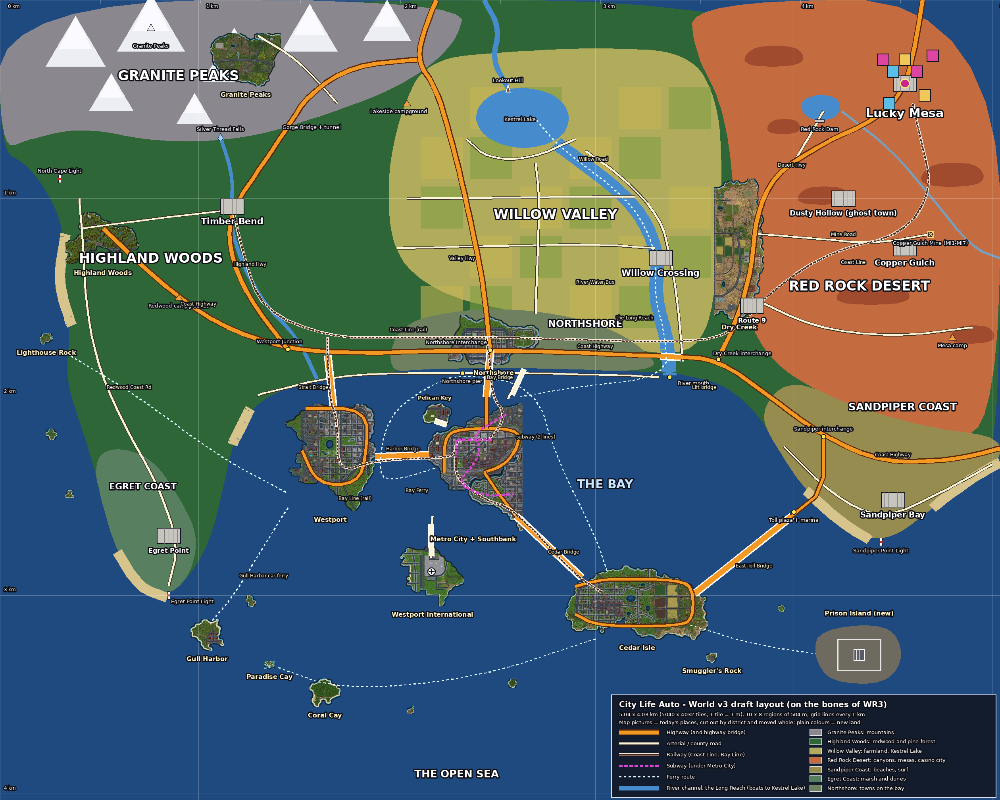

# World v3: the bigger world, on the bones of WR3

The owner (2026-10-10 07:35): "Can you list out every area and district and biome and everything we need included in
the world? Can you give me some prompts to use and what references to include to make this work? ... I like how the
islands connect better than how we have our current world i think the layout of the major arterial infrastructure
looks really good like this. Can we take a lot of the districts and layout we have now that looks good and keep the work
we've done blending things together but rebuild the entire highway and trains and ferry systems and subways and major
arterial roads and connect them similarly to this new world map? The new world map isn't perfect but I think the layout
and bones are there".

**The decision** (the coordinator's, told to the owner): keep every district, the blending between them and all the
generators (buildings, nature, places); rebuild the skeleton to WR3 (`docs/art-v2/targets/WR3_whole-world.png`) - the
highways and major arterials, the railway and subway lines, the ferry routes and the bridges, the islands set in a bay
round the river channel - and re-fit the districts into it. The mainland round the bay holds the new regions. Target
about 5 x 4 km (today 1312 x 1200 tiles, 1 tile = 1 m). Stage 1 is the engine: land generated and kept by region near the
player (client), the server running only the areas near players.

This document has four parts: **1 the inventory** (everything the world needs, marked *exists* / *moves* / *new*),
**2 the layout** (the draft map, `docs/world-v3-layout.png`, made by `tools/world-v3-layout.py`), **3 concept prompts** for
what is still missing, **4 the engine plan**.

Status marks used throughout:
- **exists** - in the game today and stays as it is (where it is relative to its island or region).
- **moves** - in the game today, kept whole (its generator, its blends, its places) and re-fitted to a new spot.
- **new** - not in the game yet.
- **rebuilt** - in the game today, but laid out again for the new skeleton (all the transport).



---

## Part 1 - The inventory

### 1.1 The frame

| | Today | World v3 |
|---|---|---|
| Size | 1312 x 1200 tiles (1.57 km²) | **5040 x 4032 tiles (5.04 x 4.03 km, 20.3 km², 13x today)** |
| Regions | - (one whole world) | 10 x 8 regions of 504 x 504 tiles (21 x 21 net chunks of 24) |
| Layout | islands in an open sea, joined by long bridges | a bay with the city's islands in it, the mainland round three sides, the open sea to the south |
| Land | ~0.9 km² | ~13 km² (mainland ~11, islands ~2) |

Why 5040 x 4032: it is about 5 x 4 km, a whole number of net chunks (210 x 168 of `CHUNK_TILES` 24) and of regions (10 x 8 of
504). The bay is about 2.4 km across; the mainland is a band about 1.8 km deep along the north with arms down the west
(about 1 km wide) and the east (about 1.2 km) - the WR3 shape.

### 1.2 The bay and its islands

The islands keep their shapes, districts, streets and blends; each moves whole (one offset per island, listed in part 2).
What changes is how they are joined: a bridge to every island (WR3), the ring highways tied into one Bay Ring.

| Place | Today | World v3 | Status |
|---|---|---|---|
| **Metro City** (the central island: Downtown, Midtown, Northgate, Civic Center, Arts District, Bayside Heights, Neon Strip, The Pink Mile, Old Town, Sunset Beach, Harbor, The Yards, Greenfield Park) | the middle of the map | the middle of the bay, as WR3's downtown island; its elevated Metro Ring kept | moves |
| **Southbank** (Pine Hills, Southside) | across the river from Metro City | stays joined to Metro City across its river (the two move as one) | moves |
| **Pelican Key** | off Sunset Beach | stays off Sunset Beach (moves with Metro City); Pelican Way bridge | moves |
| **Westport** (Westport Center, Old Quarter, Lakeview, Stadium District, West Hills, Port Westport) | the big west island | WR3's port island west of Metro City: the container port faces the west channel; Harbor Bridge east to Metro City, Strait Bridge north to the mainland | moves (without Highland Woods and the airport) |
| **Airport island** (Westport International) | Westport's south-west | its own island south of Metro City (WR3's airport island), the Airport Causeway to The Yards | moves |
| **Cedar Isle** (Cedar Falls, Falls Center, Lake District, Cedar Farms, South Port, Cedar Hills) | the south island | WR3's beach islands south-east of Metro City: Cedar Bridge (the red suspension bridge) from Southbank, the East Toll Bridge to the Sandpiper Coast | moves |
| **Smuggler's Rock** (the syndicate's) | a rock off Dry Creek | a rock at the bay's mouth, boat only | moves |
| **Prison Island** (J1-J4: walls, guard towers, cells, the yard, the pier) | - (cells are in police stations) | out at sea south-east of the bay mouth (WR3), reached by the prison boat only | **new** |
| **Gull Isles** (Gull Harbor, Coral Cay, Paradise Cay, Wreck Island, Seal Islets) | along the south edge | outside the bay mouth to the south-west and south, boat only (ferries) | moves |
| **Lighthouse Rock, The Islets** | small rocks | off the west coast, under the North Cape | moves |
| **The bay** (Liberty Bay, district 13) | the open water between islands | an enclosed bay: shallows along the shores, a deep fairway from the mouth to the river and the ports, the river mouth, the shark water outside the mouth | rebuilt |
| Beaches in the bay | Sunset Beach, Pelican Key, Cedar Isle's | kept; plus the mainland beaches (Sandpiper Coast, the west coast coves, Egret Point) | exists + new |
| Marinas and docks | Harbor marina, Port Westport, South Port, Westport Pier | kept; plus the toll-bridge marina (I4) and quays up the river | exists + new |

### 1.3 Every city district (`shared/map.js` DISTRICTS)

All 47 districts are kept. *Style* is the building/fill style, *tier* the wealth (peds, police, litter).

| id | District | Style / tier | Today on | World v3 | Status |
|---|---|---|---|---|---|
| 0 | Pine Hills | houses / suburb | Southbank | Southbank, with Metro City | moves |
| 1 | Midtown (the hero corner, Holly St x Madison St) | commercial / mid | Metro City | Metro City | moves |
| 2 | Northgate | apartments / mid | Metro City | Metro City (the Bay Bridge lands here) | moves |
| 3 | The Yards | industrial / rough, turf | Metro City | Metro City (Airport Causeway) | moves |
| 4 | Downtown | towers / lux | Metro City | Metro City | moves |
| 5 | Civic Center | civic / mid | Metro City | Metro City | moves |
| 6 | Southside | southside / rough, turf | Southbank | Southbank | moves |
| 7 | Neon Strip | nightlife / neon | Metro City | Metro City | moves |
| 8 | Harbor | harbor / industrial | Metro City | Metro City (Harbor Bridge, Bay Ferry) | moves |
| 9 | Dry Creek (farms) | rural / rural | Dry Creek island | the valley-desert border east of the river: Dry Creek moves whole and becomes where the farmland meets the desert (WR4) | moves |
| 10 | Sunset Beach | beach / mid | Metro City | Metro City | moves |
| 11 | Ironworks | factory / industrial | Metro City | Metro City | moves |
| 12 | Greenfield Park | park / mid | Metro City | Metro City | moves |
| 13 | Liberty Bay | water | the sea | the bay and the open sea | rebuilt |
| 14 | Pelican Key | beach / mid | Pelican Key | Pelican Key (off Sunset Beach) | moves |
| 15 | Smuggler's Rock | rocky / rough, turf | the rock | the bay mouth | moves |
| 16 | Bayside Heights | luxury / lux | Metro City | Metro City | moves |
| 17 | The Pink Mile | redlight / red | Metro City | Metro City | moves |
| 18 | Old Town | oldtown / low | Metro City | Metro City (Old Town Bridge to Northshore, the river water bus quay) | moves |
| 19 | Lighthouse Rock | wild | sea isle | off the west coast | moves |
| 20, 21 | The Islets | wild | sea isles | off the west coast | moves |
| 22 | Gull Isles (wild ground) | wild | Gull Isles | outer islands | moves |
| 23 | Westport Center | towers / lux | Westport | Westport island | moves |
| 24 | Lakeview | luxury / lux | Westport | Westport island | moves |
| 25 | Stadium District | commercial / mid | Westport | Westport island | moves |
| 26 | Port Westport | harbor / industrial, turf | Westport | Westport island (the port faces the west channel) | moves |
| 27 | Westport International | airport | Westport | the airport island | moves |
| 28 | West Hills | houses / suburb | Westport | Westport island | moves |
| 29 | Highland Woods | wild (redwood) | Westport (north) | the mainland: the heart of the Highland Woods region (west coast) | moves |
| 30 | Old Quarter | oldtown / low | Westport | Westport island | moves |
| 31 | Northshore | commercial / mid | Northshore island | the mainland's bay shore, north of Metro City (the Bay Bridge's north end) | moves |
| 32 | North Point | apartments / mid | Northshore island | with Northshore | moves |
| 33 | Granite Peaks | wild (mountain) | Northshore island | the mainland: the heart of the Granite Peaks region | moves |
| 34 | The Bluffs | luxury / lux | Northshore island | with Northshore, on the bay cliffs east of it | moves |
| 35 | Cedar Falls | houses / suburb | Cedar Isle | Cedar Isle | moves |
| 36 | Falls Center | commercial / mid | Cedar Isle | Cedar Isle | moves |
| 37 | Lake District | luxury / lux | Cedar Isle | Cedar Isle | moves |
| 38 | Cedar Farms | rural / rural | Cedar Isle | Cedar Isle (island farms; the big farmland is the new Willow Valley) | moves |
| 39 | South Port | harbor / industrial | Cedar Isle | Cedar Isle (Bay Ferry, Gull car ferry) | moves |
| 40 | Cedar Hills | wild (golf, hills) | Cedar Isle | Cedar Isle | moves |
| 41 | Dry Creek Desert | desert | Dry Creek island | with Dry Creek, the desert's west edge | moves |
| 42 | Dry Creek Airstrip | airport / rural | Dry Creek island | with Dry Creek | moves |
| 43 | Gull Harbor | beach / mid | Gull Isles | the outer islands (car ferry) | moves |
| 44 | Coral Cay | beach / mid | Gull Isles | the outer islands (water bus) | moves |
| 45 | Paradise Cay | wild (jungle) | Gull Isles | the outer islands (water bus) | moves |
| 46 | Arts District | arts / mid | Metro City | Metro City | moves |

New districts the regions need (each a new style for the generators, with blends to its neighbours):

| District | Style / tier | Where | Concepts | Status |
|---|---|---|---|---|
| Timber Bend | small town (logging, main street) / rural | Highland Woods, at the Highland Highway interchange | WR2-A, D15-A/B, HU2, WD1-WD3 | **new** |
| Willow Crossing | farm town (church, grain elevator, main street, weir) / rural | Willow Valley, on the river | WR2-C, D13, D13-B, NT1-D | **new** |
| Lucky Mesa: The Strip | casino resorts / lux + neon | Red Rock Desert, north-east | VG1, GM3, GM4 | **new** |
| Lucky Mesa: Old Downtown | the covered street of lights, pawn shops, motels / low + neon | Red Rock Desert | VG1, VG2 | **new** |
| Lucky Mesa: the side streets and suburbs | motels, wedding chapels, trailer parks, tract homes / low, suburb | Red Rock Desert | VG1, SC2-F, SC2-G | **new** |
| Copper Gulch | mining town (company houses, the assay office, the saloon) / rough | Red Rock Desert, by the mine | MI1, MI6, WR2-B | **new** |
| Dusty Hollow | ghost town (empty, wrecked) / wild | Red Rock Desert | WR2-B, NS1-C | **new** |
| Sandpiper Bay | beach town (surf shops, boardwalk, cottages) / mid | Sandpiper Coast | BE1-BE5, SR1-SR7, D10 | **new** |
| Egret Point | fishing village / low | Egret Coast (the west arm's tip) | NT1-F, N7, FS1 | **new** |
| The Bay Ring's toll plaza and marina | harbor / mid | the East Toll Bridge's east end | I4-A..E | **new** |

### 1.4 Today's places (they move with their district)

**Parks, lakes, airports, farm stands, villages** (`shared/islands.js`, `citylayout.js`): Greenfield Park, Lakeview Park
(and Lakeview Lake), Westport Stadium, Northshore Commons; Cedar Lake, Mirror Pond, Reed Pond, Heron Lake, Mirage Lake,
Summit Tarn; Westport International, Dry Creek Airstrip; Cedar Farms Market; Gull Harbor and Coral Cay villages; the homes
for sale in the wilds (cottages, farmhouses, the desert ranch); the concept scenes laid on wild ground (Cedar Hills Golf
Club, Red Rock Canyon, Paradise Cay). All **move**.

**Designed nature places** (`shared/naturesites.js`, each a scene from the concepts; 45 today): Redwood Creek and
Redwood Creek Falls, Redwood Creek Trapper's Cabin, Giants Loop, Fern Gorge, Redwood Cove, Pine Lake (Highland Woods);
Summit Tarn and its falls, Granite Hot Springs, Granite Cove, Old Granite Mine, Ridge Fire Lookout, Ridge Trail Hunting
Camp, The Sentinel Stones (Granite Peaks); Northshore Botanical Gardens, Bluffs Maze Garden, North Point Courts
(Northshore); Willow River, Willow River Falls, Willow Lake, Willow River Pasture, Orchard and Vineyard, Dry Creek Farm
Co-op Pasture, Red Rock Wash, Canyon Oasis, Mirage Camp, Dry Creek Boneyard, Old Mission Ruins, Dry Creek Balloon Field,
Canyon Track Hunting Camp, Route 9 and its airstrip, Splash Canyon Water Park (Dry Creek); Cedar Creek and Cedar Creek
Falls, Heron Marsh and its Trapper's Cabin, Cedar Point Lavender, Cedar Farms Market Pasture, Cedar Hills Golf Club,
Cedar Farms Game Butcher, Driftwood Point (Cedar Isle); Lighthouse Tidepools (Lighthouse Rock), Wreck Island, Seal
Islets (The Islets); Bonfire Beach (Gull Harbor), Coral Cay Falls and Coral Cay Rainforest (Coral Cay); Old Town Market
(Metro City), Lakeview Park, Stadium Lido, Westport Pier (Westport). All **move** with their district. Dry Creek's own
small Willow River (with its falls, lake, orchard and vineyard) moves with Dry Creek and, in v3, runs west into the new
river channel (the Long Reach) at Willow Crossing.

**Country sites** (`shared/countryside.js` SITES): Pine Ridge Campground, Highland roadside stop, Highland Radio Mast
(Highland Woods); Granite Quarry (and its assay office), Granite Peak Observatory, Granite Cove Campground, Windy Point
Wind Farm, North Ridge Mast (Granite Peaks); Dry Creek Oil Field, Sunfield Solar Farm, Starlite Drive-In, Route 9 stop,
Mesa Radio Mast, Dry Creek Wind Farm, The Rusty Spur (Dry Creek); Cedar Hills Campground, Cedar Point Wind Farm (Cedar
Isle); Westport Raceway; the power lines and the runway lights. They **move** with their district, but each one finds its
own open ground near its spot when the roads are laid, so they can take a new spot in a new region as easily: Windy Point
Wind Farm and the Westport Raceway fit the new mainland better (the raceway went with the airport's open ground - in v3 it
needs a spot on the Egret Coast or in the valley).

**Points of interest and venues** in today's world (`m.pois`, `m.venues`; counted from `generateCity`, see 4.2):
606 points of interest in 51 kinds: 166 homes, 109 ATMs, 108 delivery drops, 35 convenience stores, 21 clothing
stores, 13 clubs, 12 rail stations, 11 gun shops, 11 vending spots, 9 banks, 8 coffee shops, 8 tackle shops, 7 hospitals
(and their receptions), 7 paint shops, 7 rentals, 5 police stations (and their evidence rooms), 5 barbers, 5 gas stations,
3 pharmacies, 3 snack bars, 3 rides, 3 race starts, 2 fish markets, 2 gang hideouts, 2 farms, 2 airports, 2 markets, 2
hunting camps, 2 trappers, and one each of the courthouse, marina, garage, fence, sports store, hardware store, grocery,
pawn shop, dealer, warehouse, assay office, roadhouse (the Rusty Spur), lodge, winery, fruit stand, salvage yard, farm
stand, clubhouse, butcher, charter and smuggler. 4 venues (2 beach volleyball courts, 2 soccer pitches), 45 designed
nature places, 861 buildings, 29,861 props, 1,234 road edges (63 highway, 51 frontage, 223 avenue, 13 boulevard, 320
street, 116 alley, 49 minor, 91 drive, 14 ramp, 208 arterial, 58 rural, 28 dirt).

They all belong to buildings and lots inside districts and move with them. The mainland's new towns need their own: each
new town gets the basics (a gas station, a convenience store, a diner or bar, a clinic or the sheriff, a bus stop), and the
regions get the special ones listed below.

### 1.5 The new mainland regions

Coordinates are World v3 tiles (x east, y south); see the layout picture. Each region lists what it holds from the
biggest roads down to the trails.

**R1 Granite Peaks** (the north-west mountains, about 2.3 x 0.7 km; WR3's snow peaks; WR2-A, NA1-B, N5, NR1-D, SC3-G)
- Moves in: Granite Peaks (district 33) with Pine Lake, Summit Tarn and its falls, Granite Hot Springs, Old Granite Mine,
  Granite Quarry and its assay office, the observatory, Ridge Fire Lookout, North Ridge Mast, Granite Cove Campground.
- Roads: the Highland Highway over the pass (a tunnel through the ridge and a bridge over the gorge, WR1 view 2); the
  Valley Highway's north end meeting it at the pass; Peak Road up to the observatory; switchback mountain roads on stone
  walls (NT1-C); jeep tracks to the quarry; trails up the granite, cairns, a summit trail.
- New: a mountain lodge on a lake (SC3-G, NT1-C), the ranger station, a ski-less alpine meadow with a stone hut (NS1-D),
  snowfields on the high peaks (white ground, no snow system yet), twin falls off the granite (NA1-B), cliff faces in
  layers with ledges (EL1), a mountain lake boat ramp.
- Activities: hunting (elk, mountain goats, bears, cougars), mining (the old mine, the quarry), fishing (lakes), hot
  springs, camping, hiking, the lookout, off-road.

**R2 Highland Woods** (the west coast forest, about 1.6 x 1.3 km; WR3's forest with lighthouses and the waterfall; NA1-A,
N1-A..E, D15-A/B, NT1-A, NT1-E, SC3-A..C, HU1-HU7)
- Moves in: Highland Woods (district 29) with Redwood Creek and its falls, Giants Loop, Fern Gorge, Redwood Cove, the
  hunting camp, Pine Ridge Campground, the Highland stop and mast.
- New town: **Timber Bend** at the Highland Highway interchange (main street, sawmill and log yard, the hunting lodge and
  butcher (HU2), a motel, a gas station and diner, the Coast Line's west terminus).
- Roads: the Coast Highway along the bay; the Highland Highway north through the forest; the Redwood Coast Road down the
  cliffs (SC3-B, NT1-E: guard rails, culverts spilling to coves, sea stacks); Timber Road; logging roads (dirt); trails
  with trailheads, log steps, footbridges.
- New landmarks: **Silver Thread Falls** (WR3's big waterfall, SC3-A/NR1-E basalt columns, a viewing platform), **North
  Cape Light** (a lighthouse on the headland, N8-B tidepools below), the coves and sea stacks of the west coast, a beaver
  pond (HU4), a hunting camp in autumn (HU5), a lake with a boathouse and islands (WR2-A, NA1-A).
- Activities: hunting, felling (WD1-WD3), foraging, fishing (creeks, the coast), camping, the coast drive, surfing coves.

**R3 Egret Coast** (the west arm, about 0.7 x 1 km; marsh and dunes; N7, NK1-D, NK1-O, E3e)
- New: **Egret Point** fishing village at the arm's tip (piers, a fish market, the Gull Harbor car ferry's mainland
  pier), **Egret Point Light**, a salt marsh with boardwalks (NK1-O), dunes with board ramps down to the beach (EL1), duck
  blinds, the Westport Raceway's new spot (open flat ground).
- Roads: the Redwood Coast Road's south end; marsh boardwalks and dirt tracks.
- Activities: duck and goose hunting, fishing, crabbing, birding, beachcombing, the raceway.

**R4 Northshore** (the bay's north shore, about 1.4 x 0.3 km)
- Moves in: Northshore, North Point and The Bluffs (districts 31, 32, 34) with Northshore Commons, the Botanical Gardens,
  the Maze Garden, North Point Courts.
- New: the Northshore interchange (Coast Highway x Valley Highway, H1 concept), Northshore station (the Coast Line meets
  the Bay Line), the Bay Ferry pier, Shore Road along the water, the suburbs thinning into fields (WR4 panel 1).

**R5 Willow Valley** (the middle, about 1.6 x 1.5 km; WR3's farmland and the lake with the lookout; WR2-C, NA1-D, D13,
D13-B, SC3-E, NT1-D, FA1)
- New town: **Willow Crossing** on the Long Reach, where Dry Creek's Willow River joins it (church, grain elevator, the farm co-op, feed store (ST2), a diner, the
  farmers' market (D13-B), the weir and the river water bus quay).
- **Kestrel Lake** (WR3's lake, about 500 x 300 m): the river channel ends here; a lookout on **Lookout Hill** (WR3's
  binoculars), a lakeside campground, a boathouse and rentals, fishing docks, an island.
- Roads: the Valley Highway north up the valley; a section grid of county roads every 250 m (Section Roads, County Road
  7); Willow Road along the river; Lake Road; farm tracks between fields; a truck stop with big rigs and silos (WR1 view 3).
- Farms: wheat, corn, lavender, sunflower, pumpkin fields (FA1), orchards and a vineyard with a villa on the hill (NA1-D),
  pastures with cows and horses, red barns and farmsteads with silos (B7, NS1-E), windmill pumps and ponds, irrigation
  ditches and culverts (SC3-E), power lines.
- Activities: farm work (harvest, plant, deliver - DESIGN-NOTES "Farm work"), the farmers' market, fishing (lake, river),
  boating up the river, quail and pheasant hunting, a county fair ground (later), the race track (GM6 Riverside Downs fits
  here, on the river).

**R6 Red Rock Desert** (the north-east, about 1.6 x 2.2 km; WR3's red rock, casino city and mine; WR2-B, NA1-C, N4,
D14, VG1, VG2, MI1-MI7, SC3-F, WR1 view 1)
- Moves in: Dry Creek (districts 9, 41, 42) whole, at the desert's west edge where the farmland meets it - its fields
  face the valley, its desert faces east - with its airstrip, Route 9, the Rusty Spur, the oil field, the solar and wind
  farms, the drive-in, Red Rock Wash, Canyon Oasis, Mirage Lake and Camp, the Sentinel Stones, the boneyard, the mission
  ruins, the balloon field, Splash Canyon Water Park.
- New city: **Lucky Mesa**, the casino city (VG1): the Strip of themed resorts with invented names and looks (a
  lotus-crowned tower, a domed palace, a pyramid with a beam, glass towers), the fountain show, wedding chapels, the old
  downtown's covered street of lights, motels and pawn shops on the side streets, the welcome sign on the highway, the
  syndicate's back rooms (VG2: the counting room, the boss's office, the supper club), a small airport for jets.
- New: **Copper Gulch** mining town and **Copper Gulch Mine** (WR3's mine: the canyon adit MI1, the open pit MI6, the
  underground river MI4 beneath - the cave world of `shared/underground.js` grows here), **Dusty Hollow** ghost town
  (WR2-B), **Red Rock Dam** and its reservoir with the dry wash below (WR2-B), a lookout tower on a mesa, the sheriff's
  post, a gas station and diner, a motel with a pool and billboards (WR1 view 1), the natural arch, mesas and hoodoos
  (NR1-B), a desert camp with pickups and string lights (N11).
- Roads: the Desert Highway (two lanes, long straights) from the Dry Creek interchange to Lucky Mesa; Route 9 (the old
  road east); Mine Road; Canyon Road to the dam; jeep tracks to the mesas (NT1-B); dirt bike trails.
- Activities: the casino games (GM3, GM4), the syndicate's jobs, mining, off-road and dirt bikes, the desert races,
  hunting (coyotes, quail), the drive-in, the balloon field.

**R7 Sandpiper Coast** (the east arm, about 1.2 x 0.8 km; WR3's east beaches and lighthouse; BE1-BE5, SR1-SR7, N8-D,
NT1-E, WR4 panel 3)
- New town: **Sandpiper Bay** (the boardwalk and pier (BE2), the surf shop (SR7), cottages and beach houses, the
  campground).
- New: **Sandpiper Point Light**, the surf point with its contest scaffold (SR1, SR5), public beaches with lifeguard
  towers (BE1), the toll plaza and marina at the East Toll Bridge (I4), the Sandpiper interchange.
- Roads: the Coast Highway's east end; Sandpiper Drive along the beaches; beach car parks with stairs down (WR1 view 4).
- Activities: surfing, the beach, fishing off the pier, boating from the marina, the boardwalk arcade.

**R8 The open sea and the outer islands** (south of the bay mouth)
- Moves: the Gull Isles, Lighthouse Rock, The Islets, Smuggler's Rock (see 1.2). New: Prison Island; whales spouting,
  a shipwreck, sea arches (NA1-F); sharks keep to the open sea (DESIGN-NOTES "Sharks").

**Region borders** (WR4): every border is a blend, as between today's districts: the city thinning into farms and
fields (Northshore to Willow Valley); forest thinning into red rock along the highway with a creek and a fire lookout
(Willow Valley's east and Highland Woods' north to the desert and the mountains); the coast meeting the forest with a
lighthouse, a cove and a campground (Highland Woods' west coast). New ones to draw: farmland to desert (Dry Creek's own
border, kept), mountains to forest (the tree line), marsh to forest (Egret Coast), beach town to desert (Sandpiper to
Red Rock).

### 1.6 Biomes, plants and wildlife

The terrain classes today (`map.js` terrainAt / wildBiome): water, grassland, forest, desert, mountain, beach; Highland
Woods is redwood throughout; the habitat tags the wildlife uses (`shared/fauna.js`, `server/systems/wildlife.js`
habitatAt): redwood, forest, meadow, farm, scrub, desert, mountain, cliff, lake, marsh.

| Biome | Where in v3 | Plants (exists in `client/art2/game/statics.js` SPECIES; new from E3a-f, NK1-M) | Wildlife (`shared/fauna.js`) | Status |
|---|---|---|---|---|
| Redwood forest | Highland Woods | giant redwoods (giantL, giant, giantS, redwood2), ferns (fern, fernR), berry shrubs; new: sorrel, moss carpets, fallen logs (NS1-A) | deer, elk, black bear, cougar, bobcat, grey fox, raccoon, squirrel, turkey | exists, grows |
| Pine and oak forest | Highland Woods' edges, the valley's hills | fir, mountain pine, young trees, maple (autumn); new: oak, birch, twisted pine (NK1-M) | deer, boar, black bear, bobcat, red fox, rabbit, squirrel, turkey | exists, grows |
| Mountain and alpine | Granite Peaks | mountain pine, fir; new: alpine flowers, dwarf shrubs, snowfields (E3f) | mountain goat, elk, grizzly, cougar, moose (lakes) | exists, grows |
| Meadow and grassland | the valley's edges, the sea isles | daisies, tulips, dry grass, sunflowers; new: wildflower meadows | deer, rabbit, quail, pheasant, coyote, red fox | exists |
| Farmland | Willow Valley, Dry Creek, Cedar Farms | crops in fields, apple orchard, hedges, sunflowers; new: vineyard, lavender, corn (FA1, E3e) | boar, rabbit, pheasant, quail, coyote, geese | exists, grows |
| Lake, river and marsh | Kestrel Lake, the river channel, Egret Coast | reeds, cattails, willows (E3e, NK1-D/O) | moose, beaver, otter, duck, goose, heron (new), fish | exists, grows |
| Desert and canyon | Red Rock Desert | mesquite, creosote, ocotillo, dry grass; new: saguaro-like and barrel cacti, prickly pear, palo verde, joshua-like trees, agave (E3c) | coyote, quail, rattlesnake (new), roadrunner (new), hawk (new) | exists, grows |
| Beach and dunes | every coast | coconut and small palms, dune grass, hibiscus | gulls, crabs (new), sea otter, seals (new) | exists |
| Tropical jungle | Paradise Cay, Coral Cay | palms, banana, flowering trees (E3d, NS1-G) | parrots (new), fish in the reef | exists |
| City green | the towns | street trees, young trees, hedges, flower beds | dogs, cats, pigeons, squirrels, raccoons | exists |
| Sea | the bay and the open sea | kelp (new) | sharks, fish schools, dolphins, whales (new, NA1-F) | exists, grows |
| Underground | under the cities and the desert | glowing mushrooms (MI4) | bats, spiders, bears asleep (MI5) | exists (sewers, the cave), grows |

The wildlife already has the habitats; the new regions only need their habitat tags painted. New species worth adding:
rattlesnake, roadrunner, hawk, heron, seals, crabs, parrots, whales.

### 1.7 The transport skeleton (all rebuilt)

**Highways** (two lanes each way, grade-separated; WR1, H1, H2):
- **Coast Highway** - the backbone: from Highland Woods along the bay's north shore, over the river mouth on a lift
  bridge, round the east arm to Sandpiper Bay. *new* (replaces today's island-to-island highways).
- **Highland Highway** - from Westport Junction north through the forest (curves, a tunnel, the gorge bridge) to the pass.
  *new*
- **Valley Highway** - from the Bay Bridge north up Willow Valley, along the lake, to the pass. *new*
- **Desert Highway** - from the Dry Creek interchange north-east to Lucky Mesa (today's name, a new road). *rebuilt*
- **The Bay Ring** - the island highways tied into one loop: Strait Bridge - Westport Beltway - Harbor Bridge - the Metro
  Ring - Southbank - Cedar Bridge - Cedar Isle Loop - East Toll Bridge - the Coast Highway. The three ring roads exist
  today (Westport Beltway, Metro Ring with its frontage roads, Cedar Isle Loop); the links between them are new. *rebuilt*
- **Interchanges**: Northshore (Coast x Valley, a cloverleaf), Westport Junction (Coast x Highland x Strait Bridge),
  Dry Creek (Coast x Desert), Sandpiper (Coast x the Bay Ring), Timber Bend (a diamond), the Metro Ring's ramps (exist).

**Bridges** (WR3: a bridge to every island):

| Bridge | Joins | Kind | Status |
|---|---|---|---|
| Bay Bridge | Metro City (Northgate) - Northshore | highway, rail deck for the Bay Line | rebuilt (today's name) |
| Old Town Bridge | Old Town - Northshore east | arterial | new |
| Strait Bridge | Westport - the mainland (Westport Junction) | highway and rail | rebuilt (today's name) |
| Harbor Bridge | Metro City (Harbor) - Westport | highway and rail | new |
| Pelican Way | Sunset Beach - Pelican Key | street | exists (moves) |
| Airport Causeway | The Yards - the airport island | arterial | new |
| Cedar Bridge | Southbank - Cedar Isle | the red suspension bridge, highway and rail | rebuilt (today's name) |
| East Toll Bridge | Cedar Isle - Sandpiper Coast | highway with a toll plaza and marina (I4) | new |
| River Lift Bridge, rail swing bridge | the Coast Highway and the Coast Line over the river mouth | lift / swing spans that open for boats | new |
| River bridges inland | Willow Crossing, the farm roads | stone and steel road bridges, fords on dirt roads (NK1-A) | new |
| Gorge Bridge, the tunnel | the Highland Highway | a high bridge over the gorge, a tunnel through the ridge (WR1) | new |

**Arterials and county roads**: Shore Road (the bay's north shore), the Redwood Coast Road (west cliffs), Willow Road
(the river), Lake Road, the valley's section grid, Timber Road, Peak Road (exists, moves), Route 9 (exists, moves),
Mine Road, Canyon Road, Sandpiper Drive; inside the islands today's avenues and boulevards (exist, move). Below them:
streets (the towns), lanes, alleys, dirt roads and jeep tracks, trails (`shared/roads.js` ROAD_KINDS: the hierarchy holds,
a dirt track never meets a highway).

**Railway** (WR3: along the coast). Today one loop round the whole map with 12 stations (West Hills, Westport Center,
Granite Peaks, Northshore, Old Town, Dry Creek, Southside, Civic Center, Downtown, Midtown, The Yards, Cedar Falls), under
the core in a tunnel. In v3, two lines:
- **Coast Line** (new): Timber Bend - Westport Junction - Northshore - (swing bridge) - Dry Creek - Copper Gulch (the mine's
  freight yard) - Lucky Mesa. Passenger trains and freight (ore, grain, logs: cargo for the open-cargo system).
- **Bay Line** (rebuilt): a loop through the islands - Northshore - Bay Bridge - Old Town - (tunnel) Civic Center, Downtown,
  Midtown - Harbor Bridge - Westport Center - West Hills - Strait Bridge - Westport Junction - Northshore; a spur from
  Midtown through The Yards and Southside over the Cedar Bridge to Cedar Falls. Today's stations keep their names and
  districts.

**Subway** (SU1-SU6, SU5-B): today the railway's tunnel under the core (stations Civic Center, Downtown, Midtown, reached
by kiosks on plazas). In v3: the Bay Line's tunnel (kept) plus a **north-south line** under Metro City: Old Town -
Northgate - Downtown - Neon Strip - The Yards - Pine Hills - Southside (new). Mostly single track with passing places
(the owner, SU6), one level down (SU5).

**Ferries** (`server/systems/ferries.js` finds its routes from the map, so they follow the islands):
- Gull Harbor Ferry (car ferry), Coral Cay, Paradise Cay and Lighthouse Rock water buses - exist, re-routed from the new
  piers (Egret Point, Port Westport, South Port).
- **Bay Ferry** (new): the walk-on commuter loop - Metro City Harbor, Westport, Northshore pier, South Port (FE1).
- **River Water Bus** (new): Old Town quay - up the river channel - Willow Crossing - Kestrel Lake.
- **Prison Boat** (new): the police dock at South Port - Prison Island (custody only).

**Buses** (`server/systems/transit.js`: lines worked out from the bus shelters, one per town zone): Metro Loop,
Southside, Westport, Northshore, Cedar Isle, East (Dry Creek), Key and Gull lines - exist, follow their towns. New:
lines in Timber Bend, Willow Crossing, Lucky Mesa (the Strip shuttle), Sandpiper Bay; **intercity coaches** on the
highways (Metro City - Lucky Mesa, Metro City - Timber Bend - Willow Crossing).

**Air**: Westport International (moves to its island), Dry Creek Airstrip (moves), Lucky Mesa's airport (new),
helipads at the hospitals and police HQ (exist).

**The river channel, the Long Reach** (new; W1, NK1-E/N, SC3-D): from the bay's north-east corner up between the farmland and the
desert to Kestrel Lake, about 2 km, 50-80 m wide, deep enough for boats the whole way (a navigable fairway, quays at Old
Town and Willow Crossing, the lift bridge at the mouth); above the lake the upper river (Kestrel Creek) comes down from the
mountains with rapids and falls (not navigable). Creeks feed it (Silver Thread Creek from the waterfall). Generated
by the water generator (`WORLD-V2.md` "Water"; `client/art2/rivergen.js`) along a fixed course.

### 1.8 Systems tied to places

| System | Places it needs in v3 | Status |
|---|---|---|
| Respawn (hospitals, clinics, home) | spread evenly: today's in the islands, plus a clinic in each new town | exists + new places |
| Police (stations, cells, motor pools), the law | today's stations; a sheriff in each new region; Prison Island for long sentences | exists + new |
| Gangs and turf (`isTurf`, turf districts) | today's turf (The Yards, Southside, Port Westport, Smuggler's Rock); the syndicate in Lucky Mesa; the biker clubs on the Desert Highway (MC1-MC5) | exists + new |
| Bounties (BO1) | the bounty office; targets roam the regions | exists |
| Trains (`trains.js`), robbery of the mail car | the two lines, their stations and crossings | rebuilt |
| Buses, taxis, rideshare (`transit.js`) | the towns' shelters; intercity coaches | exists + new |
| Ferries (`ferries.js`) | piers on every island | exists, re-routed + new routes |
| Boats, the marina, boat rentals | the bay, the river channel, the lake | exists + new water |
| Fishing (FS1, FS2) | piers, the river, the lake, the sea (harbour and sea, river, lake and pond fish) | exists, more water |
| Hunting (`hunting.js`, HU1-HU7), wildlife | the wild regions by habitat; hunting camps, butchers, the lodge | exists, much more ground |
| Foraging, felling (WD1-WD3) | forests, beaches, tide pools | exists |
| Mining (`underground.js`, MI1-MI7) | the old mine and the quarry (move), Copper Gulch Mine and the open pit (new) | exists + new |
| Farming (FA1-FA3), farm work | Willow Valley, Dry Creek, Cedar Farms; the markets and the co-op | exists + new ground |
| Campfires and campsites (`campfires.js`, CF2) | campgrounds, beaches, secluded spots | exists + new |
| Gambling (GM1-GM11): casino, cards, dice, cockfights, the races | Lucky Mesa (new), today's back rooms, a race track (new) | new places |
| Surfing (SR1-SR7), the beaches (BE1-BE5) | Sandpiper Coast (new), today's beaches | new |
| Golf (GO1-GO3) | Cedar Hills (moves) | exists |
| Water park (WP1), the arcade (AC1-AC7), pools and baths (L1-L9) | Splash Canyon (moves), the boardwalks | exists |
| Homes and properties (DESIGN-NOTES) | every tier in every region: cabins, farmhouses, lake houses, desert ranches, beach houses, the casino penthouse | exists + new |
| Contraband (X1) | grow rooms, the shady buyers, tide pools for the star | exists |
| Weather and day/night | every region (fog on the coast, heat in the desert later) | exists |
| The map, the phone's transit app, the respawn map (U7, U12) | a 5 km world: zoom levels, region tiles | rebuilt (part 4) |

---

## Part 2 - The layout

`docs/world-v3-layout.png` (2520 x 2016, 1 px = 2 m, grid lines every 1 km; made by `tools/world-v3-layout.py` from
today's world map picture and today's district grid). Today's places are cut out of the world map picture district by
district and moved whole; the plain colours are new land. It is a plan to OK, not the game: the coastlines and roads are
hand-placed lines.

What it shows:
- **The bay** (about 2.4 x 1.6 km) with **Metro City** (and Southbank and Pelican Key) in the middle, **Westport** to the
  west with its port on the west channel, the **airport island** south of Metro City, **Cedar Isle** to the south-east,
  **Smuggler's Rock** at the mouth, **Prison Island** out at sea, the **Gull Isles** outside the mouth to the south-west,
  **Lighthouse Rock** and **The Islets** off the west coast.
- **The mainland** round three sides: Granite Peaks (north-west), Highland Woods (west), Egret Coast (the west arm),
  Northshore (the bay's north shore, with Northshore, North Point and The Bluffs moved there), Willow Valley (the middle,
  the lake and the river), the Red Rock Desert (north-east, with Dry Creek moved whole to its west edge, Lucky Mesa, Copper
  Gulch, Dusty Hollow, the dam), the Sandpiper Coast (the east arm).
- **The skeleton**: the four highways and the Bay Ring with its bridges, the arterials, the Coast Line and the Bay Line,
  the subway under Metro City, the ferry routes, the river channel.

Where today's places go (World v3 tile = today's tile + offset):

| Place | Today (tiles) | World v3 (tiles) | Offset |
|---|---|---|---|
| Metro City + Southbank + Pelican Key | 542..1045, 301..947 | 2133..2636, 2030..2676 | +1591, +1729 |
| Westport (without the airport and Highland Woods) | 34..497, 237..778 | 1434..1897, 2037..2578 | +1400, +1800 |
| Westport International (the airport island) | 68..390, 614..917 | 2018..2340, 2754..3057 | +1950, +2140 |
| Cedar Isle | 270..991, 784..1158 | 2850..3571, 2850..3224 | +2580, +2066 |
| Northshore, North Point, The Bluffs | 748..1207, 29..279 | 2258..2717, 1589..1839 | +1510, +1560 |
| Highland Woods | 31..404, 71..334 | 331..704, 1071..1334 | +300, +1000 |
| Granite Peaks | 459..818, 17..287 | 1059..1418, 167..437 | +600, +150 |
| Dry Creek (farms, desert, airstrip) | 1045..1297, 251..959 | 3600..3852, 900..1608 | +2555, +649 |
| Gull Harbor | 40..209, 939..1100 | 960..1129, 3120..3281 | +920, +2181 |
| Coral Cay | 1040..1197, 997..1142 | 1560..1717, 3420..3565 | +520, +2423 |
| Paradise Cay | 465..520, 660..701 | 1330..1385, 3330..3371 | +865, +2670 |
| Lighthouse Rock | 274..341, 41..98 | 200..267, 1680..1737 | -74, +1639 |
| Smuggler's Rock | 1205..1259, 953..1004 | 3560..3614, 3290..3341 | +2355, +2337 |
| The Islets (the six biggest) | scattered | round the bay's mouth and the west coast | one each |

Every island moves whole, so its streets, blends, nature places and country sites come out as today (each generator
runs inside the island's new rectangle - part 4). What it touches at its edges changes: the bridges land in new places
and the island ring highways join the Bay Ring.

Things for the owner to decide:
1. **Westport's port faces the open west channel** (moving it whole keeps it on its west side, as in WR3's port island
   with its cranes on the west). Alternatively mirror Westport so the port faces Metro City across the bay (a mirror is
   a regeneration, not a move: its streets come out differently).
2. **Cedar Isle keeps its farms** (Cedar Farms) as island farms; the big farmland is the new valley. Or Cedar Farms
   moves to the valley and Cedar Isle becomes the beach and golf island.
3. **Dry Creek moves whole** to be the border where farms meet desert. Or it splits: its farms into the valley, its
   desert and airstrip into the Red Rock Desert.
4. **The size**: 5 x 4 km is 13 times today's area, mostly wild land. The regions can start smaller (the mainland only as
   deep as the lake: about 5 x 3 km) and grow north later, since regions are generated on their own (part 4).
5. **Names**: Lucky Mesa, Copper Gulch, Dusty Hollow, Timber Bend, Willow Crossing, Sandpiper Bay, Egret Point, Silver
   Thread Falls - all invented; change any.

---

## Part 3 - Concept prompts for what's still missing

In the style of the concept prompt pack: paste the style anchor, then the prompt, then the pack's reference line, and
attach the listed images. Adults only; invented names; no readable text (signs show plain shapes). New IDs carry on from
the existing ones (WR, VG, RV, BA, RL, HX, TW, PR, SE, MP).

**WR3-B - The whole world, redrawn from the plan (landscape)**
Attach: `docs/world-v3-layout.png`, WR3_whole-world.png, R1-A_hero-golden.png, R1-D_palette-materials.png

```text
[paste the style anchor]

A finished illustrated world map of the whole game world seen from high above in the game's style, the same composition as the attached plan (follow the plan's layout exactly: where every island, coast, region, road, railway, bridge and river is): a big bay in the middle with a downtown island of glass towers and old brick ringed by an elevated highway, an industrial port island with cranes and container ships to its west, an airport island to its south, a beach and golf island to its south-east, all joined by bridges - a red suspension bridge, long low causeways, a toll bridge with a marina; a fortress prison island out at sea; small jungle and rocky islands outside the bay's mouth with ferries crossing to them. The mainland wraps round the bay: snow-capped granite mountains in the north-west, a redwood forest down the west coast with two lighthouses on the headlands and a tall waterfall, a marsh and dunes on the west arm, suburbs along the bay's north shore, a farm valley in the middle with patchwork fields, a red barn town, a big lake with a lookout hill, a river channel winding from the bay up to the lake with boats on it, a red-rock desert in the north-east with mesas, a casino city glowing with neon shapes, a mining town and an open pit, a dam and a reservoir, and a beach town with a surf point on the east arm. A railway runs along the bay's north shore and over a swing bridge at the river's mouth. Small round icons mark the places of interest. Golden late-afternoon light, clouds only at the corners.
```

**WR2-D - Highland Woods, the west coast region (landscape)**
Attach: WR2-A_region-forest-mountains.png, NA1-A_highland-woods.png, NT1-E_coast-roads.png, SC3-B_redwood-coast-road-rain.png, WR4_region-borders.png

```text
[paste the style anchor]

A zoomed-out planning view of one region, about 1.6 by 1.3 kilometres, in the game's style, like a detailed illustrated map in the game's colours and camera: a redwood forest running down to a rocky west coast. A two-lane coast road on the cliffs with timber guard rails, culverts spilling waterfalls into coves, sea stacks in white surf; a highway climbing inland through the trees to a small logging town at an interchange (a main street, a sawmill and log yard, a hunting lodge with antlers over the door, a motel, a gas station and diner, a little railway station at the end of the line); logging roads and dirt tracks; hiking trails with a trailhead car park and log steps; a tall waterfall over dark basalt columns with a viewing platform; a creek running from it to the sea; a lighthouse and its keeper's house on a headland with tide pools below; a beaver pond; a lake with a boathouse; campgrounds; a hunting camp of wall tents; giant red trunks everywhere. Points of interest marked by small round icons.
```

**WR2-E - Granite Peaks, the mountains (landscape)**
Attach: WR2-A_region-forest-mountains.png, NA1-B_granite-peaks.png, N5_mountains.png, SC3-G_mountain-lake-dawn.png, NT1-C_mountain-roads.png, NR1-D_alpine-rocks.png

```text
[paste the style anchor]

A zoomed-out planning view of a mountain region, about 2 by 0.8 kilometres, in the game's style and camera: granite peaks with snow on the summits and snowfields in the gullies, layered cliff faces with ledges, pine forest below the tree line thinning to alpine meadows. A highway crossing the range over a pass: switchbacks on stone retaining walls, a tunnel through a ridge, a high bridge over a gorge with a river far below. A mountain lake with a log lodge, its car park, a boat ramp and a dock; twin waterfalls off the granite; a hot spring steaming among rocks; an old mine adit with an ore cart; a quarry with terraces; an observatory dome on a ridge; a fire lookout tower; a ranger station; a stone hut in a meadow; trails with cairns up to the summits; a campground by a tarn. Points of interest marked by small round icons.
```

**WR2-F - Willow Valley, the farmland and the lake (landscape)**
Attach: WR2-C_region-farm-valley.png, NA1-D_cedar-farms-willow-river.png, SC3-E_wheat-county-road.png, NT1-D_farmland-roads.png, D13-B_farm-work.png

```text
[paste the style anchor]

A zoomed-out planning view of a farm valley, about 1.6 by 1.5 kilometres, in the game's style and camera: a patchwork of fields on a grid of county roads every 250 metres - wheat, corn, lavender, sunflowers, pumpkins, an orchard, a vineyard climbing a hill to a villa - pastures with cows and horses, red barns and farmsteads with silos, windmill pumps and ponds, irrigation ditches with small culvert bridges, power poles along the roads. A small farm town on a river: a white church, a grain elevator by a railway siding, a main street with a diner, a feed store and a co-op, a farmers' market. The river is wide and slow, with a weir beside a lock, a quay where a small passenger boat ties up, and it opens into a big lake with an island, a boathouse, fishing docks and a lakeside campground; a hill with a lookout over the lake. A highway runs up the valley past a truck stop with big rigs. Points of interest marked by small round icons.
```

**WR2-G - The Red Rock Desert, the mine and the ghost town (landscape)**
Attach: WR2-B_region-desert-canyon.png, NA1-C_dry-creek-desert.png, MI1_canyon-cave-mouth.png, MI6_open-pit-mining.png, SC3-F_desert-dry-wash.png

```text
[paste the style anchor]

A zoomed-out planning view of a red-rock desert region, about 1.6 by 1.4 kilometres, in the game's style and camera: mesas, buttes, hoodoos and a natural arch, a canyon with a dry wash. A long straight two-lane highway with heat shimmer, a gas station and diner, a motel with a pool and billboards with plain shapes. A mining town in a gulch: company houses, an assay office, a saloon, a water tower, a railway yard with ore cars; above it an open-pit mine with terraces and a haul road switching back down, an excavator and dump trucks, a crusher and conveyor, and a timbered adit into the canyon wall. A ghost town of empty wooden buildings with fallen porches. A concrete dam holding a blue reservoir, the dry riverbed below it. A lookout tower on a mesa, a sheriff's post, jeep tracks and dirt bike trails, a desert camp with pickups and string lights. Points of interest marked by small round icons.
```

**WR2-H - The Sandpiper Coast, the east arm (landscape)**
Attach: BE1-A_public-beach.png, BE2_boardwalk-pier.png, SR1_surf-spot.png, N8-D_tidepools-coast-road.png, I4-A_toll-bridge-marina.png

```text
[paste the style anchor]

A zoomed-out planning view of a beach coast, about 1.2 by 0.8 kilometres, in the game's style and camera: a beach town on a sandy bay - a boardwalk with shops, a pier with lamps, a surf shop, cottages and beach houses on stilts, a campground in the dunes - a rocky point where surfers wait in the lineup, a lighthouse on the headland with tide pools below, public beaches with lifeguard towers and car parks with stairs down to the sand. Offshore, a long toll bridge comes in from an island across the bay and lands at a toll plaza with booths and barriers beside a marina full of boats. The coast highway curves along the bluffs to an interchange. Red rock and scrub rise behind the town. Points of interest marked by small round icons.
```

**WR2-I - The Egret Coast, marsh and dunes (landscape)**
Attach: N7_wetlands.png, NK1-O_nature-kit-marsh-boardwalk.png, NK1-D_nature-kit-wetland.png, NT1-F_island-ferry-road.png

```text
[paste the style anchor]

A zoomed-out planning view of a low coastal arm, about 0.7 by 1 kilometres, in the game's style and camera: a salt marsh with winding tidal creeks, reeds and cattails, boardwalks on posts, duck blinds and a birdwatching hide; dunes with grass and board ramps down to a long beach; a small fishing village at the tip with wooden piers, a fish market, boats and nets, a car ferry loading at a stone pier; a lighthouse on the point; a dirt track through the marsh and a coast road along the dunes; a flat open field with a dirt race track and a small grandstand. Herons, ducks and geese. Points of interest marked by small round icons.
```

**BA1 - The bay and its bridges (landscape)**
Attach: WR3_whole-world.png, I4-B_toll-bridge-marina.png, H1-A_interchange.png, D16_islands.png, R1-A_hero-golden.png

```text
[paste the style anchor]

A zoomed-out in-game screenshot of a city bay in the afternoon, people and cars small: the edge of a downtown island with towers and an elevated ring highway, and the bridges leaving it - a red suspension bridge with tall towers and cables over a wide channel to a green island of suburbs and a golf course, a long low concrete causeway on piers out to an airport island with a runway, a steel truss bridge carrying a highway and a railway side by side to the mainland shore. Ferries and sailboats on the water, a container ship heading for the port, wakes behind the boats, buoys marking a fairway, a marina at the foot of one bridge. Traffic on every bridge, a train crossing.
```

**BA2 - Four kinds of bridge (landscape)**
Attach: I4-C_toll-bridge-marina.png, I2-A_overpass.png, N1-C_redwood-road-stone-bridge.png, SC3-D_basalt-river-rapids.png

```text
[paste the style anchor]

Four in-game screenshots of bridges from the game camera, cars and people small: 1. a highway lift bridge over a river mouth, its middle span raised between two towers while a fishing boat passes under and cars wait at the barriers; 2. a railway swing bridge turned open beside it, a train waiting at a signal; 3. a long causeway on low concrete piers across shallow water with a cycle lane and lamps; 4. a high arched bridge carrying a mountain highway over a deep gorge, a river and rapids far below.
```

**RV1 - Up the river channel by boat (landscape)**
Attach: W1_river-country.png, NK1-E_nature-kit-river.png, NK1-N_nature-kit-river-2.png, I4-D_toll-bridge-marina.png, V4_bikes-boats.png

```text
[paste the style anchor]

Four zoomed-out in-game screenshots following a wide, calm river channel from a bay inland, boats small: 1. the mouth: the channel leaving the bay between a quay of old brick warehouses and a fuel dock, a small passenger water bus coming in, a speedboat, channel markers; 2. through farmland: willows and reeds on the banks, fields beyond, a farm road bridge, a farmhouse with its own little dock, cows at the water; 3. the river town: a weir beside a lock with its gates, a quay with a cafe and boat rentals, a church and a grain elevator behind; 4. the river opening into a big lake with an island, a boathouse and anglers in a rowboat, a lookout on the hill above.
```

**VG3 - Lucky Mesa by day (landscape)**
Attach: VG1_desert-casino-city.png, D8_nightlife.png, D3_commercial.png, I6_streets-by-wealth.png, SC2-F_route9-motel.png

```text
[paste the style anchor]

A zoomed-out in-game screenshot of the casino city in the desert at midday, people and cars small: the wide boulevard of themed resort casinos in daylight - a lotus-crowned tower, a domed palace, a pyramid, glass towers - with their pools, palms, porte-cocheres with valets and taxis, pedestrian bridges over the boulevard, a fountain lake, crowds in summer clothes; behind them the side streets: car parks, cheap motels with pools, a wedding chapel with a heart shape, pawn shops, a strip mall, a trailer park, then red-rock desert. Hot hard light, short shadows, heat haze over the asphalt. Every resort a look of its own, like no real one; signs show plain shapes, no words.
```

**VG4 - Lucky Mesa's old downtown and its edges (landscape)**
Attach: VG1_desert-casino-city.png, VG2_syndicate-back-rooms.png, D5_old-town.png, SC2-G_trailer-park.png

```text
[paste the style anchor]

Four in-game screenshots from the casino city's older side, the game camera: 1. the old downtown street under a long arched canopy of lights at night, old casinos with bulb signs in plain shapes, street performers and crowds; 2. a back lot behind a casino: loading docks, an armoured cash truck, guards in suits, a black sedan; 3. a wedding chapel on a side street with a couple coming out and friends throwing rice, a vintage car with cans tied on; 4. the city's edge at dusk: a welcome sign shape on the highway, a gas station, a motel, the desert beyond.
```

**HX1 - Highways at the scale of the world (landscape)**
Attach: H1-A_interchange.png, H1-B_interchange.png, H2-A_highway-kit.png, WR1_long-highways.png, I7_highways-parking.png

```text
[paste the style anchor]

Four zoomed-out in-game screenshots of the highway network between the regions, cars small: 1. a cloverleaf where the coast highway meets the valley highway at the edge of the suburbs, fields beyond; 2. a highway junction in the forest where a highway splits off to climb into the hills, with a gas station and a small town at the exit; 3. a desert interchange beside a river, a truck stop, a railway passing under; 4. a toll plaza with a row of booths and barriers at the end of a long bridge, a marina beside it.
```

**RL1 - The Coast Line (landscape)**
Attach: T1_metro-station.png, I3-A_level-crossing.png, SC4-E_station-rush-hour.png, TR1_buses-taxis.png

```text
[paste the style anchor]

Four zoomed-out in-game screenshots of the railway along the coast, people small: 1. a junction station on the bay's shore where two lines meet, two platforms with canopies, a footbridge, a bus stop and taxi rank outside, a passenger train in; 2. the line running along a sea wall between the coast road and the water; 3. a long freight train of ore cars, grain hoppers and log cars crossing farmland at a level crossing with its gates down and cars waiting; 4. a small country station in a logging town at the end of the line, a turntable and an engine shed.
```

**RL2 - Freight and the mine yard (landscape)**
Attach: MI6_open-pit-mining.png, V5_cargo.png, I3-B_level-crossing.png

```text
[paste the style anchor]

A zoomed-out in-game screenshot of a railway freight yard at a desert mine: several tracks with ore cars being loaded from a conveyor and a tall loading silo, a small switching engine, a wagon of crates and a flatbed of steel, a yard office, floodlights, a pickup on the service road, workers in hard hats and vests, the open pit's terraces rising behind, red rock all round.
```

**TW1 - Three small towns (landscape)**
Attach: WR2-A_region-forest-mountains.png, WR2-C_region-farm-valley.png, WR2-B_region-desert-canyon.png, D13_farms.png, D5_old-town.png

```text
[paste the style anchor]

Three in-game screenshots of small towns, the game camera, people and cars small: 1. a logging town in the redwoods: a main street of wooden shopfronts with porches, a sawmill with stacked logs and a log truck, a hunting lodge, a motel, a gas station; 2. a farm town on a river: a white church, a grain elevator, a feed store, a diner, a co-op with a loading dock, a farmers' market on the square, pickups parked at angles; 3. a desert mining town: company houses in rows, a saloon, an assay office, a water tower, a general store, dust blowing down the street.
```

**WR4-B - More region borders (landscape)**
Attach: WR4_region-borders.png

```text
[paste the style anchor]

Four zoomed-out in-game screenshots of the places where one region meets the next, following the attached example: 1. pine forest thinning into alpine meadow and bare granite with snow patches (the tree line), a switchback road; 2. farmland meeting the red desert: the last irrigated fields, then scrub, then red rock, an irrigation canal ending; 3. a salt marsh meeting the edge of a redwood forest, a boardwalk going in among the trunks; 4. a beach town's last cottages giving way to red rock and cactus, the coast road climbing a bluff.
```

**PR1 - Prison Island from above (landscape)**
Attach: J1_prison-island.png, J4_prison-night-escape.png

```text
[paste the style anchor]

A zoomed-out in-game screenshot of a prison island out at sea by day, the game camera: a walled fortress prison on a rocky island, guard towers at the corners, cell blocks round an exercise yard, a sports court, a kitchen block, a warden's house, a lighthouse, a small harbour with a stone pier where a prison boat is docking and guards escort a line of prisoners in orange up the ramp, razor wire, waves breaking on the rocks, a patrol boat circling.
```

**SE1 - The open sea and the outer islands (landscape)**
Attach: NA1-E_paradise-coral-cay.png, NA1-F_lighthouse-rock-islets.png, FE1_walk-on-ferry-terminal.png, A4-A_sea-life.png

```text
[paste the style anchor]

A zoomed-out in-game screenshot of the open sea outside a bay's mouth, boats small: a car ferry and a little water bus crossing on their routes, their wakes, a fishing trawler with gulls, a sailboat; small islands - a rocky one with a lighthouse, a jungle one with a beach and huts, a sandbar - a shipwreck in the shallows, a whale spouting, a shark fin, the deep water darker than the shallows round the islands.
```

**MP1 - The big map for a 5 km world (landscape)**
Attach: U7_map.png, U12_respawn-map.png, `docs/world-v3-layout.png`

```text
[paste the style anchor]

The game's full-screen map, in the style of the attached map screen, now for a much bigger world: the whole world zoomed out (a bay with islands, the mainland's regions in their colours, highways, railways, ferry routes as dotted lines), then two zoom levels closer (a region with its towns and roads; a town with its streets and icons). A legend of plain icons on the side, the player's arrow, a waypoint, the live trains, buses and ferries on their routes, the region names shown as short invented words in a clean pixel font, no other text.
```

**TR2 - Getting between regions (landscape)**
Attach: TR1_buses-taxis.png, FE2_car-ferry-loading.png, U5-A_phone-apps.png

```text
[paste the style anchor]

Four in-game screenshots of travel between the towns, the game camera: 1. an intercity coach at a highway rest stop, passengers stretching their legs, luggage bays open; 2. a river water bus at a farm town's quay, passengers stepping aboard with bicycles; 3. passengers at a junction station changing from a city train to a long-distance train; 4. the phone's transit app over the HUD showing the lines and the next departures as plain icons and numbers.
```

---

## Part 4 - The engine plan

### 4.1 What assumes the world is small and whole

- **The world size is a constant** (`shared/constants.js` MAP_W, MAP_H, WORLD_W/H, CHUNKS_X/Y): `MAP_W`/`MAP_H`/`WORLD_W`/`WORLD_H` appear 362 times in 8 shared files, 44 in 8
  server files, 94 in 15 client files and 7 in 2 tools. Most are
  bounds checks and `y * MAP_W + x` indexing, which a region grid can keep with a region-local index.
- **One CityMap holds every tile** (`shared/map.js` CityMap): about a dozen per-tile layers (tiles, dist, zone, river,
  reserve, deck, lvl0Block, roadAxis, roadRank, bld (Int16), and the propgrid), plus whole-world lists (props, pois,
  buildings, roads, edges, solidProps, venues, natureSites). At 5040 x 4032 every byte layer is 20 MB; today's set of
  per-tile layers would be about 400 MB - not possible on a phone, and slow on the server.
- **generateCity builds everything in one pass** under `withDeterministicMath`, in an order where later steps read the
  whole map (land components and labelling, flood fills for the sea and rivers, roads laid across islands, the railway
  as one loop, countryside sites searching for open ground, the bus lines and ferry routes found by search).
- **client/worldgen.js and worldcache.js** build and keep the whole city as one IndexedDB entry keyed by the world hash.
- **The art v2 chunk baker** (`client/art2/game/chunkbake.js`, `groundbake.js`, `chunkstore.js`) bakes chunks from the
  whole map; the chunks are already the right unit, but the baker's tables are sized by the world (groundbake's per-tile
  arrays) and it reads neighbours freely.
- **The map pictures** (`assets/map/`, `tools/build-worldmap2.mjs`): one picture of the whole world, tiled 5 x 5.
- **The server's world** (`server/world.js`): one map, one road network (`shared/roads.js`: nodes, edges, lanes), systems
  that scan the whole world or search the whole network (traffic, buses, ferries (`ferries.js` floods the whole grid for
  its routes), roadends, reroute, streetlife's Dijkstra over every node), and NPCs, animals and vehicles live everywhere
  at once (interest management already culls what is sent: `server/view.js`).
- **The join check**: the client compares `mapSignature` (a hash over every third tile and the list sizes) with the
  server's; a region world needs per-region signatures.

### 4.2 Today's costs (measured)

Measured with a small node script (`generateCity(1337)` in node 22 on this 2-core machine, under `flock`, with
other light tests running):

| | Today (1312 x 1200) | World v3 if built the same way (13x the area) |
|---|---|---|
| `generateCity` | **10.1 s** (54.5x the perf CPU yardstick of 185 ms) | ~130 s - not possible on a phone, and the server's start |
| The city in memory (heap after build) | **44.8 MB**, of which 31.5 MB typed arrays | ~580 MB |
| Per-tile byte layers | 14 of 1.57 MB each (tiles, dist, zone, river, reserve, deck, lvl0Block, roadAxis, roadRank, land, distSea, distRiver, lake, ringD), `bld` 3.15 MB, `compLab` 6.3 MB | 20.3 MB each |
| Lists | 29,861 props, 21,771 solid props, 861 buildings, 606 POIs, 1,234 road edges / 834 nodes, the railway's 14,127 points | 13x (but most new land is wild: fewer buildings, more trees) |
| What the browser keeps (IndexedDB `cla-world`) | the whole city, one entry | per region |

The art v2 baked chunks (`chunkstore.js`) and their weight are covered by the perf report (`node tools/perf.mjs`); they
are already per chunk and only grow with the land the player visits. A 3 x 3 window of 504 m regions (1.5 km square) is
about the size of today's whole map, so the client's working set stays about what it is today.

### 4.3 The design: a world of regions

1. **The skeleton is global, small and made first.** A new module (say `shared/world3.js`) describes the whole world as
   data: the coastlines and islands as polygons, the regions and their biomes, the highways, arterials, railway, subway,
   ferry routes and bridges as polylines, the towns and landmarks as points, each island's placement (the offsets in part
   2). It is cheap to build (lines and polygons, no tiles), every engine builds it identically, and everything else
   hangs off it: the long roads are decided here, so a region never needs its neighbour to know where a road enters it.
2. **A region is generated on its own** from the skeleton and its seed: `generateRegion(rx, ry)` paints the land, lays
   the region's streets between the skeleton's roads, builds its blocks, nature places and country sites, and records
   only what crosses its border (road ends, river ends, rail) at the positions the skeleton fixed. Today's islands are
   generated by today's generators inside their placed rectangles: a region that holds a part of Metro City runs the
   Metro City generator clipped to it (cached per island while it is near), so nothing about how today's districts look
   changes.
3. **The client keeps regions, not the world.** The worker builds the regions round the player (3 x 3 regions, 1.5 km
   square, about the size of today's whole map), keeps each one in IndexedDB under the world hash and the region id, drops
   them from memory when the player has gone two regions away. The chunk baker already works per chunk; it reads a region
   window instead of the map. The big map shows the skeleton everywhere and region pictures where they exist
   (pre-built map tiles, one picture per region per zoom).
4. **The server runs the regions near players.** A region is *awake* while a player is within about one region of it:
   its NPCs, traffic, animals and props run. Asleep, it keeps only what must persist (parked cars, dropped loot, homes)
   and the scheduled transit runs on the skeleton (trains, ferries, coaches move along their lines by timetable and
   appear when a region wakes). The lane graph is per region with stitched border nodes, and a coarse graph of the
   skeleton's roads routes long trips (a taxi to Lucky Mesa).
5. **The join check becomes per region**: the server sends the skeleton's hash and, for each region it streams, the
   region's signature; a client checks each region it builds.

### 4.4 Stages (each one goes live, as in World v2)

1. **Regions in today's world** (no change to the map): split today's 1312 x 1200 world into regions; the client keeps
   and bakes per region; the server wakes regions near players. Proves the engine with nothing new to look at.
2. **The skeleton module** and the layout of part 2 as data; a test that it is identical in every engine.
3. **Today's islands re-placed** in the bay (generated in their rectangles), the Bay Ring, the bridges, the Bay Line and
   the subway, the ferries re-routed. The mainland is plain land with the new highways.
4. **The regions one by one**: Northshore and Willow Valley with the river channel and the lake; Highland Woods and
   Granite Peaks; the Red Rock Desert with Lucky Mesa; the Sandpiper and Heron coasts; Prison Island and the outer sea.
5. **Transit and the map**: the Coast Line, intercity coaches, the river water bus, the multi-zoom map.

Each stage bumps `WORLD_VERSION` (homes and garages from the old world are released, as World v2 does).
